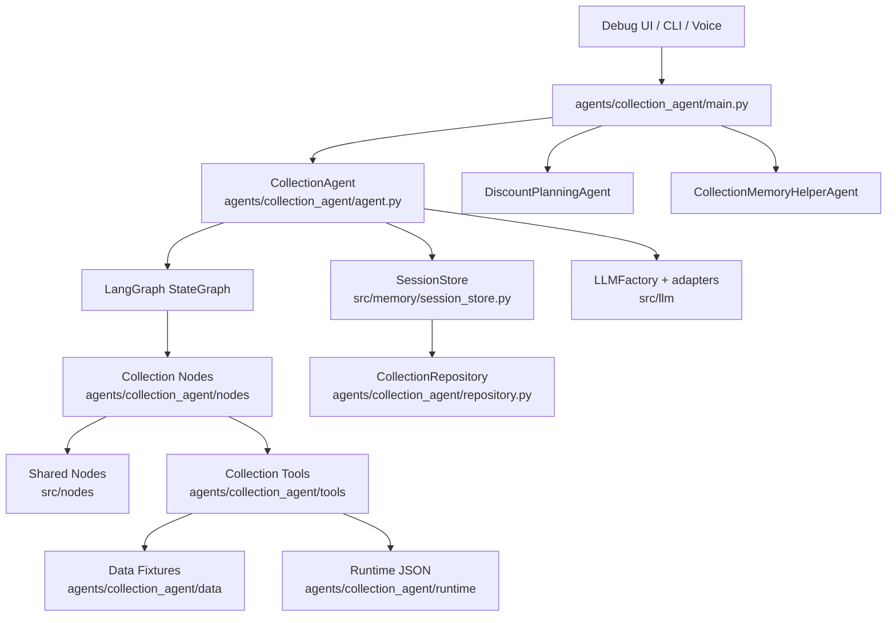

# Project Knowledge Base

This document was generated from the local repository on 2026-06-14 while on branch `ansh/collection/easy-agent`.

Scope and limits:

- Sources used: local repository structure, local git history, current tracked files, current uncommitted workspace changes, prompts, tests, data fixtures, runtime code, and existing documentation.
- Pull request comments were not available locally. Merge commits are visible, but PR discussion text is not present in the checkout.
- Runtime JSON files under `agents/collection_agent/runtime/` are mutable local state/logs. They are useful for debugging, but source behavior is primarily defined by code, config, prompts, tests, and data fixtures.
- Current workspace contains uncommitted changes after the latest commit. They are documented separately from committed history.

## 1. Project Overview

### Business Problem

The current business problem is to automate a compliant collections call flow. The agent must speak to customers with overdue installments, verify identity before disclosing sensitive account details, understand hardship or payment capacity, offer policy-backed resolutions, execute tools, and close the call cleanly.

The important compliance constraint is privacy: no account, policy, amount, due date, or reason-for-call details should be disclosed until the right party is verified. Wrong-party flows must only request that the customer call back or provide a suitable callback time.

### Project Objective

The repository objective evolved over time:

1. Build MailMind, a local-first email triage and response app.
2. Extract a reusable graph-agent framework from MailMind.
3. Add shared tools, memory, LLM adapters, graph nodes, and channel interfaces.
4. Build Collection Agent as a graph-based collections assistant.
5. Add specialist agents, local data fixtures, evaluation datasets, voice runtime, UI tracing, and scenario-specific workflow improvements.

### Collections Workflow

The canonical call flow is:

1. Opening: greet, identify agent/company, mention recording, ask for the named customer.
2. Identity verification: collect DOB and registered phone.
3. Purpose disclosure: after verification, disclose policy/account, amount, due date, and reason for call.
4. Discovery/empathy: understand job loss, hardship, partial payment ability, callback need, or dispute.
5. Resolution offer: choose a policy-backed local action or specialist handoff.
6. Tool execution: verify identity, schedule callback, generate payment link, create premium hold, evaluate/apply discount, send SMS/email.
7. Confirmation: provide generated reference and next steps.
8. Closing: named, warm sign-off and call termination grace window.

### Customer Journey

For `CUST-2002` / `Rohan Gupta`, current fixture data comes from:

- Customer: `agents/collection_agent/data/customers.json`
- Case: `agents/collection_agent/data/cases.json`
- Policy: `agents/collection_agent/data/policies.json`
- Programs: `agents/collection_agent/data/assistance_programs.json`

Important CUST-2002 values:

- `customer_id`: `CUST-2002`
- `case_id`: `COLL-1002`
- `loan_id` / policy number: `LOAN-3002`
- company: `EasySecure Financial Services`
- agent: `Alex`
- amount: `37800.00`
- due date: `2026-06-10`
- contact number: `+91-1800-555-2002`
- verification challenge: DOB `1988-04-22`, phone `9900001002`

### Overall System Architecture



## 2. Repository Evolution Timeline

### Phase 1: Initial MailMind Setup, 2026-03-30

Commits: `2df7e0a`, `ac5d8b5`, `d695390`, `b04c4aa`, `bf07e01`, `f75ea7b`, `3137fd9`

What changed:

- Added root README, MailMind application, seed data, policy YAML, package metadata, tests, docs, file-based config, Twilio/Gmail dotenv loading.

Why it changed:

- The project began as a local-first email triage and response engine.

Files involved:

- `README.md`
- `pyproject.toml`
- `config/mailmind.yaml`
- `agents/mailmind` in later refactors, originally `src/mailmind`
- Gmail/Twilio config and email schemas

Impact:

- Established the first concrete agent product and the habit of config-driven local workflows.

### Phase 2: Local LLM and Tool-Driven Agent Foundations, 2026-03-30 to 2026-03-31

Commits: `ad3fe11`, `5184331`, `0b1b6a9`, `c2bbbeb`, `8c666db`, `3a68588`, `3895955`, `d2528cd`

What changed:

- Added local Hugging Face/Qwen classifier support, reasoning parsing, tool-driven agent framework, structured planning, top-level `src/tools`, top-level `src/llm`, LangGraph ReAct conversational agent, and Function Gemma tool selection.

Why it changed:

- MailMind needed a reusable agent runtime rather than a single-purpose app.

Files involved:

- `src/llm/*`
- `src/tools/*`
- `src/nodes/react_node.py`
- `src/agents/graph_agent.py`

Impact:

- Introduced the core pattern still used by Collection Agent: classify, plan, optionally call tools, reflect, respond.

### Phase 3: Multi-Agent Platform and Memory Architecture, 2026-03-31 to 2026-04-02

Commits: `b3dcac4`, `bca0a50`, `c932619`, `f9a8d17`, `0ad82f6`, `c3b1160`, `84d8022`, `12f6629`

What changed:

- Removed stale OpenClaw references, refactored MailMind into `agents/`, added layered memory docs, extracted shared graph nodes, migrated storage to DuckDB, refined memory APIs.

Why it changed:

- The project was becoming a platform with multiple concrete agents.

Files involved:

- `agents/mailmind/*`
- `src/agents/*`
- `src/nodes/*`
- `src/memory/*`
- `docs/architecture/memory-architecture.md`

Impact:

- Created reusable memory, node, and agent abstractions.

### Phase 4: Channel Integrations and MailMind Productization, 2026-04-03 to 2026-04-17

Commits: `6f45647`, `252a2a2`, `2101cdb`, `c08bcb0`, `005a70a`, `8429626`, `c638929`, `6ef1be6`, `ac59d3b`, `1c1b5ef`, `f78e8e1`, `28e9671`, `1f85b31`, `afdc25e`, `2f1fa97`, `7369dc0`

What changed:

- Added WhatsApp endpoint, simple conversation agent, shared framework extraction, Gmail source/tool flows, hosted endpoint/OpenAI/Groq adapters, MailMind YAML prompts/config/webhook, docs reorganization, local voice processing pipeline, and shared LLM classifier helpers.

Why it changed:

- The platform needed real channels, provider flexibility, and production-shaped docs.

Files involved:

- `src/interfaces/whatsapp.py`
- `src/tools/gmail/*`
- `src/llm/remote_llm.py`
- `agents/mailmind/*`
- `src/voice_processing/*`

Impact:

- Enabled external channel integration and multi-provider LLM support.

### Phase 5: Connections Agent Experiments, 2026-04-29 to 2026-04-30

Commits: `923c072`, `2ced68f`, `7813375`

What changed:

- Added connections-agent topology docs, presentation assets, runtime with JSON-backed tools.

Why it changed:

- Demonstrated another agent domain and graph design.

Impact:

- Helped validate framework reuse beyond MailMind.

### Phase 6: Collection Agent Architecture, 2026-05-01

Commits: `7cb1c7b`, `0e71750`, `f7096ad`, `d2d7524`, `7658e72`, `1c3b9c5`, `a9b160a`

What changed:

- Added Collection Agent and DiscountPlanningAgent.
- Added CollectionMemoryHelperAgent.
- Added Pipecat voice adapter.
- Added debug UI.
- Renamed `response_plan` to `plan_proposal`.
- Refactored response-node LLM rendering.

Why it changed:

- Collections needed a graph-driven customer workflow, multi-agent handoff, UI observability, and voice entrypoints.

Files involved:

- `agents/collection_agent/agent.py`
- `agents/collection_agent/main.py`
- `agents/collection_agent/nodes/*`
- `agents/collection_agent/tools/*`
- `agents/discount_planning_agent/agent.py`
- `agents/collection_memory_helper_agent/agent.py`
- `agents/collection_agent/ui/*`

Impact:

- This became the main business application in the repo.

### Phase 7: Plan Tree, UI Timeline, and Verification Hardening, 2026-05-02 to 2026-05-04

Commits: `908b08a`, `ae37a86`, `3b693df`, `a5a87ed`, `0ab08ea`, `0a799fa`, `b6831f`

What changed:

- Added live execution stream and node explorer.
- Removed origin wrapper nodes and tracked previous/next node state.
- Added plan graph state and response targeting.
- Improved plan-tree execution and UI timeline rendering.
- Enforced strict identity verification progression.
- Hardened structured output and planner fallback.
- Added NeMo guardrails plan.

Why it changed:

- Developers needed to see why each node routed where it did, and the workflow needed strong privacy gates.

Impact:

- Plan tree status became a first-class debugging and correctness surface.

### Phase 8: Setup Scripts, Requirements, and Runtime UX, 2026-05-06 to 2026-05-15

Commits: `13843c2`, `89abac8`, `efef0f4`, `e45c098`, `87a000d`, `b7d4d0a`, `ea98220`, `15aa48f`, `f89f2d3`, `f9e4a80`, `996f3ee`, `35dbefa`

What changed:

- Updated setup scripts/readmes/requirements.
- Switched collection UI/runtime toward Groq path.
- Improved debug UX.
- Refined verification flow and hardship handoff routing.
- Archived tools not in the active catalog.

Why it changed:

- Local setup and active tool catalogs needed to match the demo workflow.

Impact:

- Reduced catalog sprawl and improved operational reliability.

### Phase 9: Verification React and Planning Split, 2026-05-17 to 2026-05-20

Commits: `4ac4ac3`, `b616d4e`, `562b1ee`, `2c78c8d`, `502590c`, `2dd61a9`, `15cb3d7`, `0af442f`, `0a7725d`, `b3bcbb4`, `a3cc8ef`, `eee2455`, `8523bb4`, `5e3e1b7`, `c044725`, `0481790`, `40e91b7`

What changed:

- Updated graph/entity extraction flow and Groq/UI fixes.
- Reset-session and LLM follow-up response fixes.
- Added `VerificationReactNode`.
- Split planning into state, graph, and directive nodes.
- Added negotiation classification and richer response/planning management.

Why it changed:

- Verification needed to be isolated from non-verification tool calls.
- Planning logic had grown too large and needed clearer ownership boundaries.

Files involved:

- `agents/collection_agent/nodes/verification_react_node.py`
- `agents/collection_agent/nodes/plan_proposal_state_node.py`
- `agents/collection_agent/nodes/plan_proposal_graph_node.py`
- `agents/collection_agent/nodes/plan_proposal_directive_node.py`
- `agents/collection_agent/nodes/negotiation_classification_node.py`

Impact:

- The current graph topology was largely established here.

### Phase 10: Data, Services, Evaluation, and Golden Dataset, 2026-05-30 to 2026-06-01

Commits: `e93dc90`, `49a9846`, `5ffca9d`, `479e170`, `456a8a9`, `d9e7348`

What changed:

- Added customer/case/policy/profile/history/program datasets.
- Added context-builder services.
- Added batch execution runner and golden dataset v3.
- Added manifest/EDA output files.

Why it changed:

- Scenario evaluation required stable input data, generated trajectories, and testable state transitions.

Files involved:

- `agents/collection_agent/data/*.json`
- `agents/collection_agent/services/*`
- `agents/collection_agent/evaluation/*`
- `agents/collection_agent/eval_dataset/*`

Impact:

- Agent behavior became testable against realistic multi-turn collections trajectories.

### Phase 11: Conversation Manager and Voice Runtime, 2026-06-03 to 2026-06-04

Commits: `5285603`, `f7d03c2`, `2e146e7`

What changed:

- Added `ConversationManagerAgent`, response buffer, interruption policy, delivery tracker, latency monitor, filler manager, and runtime/server.
- Added or updated voice/Pipecat/TTS/STT integration.

Why it changed:

- Real voice UX needs timing, interruption handling, stale response suppression, fillers, and termination behavior outside business logic.

Files involved:

- `agents/collection_agent/conversation_manager/*`
- `agents/collection_agent/pipecat_bot.py`
- `src/interfaces/pipecat_runner.py`
- `src/speech/*`

Impact:

- Collection Agent remained the business core while conversation management handled call delivery behavior.

### Phase 12: Conversation Flow Reliability and Scenario 1, 2026-06-10 to 2026-12

Commits: `a5631c6`, `e20e938`

What changed:

- Improved conversation flow reliability.
- Added dynamic opening/case variables for CUST-2002.
- Added job-loss 2-month premium hold flow with `premium_hold_create`, `sms_confirmation_send`, and `email_confirmation_send`.
- Added callback scheduling support and closing/timer behavior.

Why it changed:

- The agent was exposing generic options too early, missing named closings, and not producing durable reference/notification artifacts.

Impact:

- Scenario 1 became tool-backed rather than just LLM text.

### Phase 13: Scenario 2 Discount After Hold, 2026-06-12

Commit: `3bbd674`

What changed:

- Added policy-backed installment discount evaluation and application.
- Added uncertainty routing after a premium hold offer.
- Added discount persistence, SMS/email confirmation chaining, revised amount responses, named closing, and plan-tree tracking.

Why it changed:

- Customer uncertainty after a 2-month hold should move to discount evaluation, not repeat the hold offer or transfer prematurely.

Files involved:

- `agents/collection_agent/tools/installment_discount_evaluate_tool.py`
- `agents/collection_agent/tools/installment_discount_apply_tool.py`
- `agents/collection_agent/nodes/collection_react_node.py`
- `agents/collection_agent/nodes/plan_proposal_graph_node.py`
- `agents/collection_agent/nodes/collection_response_node.py`
- `tests/test_installment_discount_flow.py`

Impact:

- The agent can now apply `JOB_LOSS_INSTALLMENT_DISCOUNT_001` for `LOAN-3002` and issue `DISC-*` references.

### Phase 14: Current Uncommitted Workspace Changes, 2026-06-14

Current uncommitted changes include:

- Scenario 3 partial payment flow.
- LLM-based hold/discount response classification fields.
- Partial-payment amount/percentage extraction from current-turn structured entities.
- Plan-tree status reconciliation for partial amount/link nodes.
- Additional tests for premium hold, installment discount, and partial payment.

Files changed:

- `agents/collection_agent/nodes/partial_payment_utils.py` (untracked new file)
- `tests/test_partial_payment_flow.py` (untracked new file)
- `agents/collection_agent/nodes/collection_react_node.py`
- `agents/collection_agent/nodes/collection_response_node.py`
- `agents/collection_agent/nodes/execution_path_intent_node.py`
- `agents/collection_agent/nodes/negotiation_classification_node.py`
- `agents/collection_agent/nodes/plan_proposal_directive_node.py`
- `agents/collection_agent/nodes/plan_proposal_graph_node.py`
- `agents/collection_agent/nodes/plan_proposal_utils.py`
- `agents/collection_agent/nodes/pre_plan_intent_node.py`
- `agents/collection_agent/prompts/agent_prompts.yml`
- `agents/collection_agent/state.py`
- `tests/test_installment_discount_flow.py`
- `tests/test_premium_hold_tools.py`

Impact:

- Partial-payment conversations now progress from "I can pay part" to amount collection, secure link offer, payment-link/SMS tool execution, confirmation, and closing.
- Scenario 1 and 2 response decisions use structured LLM classification (`hold_response`, `discount_response`) with deterministic operational safeguards.

## 3. Git History Analysis

### Commit Table

| Commit | Date | Message | Feature Group | Functional Impact |
| --- | --- | --- | --- | --- |
| `2df7e0a` | 2026-03-30 | first commit | Initial docs | Added initial README. |
| `ac5d8b5` | 2026-03-30 | Build mailmind core application | MailMind | Added first email triage application, policies, seed messages, package metadata. |
| `d695390` | 2026-03-30 | Add mailmind docs and test coverage | MailMind tests/docs | Added tests and docs for the early app. |
| `b04c4aa` | 2026-03-30 | Ignore local development artifacts | Repo hygiene | Added ignore rules for local artifacts. |
| `bf07e01` | 2026-03-30 | Add file-based app configuration | Config | Introduced YAML-based app config. |
| `f75ea7b` | 2026-03-30 | Rename WhatsApp config to Twilio credentials | Channel config | Clarified WhatsApp/Twilio credential naming. |
| `3137fd9` | 2026-03-30 | Load Gmail and Twilio credentials from dotenv | Env loading | Added dotenv-based credential loading. |
| `ad3fe11` | 2026-03-30 | Add local Hugging Face Qwen classifier support | LLM | Added local classifier backend. |
| `5184331` | 2026-03-30 | Parse optional reasoning output from local LLMs | LLM | Added support for reasoning/thinking extraction. |
| `0b1b6a9` | 2026-03-30 | Add tool-driven agent framework foundation | Tools/framework | Added tool abstractions and tool-driven execution foundation. |
| `c2bbbeb` | 2026-03-30 | Add structured planning and agent execution | Planning | Added structured planner/runtime concepts. |
| `8c666db` | 2026-03-30 | Move tools package to top-level src | Refactor | Promoted tools into shared `src/tools`. |
| `3a68588` | 2026-03-31 | Move LLM package to top-level src | Refactor | Promoted LLM adapters into shared `src/llm`. |
| `3895955` | 2026-03-31 | Add LangGraph ReAct conversational agent | Graph runtime | Added reusable ReAct graph pattern. |
| `d2528cd` | 2026-03-31 | Add Function Gemma tool selection | Local LLM/tools | Added local tool-selection model path. |
| `b3dcac4` | 2026-03-31 | Remove stale OpenClaw project references | Cleanup | Removed old naming references. |
| `bca0a50` | 2026-03-31 | Refactor mailmind into multi-agent platform | Platform | Moved concrete agents under `agents/`; `src/` became shared framework. |
| `c932619` | 2026-03-31 | Add layered memory architecture and documentation | Memory | Added hot/warm/cold memory design and docs. |
| `f9a8d17` | 2026-04-01 | Extract shared agent graph nodes | Nodes | Added reusable node layer under `src/nodes`. |
| `0ad82f6` | 2026-04-01 | Migrate platform memory and storage to DuckDB | Storage | Added DuckDB memory backend/storage path. |
| `c3b1160` | 2026-04-02 | Update calculator node demo notebook | Demo | Updated example notebook. |
| `84d8022` | 2026-04-02 | Make react node self-sufficient | ReAct | Reduced external setup needed by ReAct node. |
| `12f6629` | 2026-04-02 | Refine memory nodes and type-first memory API | Memory/nodes | Strengthened typed memory contracts. |
| `6f45647` | 2026-04-03 | Add WhatsApp endpoint and simple conversation agent | Channels/examples | Added WhatsApp endpoint and simple agent. |
| `252a2a2` | 2026-04-04 | Extract shared framework from MailMind internals | Framework | Further separated platform from MailMind. |
| `2101cdb` | 2026-04-04 | Separate graph nodes into top-level package | Refactor | Moved graph nodes into shared top-level package. |
| `c08bcb0` | 2026-04-04 | Add real Gmail source and direct Gmail tool flows | Gmail | Added Gmail source/sender/tool path. |
| `005a70a` | 2026-04-09 | Improve local LLM prompt debugging and repo naming cleanup | Debug/cleanup | Improved prompt debug visibility. |
| `8429626` | 2026-04-09 | Remove deprecated src/mailmind package | Cleanup | Removed obsolete package after agent extraction. |
| `c638929` | 2026-04-09 | Remove legacy MailMind scaffolding and stale tests | Cleanup | Removed stale app/test code. |
| `6ef1be6` | 2026-04-09 | Add hosted endpoint, OpenAI, and Groq LLM adapters | LLM providers | Added remote LLM provider support. |
| `ac59d3b` | 2026-04-09 | Add Gmail email send tool and update MailMind scope | Gmail tools | Added email sending and updated scope. |
| `1c1b5ef` | 2026-04-11 | Add MailMind graph spec and reusable vector retrieval | Retrieval/MailMind | Added graph spec and vector retrieval. |
| `f78e8e1` | 2026-04-12 | Implement MailMind agent and YAML prompt catalog | MailMind | Added concrete MailMind graph/prompt runtime. |
| `28e9671` | 2026-04-13 | Move MailMind entrypoint and config into agent package | Refactor | Package-local MailMind runtime/config. |
| `1f85b31` | 2026-04-13 | Add MailMind webhook entry mode | MailMind channel | Added webhook server mode. |
| `afdc25e` | 2026-04-14 | Reorganize documentation into docs directory | Docs | Centralized docs under `docs/`. |
| `2f1fa97` | 2026-04-17 | Add local voice processing pipeline | Voice | Added local voice-processing modules. |
| `7369dc0` | 2026-04-17 | Add shared LLM classifier helpers | LLM helpers | Added reusable classifier helper template. |
| `923c072` | 2026-04-29 | Add connections agent topology docs and related updates | Docs/agent experiment | Added connections-agent design docs. |
| `2ced68f` | 2026-04-30 | Add connections agent presentation and deck builder | Presentation | Added deck artifacts/scripts. |
| `7813375` | 2026-04-30 | Add connections agent runtime with JSON-backed tools | Agent experiment | Added JSON-backed tool runtime. |
| `7cb1c7b` | 2026-05-01 | Add collection + discount-planning agent architecture and external orchestration loop | Collections | Introduced core Collection Agent and DiscountPlanningAgent. |
| `0e71750` | 2026-05-01 | Add memory helper agent flow and update collection orchestration artifacts | Memory helper | Added CollectionMemoryHelperAgent. |
| `f7096ad` | 2026-05-01 | Add Pipecat voice runtime adapter and collection agent voice entrypoint | Voice | Added collection voice runtime entrypoint. |
| `d2d7524` | 2026-05-01 | Add NVIDIA provider support and user/global memory context plumbing | Providers/memory | Added NVIDIA support and memory context plumbing. |
| `7658e72` | 2026-05-01 | Add collection agent debug UI with demo users and state inspector | UI | Added debug UI. |
| `1c3b9c5` | 2026-05-01 | Refine collection response rendering and rename response_plan to plan_proposal | Planning/response | Introduced `plan_proposal` naming. |
| `a9b160a` | 2026-05-01 | Refactor collection plan_proposal contract and response-node LLM rendering | Planning/response | Refined proposal and rendering contract. |
| `908b08a` | 2026-05-02 | Add live execution stream and node explorer in collection UI | UI/tracing | Added live graph/debug visibility. |
| `ae37a86` | 2026-05-02 | refactor(collection_agent): remove origin wrapper nodes and track prev/next node state | Graph/debug | Added previous/next node tracking. |
| `3b693df` | 2026-05-02 | feat(collection_agent): add plan-graph state, response targeting, and ui startup script | Plan tree/UI | Added plan graph state and response targets. |
| `a5a87ed` | 2026-05-02 | Improve collection plan-tree execution and UI timeline rendering | Plan tree/UI | Improved plan status and timeline rendering. |
| `0ab08ea` | 2026-05-04 | Collection agent: enforce strict identity verification progression and add detailed documentation book | Verification/docs | Hardened privacy gate and added engineering book. |
| `0a799fa` | 2026-05-04 | fix(collection-agent): harden structured output and planner LLM fallback | LLM robustness | Improved structured output failure behavior. |
| `b6831f6` | 2026-05-04 | docs(collection-agent): add NeMo guardrails implementation plan | Docs/guardrails | Added guardrails plan. |
| `13843c2` | 2026-05-04 | updating remaining codes and changes | Misc | Miscellaneous updates. |
| `89abac8` | 2026-05-06 | updated readme | Docs | README updates. |
| `efef0f4` | 2026-05-06 | added requirement txt | Setup | Added requirements file. |
| `e45c098` | 2026-05-06 | setting up init scripts | Setup | Added initialization scripts. |
| `87a000d` | 2026-05-06 | updated init scripts | Setup | Script updates. |
| `b7d4d0a` | 2026-05-06 | updated init scripts | Setup | Script updates. |
| `ea98220` | 2026-05-06 | updated init scripts | Setup | Script updates. |
| `15aa48f` | 2026-05-06 | updated init scripts | Setup | Script updates. |
| `f89f2d3` | 2026-05-06 | updated init scripts | Setup | Script updates. |
| `f9e4a80` | 2026-05-12 | Switch collection UI/runtime to Groq path and improve debug UX | Provider/UI | Improved Groq path and UI debugging. |
| `996f3ee` | 2026-05-14 | Refine collection verification flow and hardship handoff routing | Verification/routing | Improved verification and hardship routing. |
| `35dbefa` | 2026-05-15 | Archive non-listed tools and add removed column in collection README | Tool catalog | Moved inactive tools to archive. |
| `4ac4ac3` | 2026-05-17 | Update collection agent graph, entity extraction flow, and Groq/UI fixes | Graph/extraction | Updated graph and extraction. |
| `b616d4e` | 2026-05-17 | Fix verification flow: reset start session and LLM follow-up responses | Verification | Fixed reset and follow-up behavior. |
| `562b1ee` | 2026-05-17 | updading some files | Misc | Miscellaneous updates. |
| `2c78c8d` | 2026-05-17 | addrd plan consistency in web | UI/plan | Improved web plan consistency. |
| `502590c` | 2026-05-18 | verified agent working for the turn | Verification | Working-turn validation updates. |
| `2dd61a9` | 2026-05-18 | bug fix | Bug fix | Unspecified bug fix in history. |
| `15cb3d7` | 2026-05-18 | updated few hardcoding | Refactor | Reduced hardcoding. |
| `0af442f` | 2026-05-18 | saw the flow is working fine now | Flow fix | Validated flow updates. |
| `0a7725d` | 2026-05-18 | saw the flow is working fine now | Flow fix | Validated flow updates. |
| `b3bcbb4` | 2026-05-19 | saw the flow is working fine now | Flow fix | Validated flow updates. |
| `a3cc8ef` | 2026-05-19 | now react is working fine | ReAct | ReAct behavior fix. |
| `eee2455` | 2026-05-19 | added some unrivisioned files | Cleanup/additions | Added previously untracked files. |
| `8523bb4` | 2026-05-19 | added new verification react node | Verification | Added dedicated verification ReAct node. |
| `5e3e1b7` | 2026-05-19 | Merge pull request #1 from deep-saket/saket/collection/auth_fix | Merge | Merged auth/verification branch. |
| `c044725` | 2026-05-20 | added different noted for managing planning and response | Planning split | Added split planning/response management. |
| `0481790` | 2026-05-20 | added different noted for managing planning and response | Planning split | Continued planning/response updates. |
| `40e91b7` | 2026-05-20 | updated relavance response | Response | Updated relevance response. |
| `e93dc90` | 2026-05-30 | refactor collection agent state, prompts, datasets, and evaluation tooling | Data/evaluation | Added data/services/evaluation support. |
| `49a9846` | 2026-05-31 | Merge pull request #2 from deep-saket/main | Merge | Merged main into feature branch. |
| `5ffca9d` | 2026-05-31 | Merge pull request #3 from deep-saket/saket/collection/auth_fix | Merge | Merged auth fix branch. |
| `479e170` | 2026-06-01 | added new dataset | Dataset | Added dataset artifacts. |
| `456a8a9` | 2026-06-01 | Merge remote-tracking branch 'origin/saket/collection/auth_fix' into saket/collection/auth_fix | Merge | Synced remote auth branch. |
| `d9e7348` | 2026-06-01 | add collection agent golden trajectory dataset v3 | Evaluation | Added golden trajectory dataset v3. |
| `5285603` | 2026-06-03 | feat(collection): add conversation manager interruption handling | Conversation manager | Added interruption/timing wrapper. |
| `f7d03c2` | 2026-06-04 | added bew exo functiuonalities | Voice/runtime | Added voice/runtime functionality. |
| `2e146e7` | 2026-06-04 | Merge remote-tracking branch 'origin/saket/collection/auth_fix' into saket/collection/auth_fix | Merge | Synced collection auth branch. |
| `a5631c6` | 2026-06-10 | fix(collection-agent): improve conversation flow and workflow reliability | Flow fixes | Fixed opening/wrong-party/closing/status reliability areas. |
| `e20e938` | 2026-06-12 | fix: scenario 1 job_lost_hold - dynamic case ref, SMS/email confirmation, and customer name in closing | Scenario 1 | Added tool-backed premium hold flow. |
| `3bbd674` | 2026-06-12 | feat: scenario_2_job_loss_discount_after_hold - add policy-backed discount evaluation, uncertainty routing, discount persistence, SMS/email confirmation chaining, revised amount responses, named closing, and plan-tree tracking | Scenario 2 | Added tool-backed installment discount flow. |

## 4. File-by-File Documentation

### Root and Config

#### `pyproject.toml`

Purpose: Python package metadata and dependencies.

Responsibilities:

- Defines project name `easy_agent`.
- Requires Python `>=3.11`.
- Declares runtime dependencies: `duckdb`, `fastapi`, `jinja2`, `langgraph`, `pydantic`, `pyyaml`, `twilio`, `uvicorn`.
- Declares optional extras for dev, Gmail, local LLM, vector memory, voice processing, realtime Pipecat, and local TTS.
- Adds console scripts `voice-processing` and `collection-speech-tools`.
- Configures pytest.

Why it exists:

- Single package setup for shared framework and concrete agents.

### Shared Framework Files

#### `src/agents/base_agent.py`

Purpose: Abstract base class for agents.

Responsibilities:

- Common agent interface.
- Shared LLM/logger/trace-sink fields.

Interacts with:

- `CollectionAgent`, `MailMindAgent`, `CollectionMemoryHelperAgent`, and `GraphAgent`.

#### `src/agents/graph_agent.py`

Purpose: Reusable graph-agent runtime.

Responsibilities:

- Builds a generic LangGraph flow with memory retrieval, planning, action, reflection, and response.
- Demonstrates reusable node wiring.

Interacts with:

- `src/nodes/*`
- `src/tools/*`
- `src/memory/*`

#### `src/nodes/types.py`

Purpose: Shared typed graph state definitions.

Key classes:

- `AgentState`
- `NodeUpdate`
- memory/session protocols

Interacts with:

- All graph nodes, including collection-specific state extension in `agents/collection_agent/state.py`.

#### `src/nodes/react_node.py`

Purpose: Generic ReAct node.

Responsibilities:

- Produces tool-call or response decisions.
- Supports looped tool execution.

Interacts with:

- `CollectionReactNode`
- `VerificationReactNode`
- `ToolExecutionNode`

#### `src/nodes/tool_execution_node.py`

Purpose: Executes selected tools through `ToolExecutor`.

Responsibilities:

- Reads pending tool decision.
- Invokes registered typed tool.
- Emits normalized `observation` and `observations`.

Interacts with:

- `src/tools/executor.py`
- Collection tools
- Plan and response nodes that consume observations.

#### `src/tools/base.py`

Purpose: Base class for typed tools.

Key class:

- `BaseTool[InputT, OutputT]`

Responsibilities:

- Standardizes tool `name`, `description`, `input_schema`, `output_schema`, and `execute`.

#### `src/tools/registry.py`

Purpose: Tool lookup registry.

Key class:

- `ToolRegistry`

Responsibilities:

- Register tool instances.
- Resolve by name during execution.

#### `src/tools/executor.py`

Purpose: Executes tools and logs results.

Key class:

- `ToolExecutor`

Responsibilities:

- Validates input with tool schemas.
- Calls tool `execute`.
- Saves logs through repository when available.

#### `src/llm/factory.py`

Purpose: Factory for local and remote LLM adapters.

Key class:

- `LLMFactory`

Important builders:

- `build_default_local_llm`
- `build_function_calling_llm`
- `build_endpoint_llm`
- `build_openai_compatible_llm`
- `build_openai_llm`
- `build_nvidia_llm`
- `build_groq_llm`

Interacts with:

- `agents/collection_agent/main.py` for provider selection.

#### `src/llm/remote_llm.py`

Purpose: Endpoint-backed LLM adapters.

Key classes:

- `EndpointLLM`
- `OpenAICompatibleLLM`
- `OpenAILLM`
- `NvidiaLLM`
- `GroqLLM`

Responsibilities:

- Normalize response formats from hosted endpoints.
- Support OpenAI-compatible chat completions.
- Map `max_new_tokens` to OpenAI-style `max_tokens` in `OpenAICompatibleLLM`.
- Use Groq SDK in `GroqLLM`.

### Collection Agent Core

#### `agents/collection_agent/config.yml`

Purpose: Collection runtime configuration.

Responsibilities:

- Enables strict collections mode.
- Sets `strict_llm_mode: true`.
- Sets current LLM provider to Ollama with `gemma4:31b-cloud`.
- Configures verification fields (`dob`, `phone`) and strict tool-only verification.
- Configures local voice runtime.
- Configures tracing path and demo hop caps.

#### `agents/collection_agent/main.py`

Purpose: CLI entrypoint and outer orchestration loop.

Key functions/classes:

- `load_env_file`
- `load_collection_config`
- `build_parser`
- `build_llm`
- `build_trace_sink`
- `format_trace_summary`
- `_route_internal_turn`
- `_run_memory_helper_if_requested`
- `_build_memory_helper_payload`
- `interactive`
- `main`
- `MultiTraceSink`

Responsibilities:

- Load `.env`.
- Build LLM from config.
- Build `CollectionAgent`, `DiscountPlanningAgent`, and `CollectionMemoryHelperAgent`.
- Route `response_target=customer`, `self`, or `discount_planning_agent`.
- Enforce soft/hard hop caps.
- Trigger memory helper when requested by `additional_targets`.

#### `agents/collection_agent/agent.py`

Purpose: Main Collection Agent graph runtime.

Key class:

- `CollectionAgent`

Responsibilities:

- Creates session store, callback queue, memory repository, context builder, tool registry, tool executor.
- Instantiates all collection graph nodes with prompts.
- Registers tools in `_build_tool_registry`.
- Builds LangGraph topology in `_build_graph`.
- Wraps every node for tracing and `previous_node`/`next_node` instrumentation.
- Runs one turn through `run_turn`.
- Provides simple text API through `run`.

Important registered tools:

- `verify_dob`
- `verify_mobile`
- `loan_policy_lookup`
- `offer_eligibility`
- `outbound_callback_schedule`
- `outbound_callback_cancel`
- `payment_link_create`
- `promise_capture`
- `premium_hold_create`
- `installment_discount_evaluate`
- `installment_discount_apply`
- `sms_confirmation_send`
- `email_confirmation_send`
- `human_escalation`
- `plan_propose`

#### `agents/collection_agent/state.py`

Purpose: Collection-specific graph state contract.

Key class:

- `CollectionGraphState`

Responsibilities:

- Extends shared `AgentState`.
- Defines collection-specific keys for identity verification, right-party status, wrong-party callback, negotiation, hardship hold, installment discount, partial payment, plan tree, closing, and response metadata.

Important recent keys:

- `right_party_status`
- `wrong_party_callback_stage`
- `wrong_party_callback_time`
- `conversation_complete`
- `conversation_closing`
- `terminate_call`
- `termination_grace_seconds`
- `hold_response`
- `discount_response`
- `partial_payment_stage`
- `partial_payment_details`

#### `agents/collection_agent/repository.py`

Purpose: Local file-backed conversation repository.

Key class:

- `CollectionRepository`

Responsibilities:

- Persists conversation messages to `runtime/conversation_messages.json`.
- Persists conversation state to `runtime/conversation_states.json`.
- Persists tool logs to `runtime/tool_logs.json`.

Known operational issue:

- File-backed JSON writes can surface OS-level errors if a file is locked, concurrently written, corrupted, or temporarily unavailable. The previous `[Errno 22] Invalid argument` on `conversation_states.json` points to local file I/O/runtime-state fragility rather than business logic.

#### `agents/collection_agent/tools/data_store.py`

Purpose: Local JSON datastore for fixtures and runtime artifacts.

Key class:

- `CollectionDataStore`

Responsibilities:

- Reads `data/*.json` fixtures.
- Ensures runtime files exist.
- Appends tool outputs to runtime JSON files.
- Finds cases, customers, policies, profiles, histories, and assistance programs.

### Collection Data and Services

#### `agents/collection_agent/data/customers.json`

Purpose: Customer fixture records and verification challenges.

Important CUST-2002 additions:

- `variables` for agent name, company name, customer name, policy number, amount, due date, ref number, contact number, and payment link.

#### `agents/collection_agent/data/cases.json`

Purpose: Case/account fixture records.

Important fields:

- `case_id`
- `customer_id`
- `loan_id`
- `product`
- `dpd`
- `emi_amount`
- `overdue_amount`
- `late_fee`
- `assigned_agent`

#### `agents/collection_agent/data/policies.json`

Purpose: Policy rules per loan.

Important fields:

- `allow_partial_payment`
- `min_partial_payment_pct`
- `max_promise_days`
- `restructure_allowed`
- `requires_hardship_for_discount`

#### `agents/collection_agent/data/assistance_programs.json`

Purpose: Hardship/discount/hold program fixtures.

Important programs:

- `PREMIUM_HOLD_001`: 2-month premium hold for `LOAN-3002`, `job_loss`.
- `JOB_LOSS_INSTALLMENT_DISCOUNT_001`: 10% installment discount for `LOAN-3002`, `job_loss`.

#### `agents/collection_agent/services/collection_context_builder.py`

Purpose: Aggregates customer, case, policy, profile, payment history, offer history, and programs.

Key class:

- `CollectionContextBuilder`

Responsibilities:

- Builds `active_collection_context`.
- Builds memory updates and summaries before graph execution.

### Collection Nodes

#### `agents/collection_agent/nodes/collection_entity_extract_node.py`

Purpose: Extracts verification and negotiation entities.

Responsibilities:

- Calls LLM structured extraction in strict mode.
- Updates `extracted_entities`, `extracted_entities_turn`, `verification_entities`.
- Captures `customer_payment_capacity` and `customer_payment_capacity_pct`.

#### `agents/collection_agent/nodes/negotiation_classification_node.py`

Purpose: Owns persistent negotiation cognition state.

Key models:

- `_HardshipContextPayload`
- `_NegotiationPayload`

Responsibilities:

- Classifies `conversation_mode`, `negotiation_stage`, `customer_payment_posture`, `discount_stage`, `hardship_context`, `customer_payment_willingness`, `response_mode`, `active_dialogue_owner`.
- Recent local change: classifies `hold_response` and `discount_response` so scenario branching can be LLM-based instead of only phrase/regex based.
- Persists negotiation state into session memory.

#### `agents/collection_agent/nodes/pre_plan_intent_node.py`

Purpose: Decides whether to go straight to planning or perform tool/execution routing.

Responsibilities:

- Uses structured LLM output plus node-specific operational overrides.
- Routes accepted hold/discount/link flows toward tool execution.
- Uses `partial_payment_from_structured_entities` for current-turn amount/percentage detection.

#### `agents/collection_agent/nodes/execution_path_intent_node.py`

Purpose: Chooses memory retrieval, verification ReAct, or non-verification ReAct.

Responsibilities:

- Sends missing verification evidence to `verification_react`.
- Sends accepted operational flows to `react`.
- Protects wrong-party callback scheduling.

#### `agents/collection_agent/nodes/verification_react_node.py`

Purpose: Dedicated verification-only ReAct node.

Responsibilities:

- Can only select `verify_dob` and `verify_mobile`.
- Computes `identity_verified`, `verification_missing_fields`, and `verification_verified_fields`.

#### `agents/collection_agent/nodes/collection_react_node.py`

Purpose: Non-verification tool-selection node with collection-specific overrides.

Responsibilities:

- Creates payment links.
- Creates premium holds and chains SMS/email confirmation.
- Evaluates and applies installment discounts and chains SMS/email confirmation.
- Schedules/cancels callbacks.
- Maintains operational state such as `hardship_hold_stage`, `discount_stage`, `partial_payment_stage`, and details payloads.

#### `agents/collection_agent/nodes/plan_proposal_state_node.py`

Purpose: Prepares state for planning.

Responsibilities:

- Overlays graph verification/negotiation state into memory state.
- Produces `plan_signals`.
- Determines `plan_mode` and plan origin.

#### `agents/collection_agent/nodes/plan_proposal_graph_node.py`

Purpose: Owns plan tree mutation and UI step-marker reconciliation.

Responsibilities:

- Creates initial plan graph.
- Ensures privacy/callback/closing nodes exist.
- Advances current node based on identity, wrong-party status, hardship hold, discount, partial payment, and closing state.
- Marks nodes done/skipped/pending/in-progress.
- Recent fixes include preventing `explain_dues` from staying in progress after wrong-party detection and marking privacy-safe callback as active.

#### `agents/collection_agent/nodes/plan_proposal_directive_node.py`

Purpose: Builds final planning directive and response contract.

Responsibilities:

- Creates `plan_proposal`.
- Selects `response_target`.
- Builds `handoff_payload` for `discount_planning_agent`.
- Defines dialogue actions such as `purpose_disclosure`, `hardship_hold_offer`, `installment_discount_offer`, `partial_payment_link_offer`, `wrong_party_callback_confirmation`, and `close_conversation`.
- Provides required/forbidden response elements consumed by `CollectionResponseNode`.

#### `agents/collection_agent/nodes/collection_response_node.py`

Purpose: Produces final customer-facing text.

Responsibilities:

- Renders responses from directives.
- Uses deterministic responses for factual confirmations and closings.
- Allows guarded LLM wording for selected offer turns.
- Calls `mark_confirmation_delivered` to prevent repeated closing/confirmation loops.
- Sets `conversation_closing`, `terminate_call`, and `termination_grace_seconds` for closing actions.

#### `agents/collection_agent/nodes/partial_payment_utils.py`

Purpose: Current uncommitted helper for scenario 3 partial payment.

Key functions:

- `partial_payment_from_structured_entities`
- `partial_payment_policy`
- `is_partial_payment_intent`

Responsibilities:

- Uses current-turn structured entities, not stale memory alone, to convert percentage or amount into partial-payment details.
- Validates that partial amount is greater than zero and below total due.

### Collection Tools

#### `verify_dob_tool.py` and `verify_mobile_tool.py`

Purpose: Verify customer DOB and phone against active challenge data.

Inputs:

- DOB: `case_id?`, `customer_id?`, `dob`
- Mobile: `case_id?`, `customer_id?`, `phone`

Outputs:

- `status`: `verified`, `failed`, or `locked`
- `field`
- `failed_attempts`

#### `payment_link_create_tool.py`

Purpose: Generate mock payment links.

Output:

- `payment_reference_id`: `PAY-*`
- `payment_url`
- `expires_at`

Persists to:

- `runtime/payment_links.json`

#### `premium_hold_create_tool.py`

Purpose: Create approved premium holds.

Output:

- `reference_number`: `HOLD-*`
- effective dates
- `status: active`

Persists to:

- `runtime/premium_holds.json`

#### `installment_discount_evaluate_tool.py`

Purpose: Evaluate configured hardship installment discount.

Output:

- eligibility
- approval status
- discount percentage
- discount amount
- revised amount
- review months

#### `installment_discount_apply_tool.py`

Purpose: Apply approved installment discount.

Output:

- `reference_number`: `DISC-*`
- original amount
- discount amount
- revised amount
- `status: applied`

Persists to:

- `runtime/installment_discounts.json`

#### `sms_confirmation_send_tool.py`

Purpose: Persist confirmation SMS.

Output:

- `message_id`: `SMS-*`
- recipient
- status `sent`

Persists to:

- `runtime/sms_confirmations.json`

#### `email_confirmation_send_tool.py`

Purpose: Persist confirmation email.

Output:

- `message_id`: `EMAIL-*`
- recipient
- status `sent`

Persists to:

- `runtime/email_confirmations.json`

#### `outbound_callback_schedule_tool.py` and `outbound_callback_cancel_tool.py`

Purpose:

- Schedule or cancel callbacks for wrong-party or callback-request flows.

Dependencies:

- `agents/collection_agent/services/outbound_callback_queue.py`

Persists:

- callback job and attempt runtime artifacts.

### Specialist Agents

#### `agents/discount_planning_agent/agent.py`

Purpose: Small specialist recommendation agent.

Key class:

- `DiscountPlanningAgent`

Behavior:

- Receives handoff payload from `CollectionAgent`.
- Builds baseline restructure recommendation and variants from hardship reason, payment capacity, posture, discount stage, and prior offers.

#### `agents/collection_memory_helper_agent/agent.py`

Purpose: Post-turn memory helper.

Key class:

- `CollectionMemoryHelperAgent`

Behavior:

- LangGraph flow: `react -> tool_execution -> reflect -> response`.
- Uses `UpdateKeyEventMemoryTool`.
- Updates global/user key-event memory stores.

### UI and Conversation Manager

#### `agents/collection_agent/ui/server.py`

Purpose: FastAPI debug UI backend.

Responsibilities:

- Starts/resets sessions.
- Runs turns.
- Serves plan-tree and trace state.
- Starts/stops voice call process.

#### `agents/collection_agent/conversation_manager/ConversationManagerAgent.py`

Purpose: Wrapper around Collection Agent for delivery behavior.

Responsibilities:

- Handles interruption.
- Buffers and tracks responses.
- Suppresses stale responses.
- Coordinates timers/fillers/delivery.

## 5. Architecture Deep Dive

### Entry Points

- CLI: `agents/collection_agent/main.py`
- UI: `agents/collection_agent/ui/server.py`
- Voice: `agents/collection_agent/pipecat_bot.py`
- Conversation manager wrapper: `agents/collection_agent/conversation_manager/main.py` and `server.py`

### Routing

Routing is split between:

- LangGraph conditional edges in `CollectionAgent._build_graph`.
- Node route methods such as `RelevanceIntentNode.route`, `CollectionReactNode.route`, `CollectionReflectNode.route`.
- Wrapper-level route inference in `CollectionAgent._wrap_node`.
- Outer-loop target routing in `_route_internal_turn`.

### Planning

Planning is intentionally split:

1. `PlanProposalStateNode`: prepare memory and signals.
2. `PlanProposalGraphNode`: mutate plan tree and UI statuses.
3. `PlanProposalDirectiveNode`: create response directive, target, handoff payload.

This split was introduced because a single plan node had too many responsibilities.

### Agent Execution

Each customer turn:

1. `CollectionAgent.run_turn` loads session memory.
2. Context builder injects customer/case/policy/history/program data.
3. Graph executes from relevance to response.
4. Tools execute through `ToolExecutionNode`.
5. Final response includes `response_target`.
6. Outer loop may return to customer, self-hop, call discount agent, or trigger memory helper.

### State Transitions

Important state transitions:

- Verification: `not_started/in_progress` to `identity_verified=true`.
- Wrong party: `right_party_status=wrong_party`, `wrong_party_callback_stage=privacy_notice_given/awaiting_callback/completed`.
- Hardship hold: `offered -> created -> sms_sent -> confirmed`.
- Discount: `none/requested/evaluating/offered/accepted/applied/sms_sent/confirmed/closed`.
- Partial payment: `collecting_amount -> link_offered -> link_requested -> link_created -> confirmed`.
- Closing: `conversation_closing=true`, `termination_grace_seconds=3.0`, `conversation_complete=true`.

### Response Generation

`CollectionResponseNode` uses hybrid generation:

- LLM wording for some empathetic/offer turns.
- Deterministic factual confirmations when tools have produced references, links, revised amounts, or notification status.
- Deterministic privacy guardrails for wrong-party disclosure.
- Deterministic closing flags to stop repeated responses.

## 6. Agent Flow Documentation

### CollectionAgent

Purpose:

- Customer-facing collections workflow.

Input:

- `user_input`
- `session_id`
- sender (`customer`, `self`, or admin/system)

Output:

- Final response text.
- Full graph state from `run_turn`.
- `response_target` for outer orchestration.

Decision logic:

- Relevance gate.
- Entity extraction.
- Negotiation classification.
- Pre-plan/execute routing.
- Verification or action ReAct.
- Tool execution.
- Plan tree update.
- Directive creation.
- Reflection.
- Response rendering.

Dependencies:

- LLM adapter.
- `CollectionRepository`.
- `CollectionDataStore`.
- `CollectionContextBuilder`.
- `ToolRegistry`.
- `ToolExecutor`.
- Session memory.

### DiscountPlanningAgent

Purpose:

- Specialist recommendation for discount/restructure handoff.

Input:

- Handoff payload containing case, customer, hardship reason, posture, capacity, discount stage, summaries, and programs.

Output:

- `recommended_offer`
- `offer_variants`
- rationale, compliance flags, confidence, next action hint

Decision logic:

- Uses customer payment capacity if available.
- Otherwise uses target EMI or fallback EMI.
- Adjusts tenure for counter-offer context.

### CollectionMemoryHelperAgent

Purpose:

- Update key-event memory after selected turns.

Input:

- JSON payload with session, user, trigger, conversation messages, and conversation state.

Output:

- Memory helper response and observation.

Decision logic:

- ReAct selects `update_key_event_memory`.
- Reflect validates completion.

## 7. Tool Documentation

| Tool | Purpose | Input Schema | Output Schema | Called From | Typical Flow |
| --- | --- | --- | --- | --- | --- |
| `verify_dob` | Verify DOB | `VerifyDOBInput` | `VerifyDOBOutput` | `VerificationReactNode` | Customer gives DOB -> tool verifies -> missing fields update. |
| `verify_mobile` | Verify phone | `VerifyMobileInput` | `VerifyMobileOutput` | `VerificationReactNode` | Customer gives phone -> tool verifies -> identity may become true. |
| `loan_policy_lookup` | Load policy | `LoanPolicyLookupInput` | `LoanPolicyLookupOutput` | `CollectionReactNode` | Used for policy-backed option evaluation. |
| `offer_eligibility` | Evaluate concession eligibility | `OfferEligibilityInput` | `OfferEligibilityOutput` | `CollectionReactNode` | Used for older waiver/restructure style flows. |
| `payment_link_create` | Create payment link | `PaymentLinkCreateInput` | `PaymentLinkCreateOutput` | `CollectionReactNode` | Pay-now or partial-payment accepted -> link generated. |
| `promise_capture` | Record promise | `PromiseCaptureInput` | `PromiseCaptureOutput` | `CollectionReactNode` | Promise-to-pay date/amount -> persisted promise. |
| `premium_hold_create` | Create premium hold | `PremiumHoldCreateInput` | `PremiumHoldCreateOutput` | `CollectionReactNode` | Customer accepts hold -> `HOLD-*` generated -> SMS/email. |
| `installment_discount_evaluate` | Evaluate discount | `InstallmentDiscountEvaluateInput` | `InstallmentDiscountEvaluateOutput` | `CollectionReactNode` | Customer unsure after hold -> approved discount calculated. |
| `installment_discount_apply` | Apply discount | `InstallmentDiscountApplyInput` | `InstallmentDiscountApplyOutput` | `CollectionReactNode` | Customer accepts discount -> `DISC-*` persisted -> SMS/email. |
| `sms_confirmation_send` | Send confirmation SMS | `SMSConfirmationSendInput` | `SMSConfirmationSendOutput` | `CollectionReactNode` | Hold/discount/partial link -> SMS runtime record. |
| `email_confirmation_send` | Send confirmation email | `EmailConfirmationSendInput` | `EmailConfirmationSendOutput` | `CollectionReactNode` | Hold/discount -> email runtime record. |
| `outbound_callback_schedule` | Schedule callback | `OutboundCallbackScheduleInput` | `OutboundCallbackScheduleOutput` | `CollectionReactNode` | Wrong party gives time -> callback job persisted. |
| `outbound_callback_cancel` | Cancel callback | `OutboundCallbackCancelInput` | `OutboundCallbackCancelOutput` | `CollectionReactNode` | User changes/cancels callback. |
| `human_escalation` | Escalate sensitive issue | `HumanEscalationInput` | `HumanEscalationOutput` | `CollectionReactNode` | Fraud/dispute/legal/sensitive issue -> human queue. |
| `plan_propose` | Propose repayment plan | `PlanProposeInput` | `PlanProposeOutput` | `CollectionReactNode` | Hardship/restructure flow. |
| `entity_extract` | Internal generic extraction | `EntityExtractInput` | `EntityExtractOutput` | `CollectionAgent` helper path | Extracts entities for state. |
| `verification_entity_extract` | Internal verification extraction | `VerificationEntityExtractInput` | `VerificationEntityExtractOutput` | `CollectionAgent` helper path | Extracts DOB/phone/name. |
| `verification_memory_verify` | Internal memory verification | `VerificationMemoryVerifyInput` | `VerificationMemoryVerifyOutput` | Optional verification helper path | Compares extracted values with cached challenge. |

## 8. State Management

### State Schema

The shared base schema is `src/nodes/types.py::AgentState`.

Collection-specific schema is `agents/collection_agent/state.py::CollectionGraphState`.

### Memory Structure

Session memory comes from `src/memory/session_store.py` and is backed by `CollectionRepository`.

Persistent session memory keys include:

- active case/user/channel
- active customer name and account amounts
- active verification challenge
- conversation history
- tool observation history
- active plan tree
- verification state
- negotiation state
- hardship/discount/partial-payment state
- closing state

### Persistence Layer

Conversation persistence:

- `runtime/conversation_messages.json`
- `runtime/conversation_states.json`
- `runtime/tool_logs.json`

Tool output persistence:

- `runtime/payment_links.json`
- `runtime/premium_holds.json`
- `runtime/installment_discounts.json`
- `runtime/sms_confirmations.json`
- `runtime/email_confirmations.json`
- `runtime/verification_attempts.json`
- callback runtime files

### State Updates

- Nodes return `NodeUpdate` dicts.
- `CollectionAgent._wrap_node` normalizes updates, annotates traversal, and infers route/next node.
- Many nodes also update session memory directly through `memory.set_state(...)` when state must persist across turns.

### State Transition Examples

Verification success:

```text
verification_missing_fields: ["dob", "phone"] -> []
verification_verified_fields: [] -> ["dob", "phone"]
identity_verified: false -> true
```

Wrong-party callback:

```text
right_party_status: unknown -> wrong_party
wrong_party_callback_stage: null -> privacy_notice_given -> awaiting_callback -> completed
wrong_party_callback_time: null -> "this evening"
```

Discount:

```text
discount_stage: none -> offered -> accepted -> applied -> sms_sent -> confirmed -> closed
```

Partial payment:

```text
partial_payment_stage: none -> collecting_amount -> link_offered -> link_requested -> link_created -> confirmed
```

## 9. Feature History

### MailMind Email Triage

Problem solved:

- Local email classification, summarization, drafting, Gmail integration.

Files:

- `agents/mailmind/*`
- `src/tools/gmail/*`

Implementation:

- YAML prompts, Gmail tools, webhook/CLI runtime.

### Shared Graph Agent Framework

Problem solved:

- Avoid one-off agents by extracting reusable graph and node primitives.

Files:

- `src/agents/*`
- `src/nodes/*`
- `src/tools/*`
- `src/llm/*`

Implementation:

- BaseAgent, GraphAgent, ReAct node, reflection node, tool registry/executor.

### Layered Memory

Problem solved:

- Support hot/warm/cold memory and structured retrieval.

Files:

- `src/memory/*`
- `docs/architecture/memory-architecture.md`

Implementation:

- Typed memory records, DuckDB backend, memory layers, retrieval/ranking.

### Collection Agent

Problem solved:

- Compliant collections workflow with privacy, verification, planning, tools, and UI.

Files:

- `agents/collection_agent/*`

Implementation:

- LangGraph workflow with dedicated collection nodes and typed tools.

### Strict Verification

Problem solved:

- Prevent account disclosure before DOB/phone verification.

Files:

- `agents/collection_agent/nodes/verification_react_node.py`
- `agents/collection_agent/config.yml`
- `agents/collection_agent/nodes/plan_proposal_graph_node.py`

Implementation:

- Verification-only ReAct node and `tool_only_verification`.

### Plan Tree Timeline

Problem solved:

- Developers needed a visual, auditable current step and status.

Files:

- `agents/collection_agent/nodes/plan_proposal_graph_node.py`
- `agents/collection_agent/ui/*`

Implementation:

- `conversation_plan` with nodes, edges, step markers, timeline, revision log.

### Wrong-Party Privacy Callback

Problem solved:

- Wrong party saying "no" or "they are not here" previously could route toward dues/options.

Files:

- `plan_proposal_graph_node.py`
- `plan_proposal_directive_node.py`
- `collection_response_node.py`
- `collection_react_node.py`
- `callback_time_extractor.py`
- callback scheduler tools/services

Implementation:

- Right-party denial detection, privacy-safe callback node, callback time extraction, callback scheduling, closing acknowledgement.

### Premium Hold Scenario

Problem solved:

- Job-loss customer needed a 2-month hold, reference, notifications, and named close.

Files:

- `premium_hold_create_tool.py`
- `sms_confirmation_send_tool.py`
- `email_confirmation_send_tool.py`
- `collection_react_node.py`
- `collection_response_node.py`
- `plan_proposal_graph_node.py`

Implementation:

- Tool chain: create hold -> SMS -> email -> confirmation response.

### Installment Discount Scenario

Problem solved:

- Customer unsure after hold needed approved discount, not repeated hold or specialist transfer.

Files:

- `installment_discount_evaluate_tool.py`
- `installment_discount_apply_tool.py`
- `collection_react_node.py`
- `negotiation_classification_node.py`
- `collection_response_node.py`
- `tests/test_installment_discount_flow.py`

Implementation:

- Evaluate approved 10% program -> offer revised amount -> apply on acceptance -> send SMS/email -> confirm.

### Partial Payment Scenario

Problem solved:

- Customer can pay part now and needs secure link plus remaining-balance follow-up.

Files:

- `partial_payment_utils.py`
- `collection_react_node.py`
- `collection_response_node.py`
- `plan_proposal_directive_node.py`
- `plan_proposal_graph_node.py`
- `tests/test_partial_payment_flow.py`

Implementation:

- Structured entity extraction for amount/percentage -> policy minimum validation -> link offer -> payment link + SMS -> confirmation.

## 10. Scenario History

### Scenario 1: `job_loss_hold`

Business objective:

- Customer lost job and accepts 2-month premium hold.

Workflow:

- Verify identity.
- Disclose policy/amount/due date.
- Customer says job loss.
- Offer 2-month premium hold.
- Customer accepts.
- Create hold and send SMS/email.
- Confirm reference and close.

Tools:

- `verify_dob`
- `verify_mobile`
- `premium_hold_create`
- `sms_confirmation_send`
- `email_confirmation_send`

Validation:

- `tests/test_premium_hold_tools.py`
- `tests/test_plan_proposal_split_nodes.py`

### Scenario 2: `job_loss_discount_after_hold`

Business objective:

- Customer lost job and is unsure they can resume payments after 2 months; offer installment discount.

Workflow:

- Verify identity.
- Disclose purpose.
- Offer hold.
- Customer says they may not manage after hold.
- Evaluate discount.
- Offer 10% discount and revised amount.
- Customer accepts.
- Apply discount, send SMS/email, confirm reference and close.

Tools:

- `installment_discount_evaluate`
- `installment_discount_apply`
- `sms_confirmation_send`
- `email_confirmation_send`

Validation:

- `tests/test_installment_discount_flow.py`

### Scenario 3: `partial_payment`

Business objective:

- Customer cannot pay full amount but can pay part now.

Workflow:

- Verify identity.
- Disclose purpose.
- Customer says partial payment.
- Ask comfortable amount.
- Customer gives amount or percentage.
- Validate against policy minimum.
- Offer secure SMS payment link.
- Customer accepts.
- Create link and send SMS confirmation.
- Confirm link/reference/remaining balance and close.

Tools:

- `payment_link_create`
- `sms_confirmation_send`

Validation:

- `tests/test_partial_payment_flow.py`

### Wrong or Unverified Party

Business objective:

- Protect privacy and arrange callback.

Workflow:

- Opening asks for customer.
- Other person says no/customer unavailable.
- Agent states privacy boundary.
- Asks for suitable callback time.
- Schedules callback when time is provided.
- Confirms callback and closes.
- Late "sure/bye" gets short acknowledgement only, not repeated details.
- Time revision during grace window updates callback time.

Tools:

- `outbound_callback_schedule`
- `outbound_callback_cancel` for revisions/cancellations.

Validation:

- `tests/test_plan_proposal_split_nodes.py`
- `tests/test_outbound_callback_scheduler.py`

### Standard Payment / Pay Now

Business objective:

- Customer can pay now.

Workflow:

- Verify.
- Disclose dues.
- Customer asks/pays now.
- Create payment link.

Tools:

- `payment_link_create`

### Promise To Pay

Business objective:

- Customer commits to date/amount.

Workflow:

- Verify.
- Disclose dues.
- Customer states date/amount.
- Capture promise.

Tools:

- `promise_capture`

### Specialist Discount / Settlement / Waiver

Business objective:

- Explicit discount, waiver, settlement, counter-offer, or exception requires specialist-style recommendation.

Workflow:

- CollectionAgent creates handoff payload.
- Outer loop calls `DiscountPlanningAgent`.
- Recommendation is stored in memory.
- CollectionAgent continues.

Tools:

- Not a graph tool; it is outer-loop agent handoff.

## 11. Bug Fix History

### Structured Output Failures With Ollama

Root cause:

- Strict LLM mode requires complete JSON. Smaller `max_new_tokens` or provider truncation caused incomplete JSON.

Files:

- `agents/collection_agent/config.yml`
- `agents/collection_agent/llm_structured.py`

Solution:

- Increase `max_new_tokens` to `2000`; strict failures remain visible.

Impact:

- Fewer incomplete structured outputs.

### Plan Tree Status Tracking

Root cause:

- Plan markers did not always reconcile tool-completed nodes or privacy branches.

Files:

- `plan_proposal_graph_node.py`
- `plan_proposal_utils.py`

Solution:

- Explicitly mark completed/skipped/current nodes for verification, wrong-party callback, confirmations, closing, discount, hold, and partial payment.

Impact:

- UI plan tree better reflects actual state.

### Premature Specialist Transfer

Root cause:

- Hardship and inability-to-pay were treated too broadly as discount specialist handoff triggers.

Files:

- `agent_prompts.yml`
- `plan_proposal_directive_node.py`
- `negotiation_classification_node.py`

Solution:

- Route to specialist only for explicit discount/waiver/settlement/counter/exception/approval requirements; handle standard hardship locally first.

Impact:

- Agent explains policy options and asks affordability before transfer.

### Wrong-Party Privacy Flow Repetition

Root cause:

- Callback request and confirmation states were not separated enough; callback time replies could repeat request wording.

Files:

- `plan_proposal_graph_node.py`
- `plan_proposal_directive_node.py`
- `collection_response_node.py`
- `callback_time_extractor.py`

Solution:

- Added explicit callback stages and confirmation/acknowledgement actions.

Impact:

- Wrong-party flow avoids disclosure and avoids repeated callback details.

### Closing Repetition / Timer Behavior

Root cause:

- Closing response remained active after goodbye and late customer messages triggered another full response.

Files:

- `collection_response_node.py`
- `plan_proposal_graph_node.py`
- `plan_proposal_utils.py`
- conversation manager files

Solution:

- Added closing state, grace seconds, termination flags, short acknowledgement, and time-revision handling within grace window.

Impact:

- Late "sure" or "bye" does not restart the conversation; callback time changes inside grace can be handled.

### Scenario 2 Repeated Hold Instead Of Discount

Root cause:

- Post-hold uncertainty was not a first-class classified outcome.

Files:

- `negotiation_classification_node.py`
- `collection_react_node.py`
- `pre_plan_intent_node.py`
- `execution_path_intent_node.py`

Solution:

- Added `hold_response=uncertain` and discount evaluation routing.

Impact:

- "Not sure I can manage after 2 months" moves to discount offer.

### Scenario 2 Confirmation Used Hold Instead Of Discount

Root cause:

- Hold state and discount state could both be present; confirmation selected the wrong operational branch.

Files:

- `collection_react_node.py`
- `plan_proposal_graph_node.py`
- `collection_response_node.py`

Solution:

- Supersede hold branch when discount becomes active and confirm from discount details.

Impact:

- Final response uses `DISC-*` reference and revised amount.

### Scenario 3 Repeated Amount Request

Root cause:

- Partial amount detection was relying on brittle patterns/stale state rather than current-turn structured extraction.

Files:

- `partial_payment_utils.py`
- `pre_plan_intent_node.py`
- `execution_path_intent_node.py`
- `plan_proposal_directive_node.py`

Solution:

- Use current-turn LLM-extracted `customer_payment_capacity` or `customer_payment_capacity_pct`.

Impact:

- "I can pay 25%" moves to link offer instead of repeating amount request.

## 12. What I Learned From This Project

### Design Patterns Used

- Graph orchestration with typed state.
- ReAct for tool selection.
- Planner split into state preparation, graph mutation, and response directive.
- Typed tools with Pydantic input/output schemas.
- Outer-loop multi-agent handoff instead of nesting every specialist as graph nodes.
- Hybrid response generation: LLM for natural wording, deterministic tools/guards for facts.

### Agentic AI Concepts

- Intent classification is not enough; persistent conversation state is required.
- Tool results should own operational truth.
- The LLM can classify "accepted/uncertain/rejected", but tools should generate references and confirmation facts.
- Graph state and session memory must be reconciled carefully every turn.

### Planning

- Plan trees help debug what the agent thinks it is doing.
- Nodes need clear ownership boundaries.
- UI status bugs often come from marker reconciliation, not response generation.

### Routing

- Privacy gates should be structural, not prompt-only.
- Hardship is not the same thing as discount request.
- Wrong-party flows need their own branch.

### Tool Calling

- Use typed schemas for every tool.
- Persist tool outputs so responses can cite actual generated references.
- Chain operational tools explicitly when one action requires notification.

### State Management

- Keep current-turn extracted entities separate from session memory.
- Sticky lifecycle flags prevent loops.
- Closing needs state, not just text "goodbye".

### Common Mistakes

- Letting LLM wording imply a tool already ran.
- Reusing old memory values as if they came from the current customer turn.
- Marking UI plan nodes from intended response text instead of actual operational state.
- Treating "thank you" after confirmation as a new scenario.

### Debugging Techniques

- Inspect `node_history` first.
- Then inspect `route`, `previous_node`, `next_node`, `response_target`.
- For privacy issues, inspect `identity_verified`, `right_party_status`, and current plan node.
- For repeated responses, inspect lifecycle stage and `last_agent_response`.
- For tools, inspect `observations` and `runtime/tool_logs.json`.

## 13. How To Add A New Scenario

1. Define the business scenario.

   - Customer utterances.
   - Required stages.
   - Allowed disclosures.
   - Expected tools.
   - Expected terminal state.

2. Add or update fixture data if needed.

   - `agents/collection_agent/data/customers.json`
   - `agents/collection_agent/data/cases.json`
   - `agents/collection_agent/data/policies.json`
   - `agents/collection_agent/data/assistance_programs.json`

3. Add state keys if the scenario has a new lifecycle.

   - Update `agents/collection_agent/state.py`.
   - Add memory default/backfill logic in `CollectionAgent` if needed.

4. Update extraction/classification.

   - Entity fields: `collection_entity_extract_node.py` and `agent_prompts.yml`.
   - Conversation/lifecycle classification: `negotiation_classification_node.py` and `agent_prompts.yml`.

5. Update routing.

   - Pre-tool or direct-plan route: `pre_plan_intent_node.py`.
   - Execution path: `execution_path_intent_node.py`.
   - Tool selection/chain: `collection_react_node.py`.

6. Add tools if operational facts must be generated.

   - Add schema in `tools/schemas.py`.
   - Add tool class under `tools/`.
   - Export in `tools/__init__.py`.
   - Register in `CollectionAgent._build_tool_registry`.
   - Add to `prompts/tool_catalog.yml`.

7. Update plan tree.

   - Add nodes/edges/status transitions in `plan_proposal_graph_node.py`.
   - Add dialogue action and required/forbidden elements in `plan_proposal_directive_node.py`.

8. Update response behavior.

   - Add deterministic confirmation if facts come from tools.
   - Add guarded LLM render only if natural wording is needed and facts can be validated.
   - Use customer name and generated reference where required.

9. Add tests.

   - Node-level tests for classification/routing.
   - Tool tests for generated/persisted output.
   - Plan-tree tests for status.
   - Response tests for final wording/flags.

10. Verify manually in UI.

   - Confirm node history.
   - Confirm tool logs.
   - Confirm plan tree statuses.
   - Confirm final response and closing behavior.

## 14. Current System Status

### Implemented Features

- Multi-provider LLM support: OpenAI, Groq, NVIDIA, local/remote Ollama-compatible routes.
- Strict structured LLM mode.
- Collection Agent graph with verification, negotiation classification, plan tree, tool execution, reflection, response.
- Debug UI with plan tree timeline and traces.
- Local JSON fixtures and runtime persistence.
- Tool-backed DOB/phone verification.
- Tool-backed payment links.
- Tool-backed premium hold with SMS/email confirmation.
- Tool-backed installment discount with SMS/email confirmation.
- Tool-backed wrong-party callback scheduling.
- Partial-payment flow in current workspace.
- Conversation manager for interruption/timing/stale response handling.
- Voice runtime support through Pipecat and local speech stack.
- Batch evaluation dataset and runner.

### Pending or Incomplete Areas

- Runtime JSON writes are file-based and can be fragile under concurrent access.
- Pull request discussion history is not locally available.
- Some older docs still describe earlier routing behavior where partial payments went to discount planning; current behavior keeps standard partial payment local.
- The current scenario 3 files are uncommitted in the workspace.
- `pytest` may need dev dependencies installed in the active virtual environment.

### Technical Debt

- Large nodes such as `plan_proposal_graph_node.py`, `plan_proposal_directive_node.py`, and `collection_response_node.py` carry many scenario-specific branches.
- Runtime state files are tracked/mutable in the repository, which creates noisy diffs.
- Some fallback heuristics remain as backup paths even when strict LLM mode is intended.
- The project description in `pyproject.toml` still says "Local-first email triage and response engine" even though the repo now covers a broader agent platform.

### Improvement Opportunities

- Move mutable runtime JSON out of tracked source paths or ignore/reset them.
- Add atomic file writes or a small database for conversation state.
- Split scenario policy/lifecycle definitions into declarative configs.
- Add end-to-end tests that run through the full `CollectionAgent` loop with fake LLMs.
- Add a scenario registry so plan-tree nodes, response directives, and tests can be generated from a single source.
- Update older collection docs to reflect scenario 1, 2, and 3 behavior.
