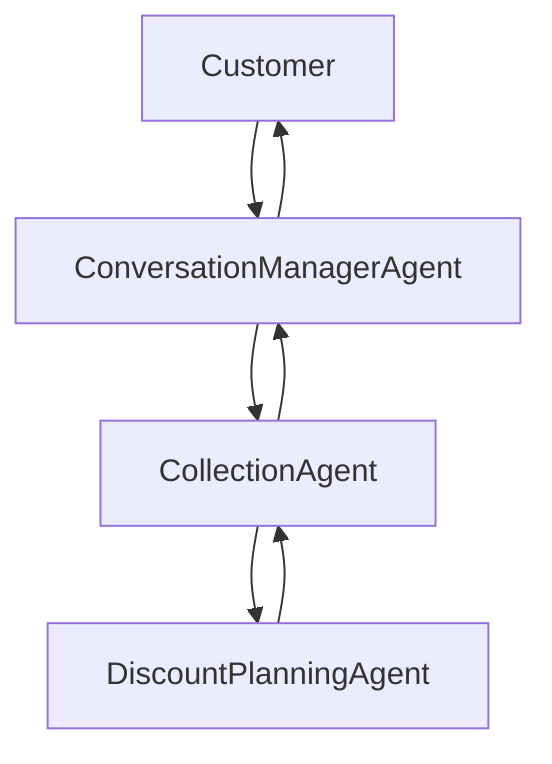

# easy_agents

`easy_agents` is a graph-native agent framework for building Satellite-enabled (tool-using), memory-aware workflows with reusable nodes, flexible LLM backends, and channel integrations such as WhatsApp and Gmail.

Project documentation lives under [docs/](./docs/README.md).

To create a typed Galaxy, Circle, Rocky or Giant Planet, Satellite, Rogue Star,
and Wormhole-routed runtime, follow [Build Your Own Galaxy](./docs/guides/build-your-galaxy.md).

Start here:

- [Getting Started](./docs/getting-started.md)
- [Current Capabilities and Limitations](./docs/reference/current-capabilities.md)
- [Functionality Catalog and Test Matrix](./docs/reference/functionalities/README.md)
- [Create an Agent](./docs/guides/create-an-agent.md)
- [Chat with Your Galaxy](./docs/guides/chat-with-your-galaxy.md)
- [Natural-Language Chat Completion Plan](./docs/plans/natural-language-chat-completion-plan.md)
- [Commons Circle Runtime](./docs/reference/functionalities/commons.md)
- [Personal Agent Constellation](./docs/vision/personal-agent-constellation.md)
- [Galaxy Terminology](./docs/architecture/galaxy-terminology.md)
- [Terminology-First Domain Model Migration](./docs/plans/terminology-domain-model-migration.md)
- [Feature Intake and Draft Charters](./docs/guides/feature-intake.md)
- [Use the Mac-Hosted Gemma Model](./docs/guides/use-local-gemma.md)
- [Explore the Galaxy Knowledge Graph](./docs/guides/constellation-map.md)
- [Run the Complete Specialist Fleet](./docs/guides/run-specialist-fleet.md)
- [Personal Constellation Delivery Plan](./docs/plans/personal-constellation-plan.md)
- [Personal and Deep-Tech Explorer Implementation Plan](./docs/plans/deep-tech-explorer-implementation-plan.md)
- [Documentation Index](./docs/README.md)
- [Framework Overview](./docs/architecture/framework-overview.md)
- [Conversation Management Architecture](./docs/architecture/conversation-management.md)
- [MailMind Overview](./docs/agents/mailmind/overview.md)

The framework is local-first, but external integrations are opt-in rather than offline: hosted LLM providers, Gmail, Twilio, and model downloads require network access. The getting-started path runs without provider credentials.

## Personal Agent Constellation

The repository now includes an offline first slice of the planned personal agent system. It maintains a starter Roster of overlapping Guilds, Specialists, and Capabilities, then analyzes a plain-language feature as one of: reuse an existing capability, compose a Playbook, extend a Specialist, or create a proposed Draft Charter.

```bash
PYTHONPATH=src python -m easy_agents.constellation.cli \
  "Track my electricity bill and remind me before the due date"
```

This command only produces a proposal. It does not run the requested workflow, persist a new agent, grant permissions, or activate generated code.

Visualize active and planned Rocky Planets together with their Circles, Satellites,
memory scopes, Playbooks, policies, models, and platform services:

```bash
./run/constellation.sh
```

Open `http://127.0.0.1:8030`. Use **Chat** for Wormhole-routed Missions,
**Commons** for named Vault memory, artifacts, knowledge sources, scheduled
reviews, approvals, and local calendar proposals, and **Live/Replay** for
operational traces.

List, route, or safely run any of the 70 compiled Specialist Charters:

```bash
PYTHONPATH=src .venv/bin/python -m easy_agents.fleet.cli list
PYTHONPATH=src .venv/bin/python -m easy_agents.fleet.cli route \
  "calculate a satellite RF link budget"
```

## Conversation Manager

Customer-facing collections entrypoints should route through the in-package wrapper at `agents/collection_agent/conversation_manager`, which sits in front of `CollectionAgent` without changing collection business logic:



Responsibilities are split deliberately:

- `ConversationManagerAgent`: wait messages, fillers, interruption handling, stale-response suppression, response delivery timing
- `CollectionAgent`: business logic, verification, planning, routing
- `DiscountPlanningAgent`: hardship and settlement recommendation logic

## Graph Builder UI

Use the local graph builder to compose nodes and export graph references:

```bash
./run/graph_builder.sh
```

Open `http://127.0.0.1:8020`.

The graph builder supports:

- handle-based arrow connections
- node inspector (description, kind, tool access, JSON config)
- mode-aware validation (`chain_of_thought`, `tree_of_thought`, `graph_of_thought`)
- runtime export bundle (`agent-graph.json` + `agent-graph-scaffold.py`)
