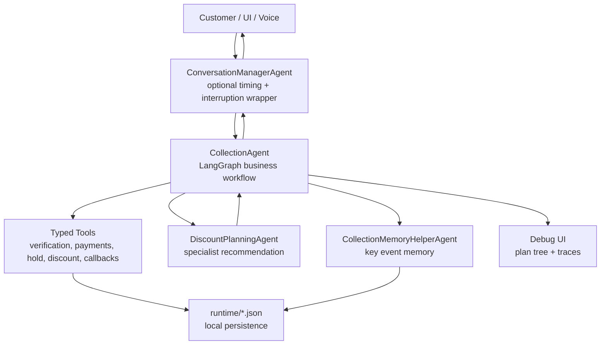
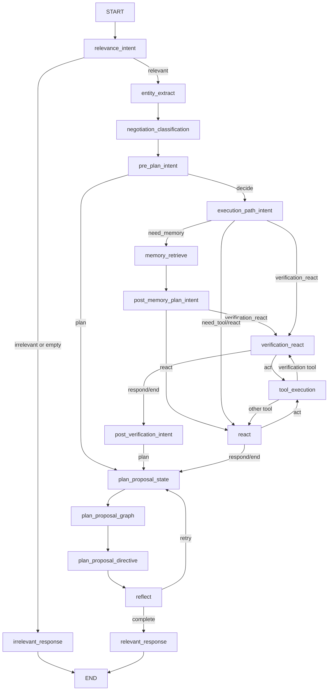

# easy_agents

`easy_agents` is a graph-native agent framework for building tool-using, memory-aware workflows. The repository started as the MailMind email triage project and evolved into a reusable multi-agent platform with a production-style Collections Agent, specialist handoffs, local JSON persistence, optional voice runtime, and a debugging UI.

The current active business workflow is the customer-facing collections assistant under `agents/collection_agent`.

## Current Branch Snapshot

- Active branch during this documentation pass: `ansh/collection/easy-agent`
- Current collection LLM config: `llm.provider: ollama`, model `gemma4:31b-cloud`, OpenAI-compatible route `http://localhost:11434/v1/chat/completions`
- Main collection customer used in recent scenarios: `CUST-2002` / `COLL-1002` / `Rohan Gupta`
- Deep project history and implementation notes: [PROJECT_KNOWLEDGE_BASE.md](./PROJECT_KNOWLEDGE_BASE.md)

## What The Project Does

The repository supports multiple agents, but the main workflow today is Collections:

1. Open a call and identify the agent, company, recording notice, and intended customer.
2. Verify the right party before exposing sensitive account details.
3. Disclose the policy/account, overdue amount, and due date only after verification.
4. Understand the customer's situation.
5. Offer compliant resolutions such as a premium hold, installment discount, partial payment link, promise-to-pay, restructure, callback, or escalation.
6. Execute tools for verification, payment links, premium holds, discounts, SMS/email confirmations, and callbacks.
7. Track every step in a plan tree for the debug UI.
8. Close the conversation with a grace period so late acknowledgements or callback-time revisions can be handled safely.

## High-Level Architecture



The core graph is defined in `agents/collection_agent/agent.py`. It uses reusable framework nodes from `src/nodes`, typed tools from `src/tools` and `agents/collection_agent/tools`, session state from `src/memory/session_store.py`, and file-backed persistence from `agents/collection_agent/repository.py`.

## Repository Structure

```text
agents/
  collection_agent/              Main collections workflow, tools, prompts, UI, data, runtime
  collection_memory_helper_agent/ Key-event memory helper called after selected turns
  discount_planning_agent/        Specialist agent for discount/restructure recommendations
  mailmind/                       Original email triage agent after framework extraction
  simple_conversation/            Simple graph example
  brainstorming_agent/            Example/experimental agent
  coding_agent/                   Example/experimental agent
  orchestrator/                   Multi-agent orchestration docs/assets
src/
  agents/                         Shared BaseAgent and GraphAgent runtimes
  nodes/                          Shared graph node primitives
  tools/                          Tool base, registry, executor, Gmail/math/memory tools
  llm/                            Local, endpoint, OpenAI, Groq, NVIDIA, Ollama-compatible adapters
  memory/                         Session memory and layered hot/warm/cold memory
  interfaces/                     CLI, API, WhatsApp, Pipecat, voice interfaces
  schemas/                        Shared typed data models
  storage/                        JSON and DuckDB storage helpers
  retrieval/                      Vector and hybrid retrieval support
docs/                             Framework and agent documentation
tests/                            Unit and regression tests
```

## Main Collection Graph



## Important Collection Files

| File | Purpose |
| --- | --- |
| `agents/collection_agent/agent.py` | Builds the graph, registers tools, initializes nodes, runs turns, wraps node tracing, and persists turn state. |
| `agents/collection_agent/main.py` | CLI entrypoint and outer orchestration loop for self-hops, discount-agent handoff, and memory-helper handoff. |
| `agents/collection_agent/config.yml` | Runtime config for strict LLM mode, Ollama/Groq/OpenAI/NVIDIA settings, verification rules, tracing, and voice backends. |
| `agents/collection_agent/state.py` | Typed graph-state contract for collection-specific routing, verification, negotiation, plan tree, partial payment, discount, and closing keys. |
| `agents/collection_agent/prompts/agent_prompts.yml` | Prompt catalog for intent classification, negotiation classification, planning, response rendering, and scenario guardrails. |
| `agents/collection_agent/prompts/tool_catalog.yml` | Human-readable tool catalog passed into ReAct nodes. |
| `agents/collection_agent/nodes/*` | Collection-specific node implementations for extraction, routing, planning, response generation, and state reconciliation. |
| `agents/collection_agent/tools/*` | Typed local tools for verification, payment link creation, premium holds, installment discounts, confirmations, callbacks, and escalation. |
| `agents/collection_agent/data/*.json` | Local fixture data for customers, cases, policies, profiles, payment history, offer history, and assistance programs. |
| `agents/collection_agent/runtime/*.json` | Mutable local runtime state and tool outputs. These are logs/state, not stable source-of-truth code. |
| `agents/collection_agent/ui/server.py` | FastAPI debug runtime used by the local plan-tree UI. |
| `agents/collection_agent/conversation_manager/*` | Optional wrapper for response timing, interruption handling, stale response suppression, fillers, and voice coordination. |

## LLM Providers

LLM construction is centralized in `agents/collection_agent/main.py` and `src/llm/factory.py`.

Supported collection providers:

- `openai`: requires `OPENAI_API_KEY`
- `groq`: requires `GROQ_API_KEY`
- `nvidia`: requires `NVIDIA_API_KEY`
- `ollama`: local Ollama at `http://localhost:11434` does not require an API key; remote Ollama Cloud requires `OLLAMA_API_KEY`

The current checked config maps Ollama through the existing OpenAI-compatible adapter:

```yaml
llm:
  enabled: true
  provider: ollama
  model_name: gemma4:31b-cloud
  base_url: http://localhost:11434
  api_path: /v1/chat/completions
  max_new_tokens: 2000
  temperature: 0.1
```

## Setup

From the repository root:

```bash
python -m venv .venv
.\.venv\Scripts\Activate.ps1
python -m pip install --upgrade pip
pip install -e ".[dev]"
```

For optional voice runtime:

```bash
pip install -e ".[voice-realtime,voice-local-tts]"
```

## Run Collection Agent

Interactive CLI:

```bash
python agents/collection_agent/main.py --interactive --session-id collection-demo
```

One-turn CLI:

```bash
python agents/collection_agent/main.py "My phone number is 9900001002 and date of birth is 1988-04-22" --session-id collection-demo
```

Debug UI:

```bash
python -m agents.collection_agent.ui.server
```

Open:

```text
http://127.0.0.1:8060/
```

## Test

The project is configured for pytest:

```bash
pytest
```

If the active virtual environment does not have pytest installed, install dev dependencies with:

```bash
pip install -e ".[dev]"
```

Recent scenario-specific regression files include:

- `tests/test_premium_hold_tools.py`
- `tests/test_installment_discount_flow.py`
- `tests/test_partial_payment_flow.py`
- `tests/test_plan_proposal_split_nodes.py`
- `tests/test_outbound_callback_scheduler.py`

## Implemented Collection Scenarios

The current codebase and recent workspace changes cover these scenarios:

- Strict opening and identity verification.
- Wrong or unverified party: no disclosure, privacy-safe callback request, callback scheduling, and clean close.
- Job loss with 2-month premium hold, generated `HOLD-*` reference, SMS/email confirmation, named closing.
- Job loss where the customer is unsure after the hold: approved 10% installment discount for `LOAN-3002`, generated `DISC-*` reference, SMS/email confirmation, revised amount, named closing.
- Partial payment: LLM-extracted amount or percentage, policy minimum validation, generated `PAY-*` link, SMS confirmation, remaining-balance response, named closing.
- Full payment / payment link.
- Promise-to-pay and follow-up scaffolding.
- Discount specialist handoff for explicit discounts, waivers, settlements, counter-offers, or exceptions.
- Debug plan-tree status tracking for done, pending, skipped, in-progress, and closing states.

## Current Technical Notes

- `strict_llm_mode: true` means structured LLM output is required for many nodes. Broken or truncated JSON will fail instead of silently falling back.
- Scenario wording is hybrid: LLM wording is allowed for human-sounding offers, but deterministic guards/tools control facts such as reference numbers, revised amounts, payment links, SMS/email confirmation status, and privacy disclosures.
- Runtime files under `agents/collection_agent/runtime/` are modified by local runs.
- Pull request comments were not available in the local repository; this documentation uses local git commits, branches, files, prompts, tests, and runtime code only.

## More Documentation

- [Full project knowledge base](./PROJECT_KNOWLEDGE_BASE.md)
- [Collection Agent README](./agents/collection_agent/README.md)
- [Collection Agent Engineering Book](./agents/collection_agent/documentation/CollectionAgent_Engineering_Book.md)
- [Node Reference](./agents/collection_agent/documentation/Node_Reference.md)
- [Tool Reference](./agents/collection_agent/documentation/Tool_Reference.md)
- [Framework Overview](./docs/architecture/framework-overview.md)
- [Memory Architecture](./docs/architecture/memory-architecture.md)
