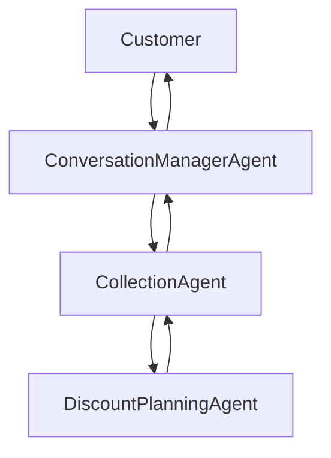

# easy_agents

`easy_agents` is a graph-native agent framework for building tool-using, memory-aware workflows with reusable nodes, flexible LLM backends, and channel integrations such as WhatsApp and Gmail.

Project documentation lives under [docs/](./docs/README.md).

Start here:

- [Documentation Index](./docs/README.md)
- [Framework Overview](./docs/architecture/framework-overview.md)
- [Conversation Management Architecture](./docs/architecture/conversation-management.md)
- [MailMind Overview](./docs/agents/mailmind/overview.md)

## Conversation Manager

Customer-facing collections entrypoints should route through the in-package wrapper at `agents/collection_agent/conversation_manager`, which sits in front of `CollectionAgent` without changing collection business logic:



Responsibilities are split deliberately:

- `ConversationManagerAgent`: wait messages, fillers, interruption handling, stale-response suppression, response delivery timing
- `CollectionAgent`: business logic, verification, planning, routing
- `DiscountPlanningAgent`: hardship and settlement recommendation logic

## Graph Builder UI

Use the local graph builder to compose nodes and export graph references:

```bash
./run/graph_builder.sh
```

Open `http://127.0.0.1:8020`.

The graph builder supports:

- handle-based arrow connections
- node inspector (description, kind, tool access, JSON config)
- mode-aware validation (`chain_of_thought`, `tree_of_thought`, `graph_of_thought`)
- runtime export bundle (`agent-graph.json` + `agent-graph-scaffold.py`)
