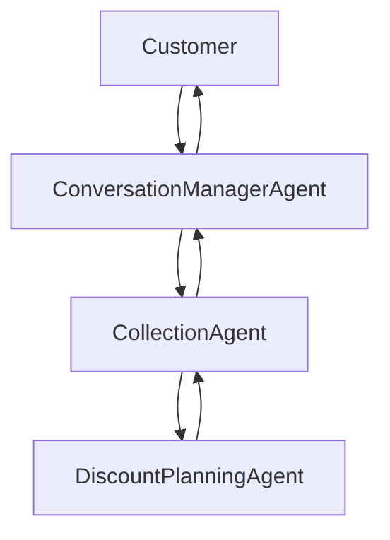

# Conversation Manager Agent

`ConversationManagerAgent` lives inside `agents/collection_agent/conversation_manager` and wraps the collection runtime without changing collection business logic.

## Purpose

- prevent dead air
- manage fillers and wait messages
- monitor latency
- preserve conversational continuity while waiting
- support latest-input-wins interruption handling for the text debug UI
- suppress stale responses that finish after a newer request started
- replay buffered responses for repeat requests without recomputing business logic
- track partial delivery state for future voice barge-in support
- deliver the final `collection_agent` response once ready

## Architecture



Ownership:

- `ConversationManagerAgent`: customer-facing pacing, fillers, latency monitoring
- `CollectionAgent`: collections business decisions, verification, planning, routing
- `DiscountPlanningAgent`: hardship / settlement / concession recommendation logic

## Components

- `ConversationManagerAgent.py`
- `ResponseBuffer.py`
- `MessageDeliveryTracker.py`
- `BargeInHandler.py`
- `InterruptionPolicy.py`
- `FillerManager.py`
- `LatencyMonitor.py`
- `ConversationManagerConfig.py`
- `filler_library.json`
- `runtime.py`
- `server.py`
- `pipecat_bot.py`

## Latency categories

- `instant`: 0-2s
- `short_wait`: 2-5s
- `medium_wait`: 5-10s
- `long_wait`: 10s+

Thresholds and repeat intervals are controlled by `ConversationManagerConfig`.

## Filler behavior

- `short_wait`: emit once
- `medium_wait`: repeat on configured cadence
- `long_wait`: repeat on configured cadence

The wrapper uses timer-based monitoring by default and forwards downstream progress events when available. It does not require any change to `collection_agent`.

## Interruption handling

Text debug UI mode uses latest-input-wins:

- a newer customer input supersedes the currently running request
- fillers stop for the superseded request
- stale responses are logged and buffered but not delivered
- repeat requests such as "Can you repeat that?" replay the last buffered response

Future voice mode uses the same delivery layer and adds:

- partial-delivery tracking
- interruption metadata
- replay from full message or unspoken tail, based on config
- VAD-enabled interruption handling when the caller barges in during TTS
- stale-response suppression if a newer spoken request supersedes an older in-flight request

## Runtime integration

Use the wrapper server instead of calling the collection debug runtime directly:

```bash
python -m agents.collection_agent.conversation_manager.server
```

Default port:

- `8061`

The wrapper reuses the existing collection UI routes and static assets, but routes requests through `ConversationManagerAgent`.

CLI entrypoint:

```bash
python -m agents.collection_agent.conversation_manager.main --interactive
```

## Logs

Separate logs are stored under:

- `agents/collection_agent/conversation_manager/runtime/logs/conversation_manager.jsonl`

Each turn log includes:

- `conversation_id`
- `request_id`
- `customer_input_id`
- `wait_duration_ms`
- `filler_messages_sent`
- `filler_categories`
- `response_delivery_time_ms`
- `interruption_type`
- `response_suppressed`
- `repeat_request_detected`
- `replayed_from_buffer`

## Example trace snippets

See:

- `agents/collection_agent/conversation_manager/runtime/examples/instant_response_trace.json`
- `agents/collection_agent/conversation_manager/runtime/examples/long_wait_trace.json`
