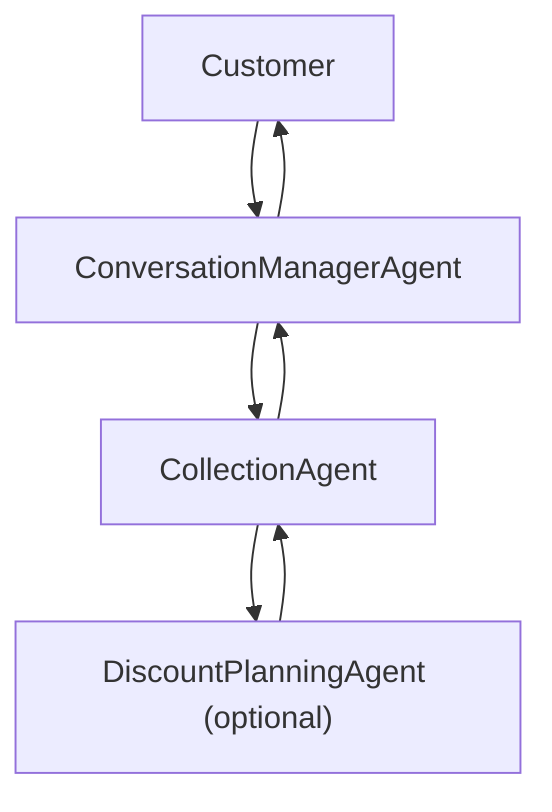
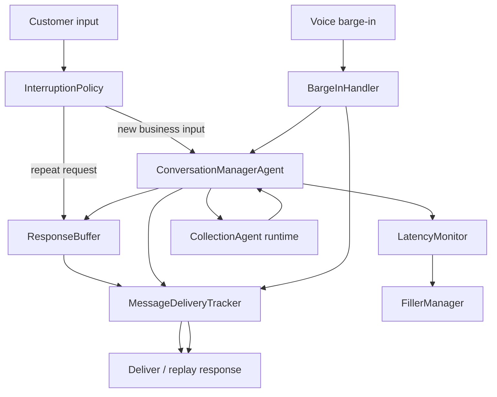

# Conversation Manager Agent

Customer-facing wrapper around `CollectionAgent`.

Important: this layer is **not** a LangGraph graph. It is a runtime wrapper that sits around the collection business agent and owns pacing, interruption handling, fillers, replay, and delivery tracking.

## First-time setup (run-only)

Use this section when someone is running the conversation-managed collection stack for the first time.

### 1) Python environment

From repo root (`/Users/saketm10/Projects/openclaw_agents`):

```bash
python3 -m venv .venv
source .venv/bin/activate
python -m pip install --upgrade pip
pip install -e .
```

Optional realtime voice dependencies:

```bash
pip install ".[voice-realtime]"
```

Optional local embedding-backed TTS dependencies:

```bash
pip install ".[voice-realtime,voice-local-tts]"
```

### 2) Environment variables

Conversation Manager reuses the downstream Collection Agent runtime, so it only needs the environment variables required by the configured downstream backends.

Create or update `.env` at repo root:

```bash
# Only needed if you switch config to llm.provider=openai
OPENAI_API_KEY=sk-...
```

Load variables into the current shell:

```bash
set -a
source .env
set +a
```

Notes:

- Collection Agent currently defaults to `llm.provider: groq` in [agents/collection_agent/config.yml](/Users/saketm10/Projects/openclaw_agents/agents/collection_agent/config.yml).
- The default voice path now uses the same local Faster-Whisper + SpeechT5 direction as `deep-saket/smruti`.
- `NVIDIA_API_KEY` is only required if you switch `voice_runtime.stt_backend` or `voice_runtime.tts_backend` to `nvidia`, or if you switch the main LLM provider to NVIDIA.
- Voice backend selection is configured in the same collection-agent config file under `voice_runtime`.

### 3) Run the integrated debug UI

This is the primary path used in this repo today. The collection debug UI already boots the conversation-managed runtime.

```bash
python -m agents.collection_agent.ui.server
```

Open:

- `http://127.0.0.1:8060/`

### 4) Run the wrapper server directly

If you want the conversation-manager server entrypoint explicitly:

```bash
python -m agents.collection_agent.conversation_manager.server
```

Open:

- `http://127.0.0.1:8061/`

### 5) Run the interactive CLI

```bash
python -m agents.collection_agent.conversation_manager.main --interactive
```

### 6) Quick health checks

Integrated UI:

```bash
curl http://127.0.0.1:8060/health
```

Wrapper server:

```bash
curl http://127.0.0.1:8061/health
```

Expected response:

```json
{"status":"ok"}
```

## Core idea

- `CollectionAgent` stays responsible for business logic.
- `ConversationManagerAgent` is the only customer-facing delivery layer.
- The wrapper forwards customer input to `CollectionAgent`, waits, emits fillers while waiting, and decides whether to deliver, suppress, replay, or interrupt a response.
- Interruption handling, stale-response suppression, and repeat-request replay live here, not inside the collection graph.

## Conversation Manager Runtime Contract

Conversation Manager uses:

- Per-session wrapper runtime state: [ConversationManagerAgent.py](/Users/saketm10/Projects/openclaw_agents/agents/collection_agent/conversation_manager/ConversationManagerAgent.py)
- Delivery-tracking state: [MessageDeliveryTracker.py](/Users/saketm10/Projects/openclaw_agents/agents/collection_agent/conversation_manager/MessageDeliveryTracker.py)
- Buffered response state: [ResponseBuffer.py](/Users/saketm10/Projects/openclaw_agents/agents/collection_agent/conversation_manager/ResponseBuffer.py)

Important: this state is wrapper-owned. It does **not** replace the collection agent graph state or memory contract.

### 1) Session-control state

`ConversationManagerAgent` keeps one `_SessionControlState` per customer session:

| Key | Meaning |
| --- | --- |
| `active_request_id` | Current in-flight request id |
| `active_customer_input` | Customer input currently being processed |
| `active_task_status` | `idle`, `running`, `completed`, or `superseded` |
| `latest_customer_input_id` | Latest customer message id |
| `superseded_request_ids` | Requests that lost to a newer request |
| `pending_response` | Most recent completed/suppressed response metadata |
| `last_delivered_response_id` | Last response actually delivered to the customer |
| `last_delivered_message_id` | Last delivery-tracker message id |
| `suppressed_response_count` | Number of stale responses suppressed |
| `interrupted_request_id` | Request interrupted by a newer text/voice input |
| `interrupted_customer_input` | Customer text tied to the interrupted request |
| `interruption_handoff` | Previous/current input bundle passed into the next turn |

### 2) Buffered response contract

`ResponseBuffer` stores downstream business responses for:

- repeat-request replay
- stale-response retention for debugging
- voice partial-delivery recovery

Buffered response records include:

- `session_id`
- `request_id`
- `response_id`
- `message_id`
- `response_target`
- `message_text`
- `delivery_status`
- `suppressed`
- `conversation_manager`
- `delivery`

### 3) Delivery-tracker contract

`MessageDeliveryTracker` records customer-facing delivery lifecycle:

- `message_id`
- `response_id`
- `message_text`
- `delivery_mode`
- `delivery_status`
- `started_at`
- `completed_at`
- `interrupted_at`
- `spoken_ms`
- `estimated_total_ms`
- `spoken_characters`
- `total_characters`
- `spoken_pct`
- `unspoken_text`

### 4) Conversation-manager log fields

Wrapper logs are written to:

- `agents/collection_agent/conversation_manager/runtime/logs/conversation_manager.jsonl`

Common fields include:

- `conversation_id`
- `request_id`
- `customer_input_id`
- `customer_input`
- `wait_duration_ms`
- `filler_messages_sent`
- `filler_categories`
- `filler_count`
- `response_delivery_time_ms`
- `repeat_request_detected`
- `replayed_from_buffer`
- `interruption_detected`
- `interruption_type`
- `response_suppressed`
- `interruption_handoff`
- `downstream_customer_input`
- `delivery_status`
- `delivery`

## Component ownership map

| Component | Responsibility |
| --- | --- |
| `ConversationManagerAgent` | Session control, request lifecycle, delivery decisions, downstream runtime invocation |
| `InterruptionPolicy` | Repeat-request detection and high-level interruption policy rules |
| `LatencyMonitor` | Threshold-based wait monitoring and filler scheduling |
| `FillerManager` | Filler phrase library loading and selection |
| `ResponseBuffer` | Replayable/suppressed response storage |
| `MessageDeliveryTracker` | Delivery lifecycle tracking for text and voice |
| `BargeInHandler` | Voice/text interruption handling against active delivery |
| `ConversationManagedRuntime` | Adapter that wraps `CollectionDebugRuntime` with conversation-manager behavior |
| `pipecat_bot.py` | Voice runtime entrypoint that uses the wrapper for live call turns |

## Wrapper architecture

This is the external ownership/runtime architecture, not a LangGraph graph:



Interpretation:

- Customer messages enter the conversation layer first.
- `CollectionAgent` remains the business decision engine.
- `DiscountPlanningAgent` remains a downstream business specialist invoked by the collection layer.
- The conversation manager decides how and when the final business response is delivered.

## Internal interaction flow

This is the internal component flow used by the wrapper while one request is running:



## Latency model

Latency thresholds are defined in [ConversationManagerConfig.py](/Users/saketm10/Projects/openclaw_agents/agents/collection_agent/conversation_manager/ConversationManagerConfig.py).

Categories:

- `instant`: below `short_wait_seconds`
- `short_wait`: `short_wait_seconds` to `medium_wait_seconds`
- `medium_wait`: `medium_wait_seconds` to `long_wait_seconds`
- `long_wait`: `long_wait_seconds` and above

Current defaults:

- `short_wait_seconds = 2.0`
- `medium_wait_seconds = 5.0`
- `long_wait_seconds = 10.0`
- `medium_wait_repeat_seconds = 4.5`
- `long_wait_repeat_seconds = 8.5`
- `monitor_poll_seconds = 0.2`

## Filler behavior

Filler prompts are loaded from:

- [filler_library.json](/Users/saketm10/Projects/openclaw_agents/agents/collection_agent/conversation_manager/filler_library.json)

Default behavior:

- `short_wait`: emit once
- `medium_wait`: repeat on configured cadence
- `long_wait`: repeat on configured cadence

The wrapper uses timer-based monitoring by default and can also forward downstream runtime events when available.

## Interruption handling

### Text mode

Text debug UI uses latest-input-wins:

- a newer customer input supersedes the currently running request
- fillers stop for the superseded request
- stale responses are logged and buffered but not delivered
- repeat requests such as “Can you repeat that?” replay the last buffered response
- new business information is forwarded to `CollectionAgent`

### Voice mode

Voice mode uses the same wrapper contract and adds:

- partial-delivery tracking
- interruption metadata
- replay from full message or unspoken tail, based on config
- VAD-enabled interruption handling when the caller barges in during TTS
- stale-response suppression if a newer spoken request supersedes an older in-flight request
- configurable TTS backends, including local SpeechT5 with speaker embeddings

Important: voice interruption progress is still estimate-based unless the underlying TTS stack exposes precise playback callbacks.

## Runtime integration

The integrated UI path already uses the wrapper:

- [agents/collection_agent/ui/server.py](/Users/saketm10/Projects/openclaw_agents/agents/collection_agent/ui/server.py) creates `ConversationManagedRuntime`
- `ConversationManagedRuntime` wraps `CollectionDebugRuntime`

The explicit wrapper runtime is implemented in:

- [runtime.py](/Users/saketm10/Projects/openclaw_agents/agents/collection_agent/conversation_manager/runtime.py)

Key behavior:

- `run_turn()` delegates to `ConversationManagerAgent.run_turn()`
- `run_turn_stream()` delegates to `ConversationManagerAgent.run_turn_stream()`
- session state is augmented with `conversation_manager`
- voice calls are started/stopped through `ConversationManagerVoiceProcessManager`

## UI and debugging

The debug UI now exposes two inspectors:

- `Conversation Inspector`
- `Collection Agent Inspector`

Conversation-manager debugging includes:

- `Conversation Manager State`
- `Conversation Manager Logs`
- `Conversation Nodes Explored`
- `Conversation Node Prompt / Response`
- `Conversation Node State`
- `Conversation Node Output`
- `Conversation State Diff`

This inspector is derived from wrapper runtime state and logs, not from LangGraph node events.

## Quick debug checks

When conversation delivery behavior looks wrong, inspect these first:

1. `active_request_id`, `active_task_status`, `latest_customer_input_id`
2. `superseded_request_ids`, `suppressed_response_count`
3. `interrupted_request_id`, `interrupted_customer_input`, `interruption_handoff`
4. `repeat_request_detected`, `replayed_from_buffer`
5. `filler_count`, `filler_messages_sent`, `wait_duration_ms`
6. `delivery_status`, `delivery.spoken_pct`, `delivery.unspoken_text`
7. `buffered_responses`
8. `downstream_customer_input` versus current customer input

## Example trace snippets

See:

- [instant_response_trace.json](/Users/saketm10/Projects/openclaw_agents/agents/collection_agent/conversation_manager/runtime/examples/instant_response_trace.json)
- [long_wait_trace.json](/Users/saketm10/Projects/openclaw_agents/agents/collection_agent/conversation_manager/runtime/examples/long_wait_trace.json)
