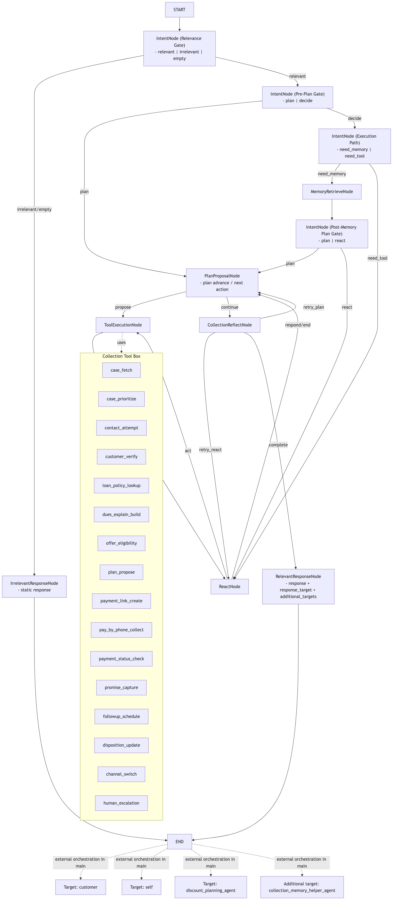

# Collection Agent Engineering Book

Version: 2026-05-04

Owner: Collections AI Engineering

---

## Table of Contents

1. Purpose and Scope
2. Business Process Mapping
3. System Architecture
4. Graph Topology and Runtime Loop
5. State Model and Memory Model
6. Node-by-Node Deep Dive
7. Tool Catalog Deep Dive
8. End-to-End Flow Walkthroughs
9. Sample Conversations
10. Code Ideology and Design Principles
11. How to Extend the Agent
12. Future Modification Playbook
13. Operational Runbook
14. Testing and Debugging Playbook
15. Appendix: Key Files

---

## 1) Purpose and Scope

The Collection Agent is a graph-driven debt-collection assistant for demo and pre-production workflows. It supports:

- outbound collections call opening
- identity verification before sensitive dues disclosure
- dues explanation and payment intent collection
- assistance path (discount/restructure) routing
- follow-up scheduling and disposition updates
- handoffs to specialist agents through orchestration loops outside the graph

The graph itself performs one bounded forward pass and always ends at a response node. Multi-hop orchestration (self-loop, specialist agent handoff, customer loop) happens in the outer runtime controller.

---

## 2) Business Process Mapping

Human collections-team actions mapped to graph + tools:

| Human activity | Graph phase | Main node/tool |
| --- | --- | --- |
| Select case and understand delinquency context | plan/bootstrap | `plan_proposal`, `case_fetch` |
| Contact borrower and establish call context | response packaging | `relevant_response` |
| Verify identity before details | plan + verify gate | `verify_identity` plan step + `customer_verify` |
| Explain dues and options | execution + response | `dues_explain_build`, `loan_policy_lookup`, `relevant_response` |
| Ask payment intent and collect payment | execution | `payment_link_create`, `pay_by_phone_collect`, `payment_status_check` |
| If cannot pay, offer policy-compliant options | planning + tooling | `offer_eligibility`, `plan_propose` |
| Capture promise-to-pay and schedule follow-up | execution | `promise_capture`, `followup_schedule` |
| Escalate sensitive disputes | execution | `human_escalation` |
| Finalize and log outcome | execution | `disposition_update` |

---

## 3) System Architecture

### 3.1 Core components

- Graph runtime: `langgraph` state graph
- Node library: shared nodes under `src/nodes`, collection-specific nodes under `agents/collection_agent/nodes`
- Tooling: typed tool classes under `agents/collection_agent/tools`
- Session memory: `ConversationMemory` via `SessionStore`
- UI runtime: FastAPI debug server + web UI
- Voice runtime: Pipecat bridge process for call mode

### 3.2 Primary execution assets

- Graph definition: `agents/collection_agent/agent.py`
- Plan logic: `agents/collection_agent/nodes/plan_proposal_node.py`
- Intent logic: `agents/collection_agent/nodes/collection_intent_node.py`
- Response packaging: `agents/collection_agent/nodes/collection_response_node.py`
- Prompt definitions: `agents/collection_agent/prompts/agent_prompts.yml`
- Tool descriptions: `agents/collection_agent/prompts/tool_catalog.yml`

---

## 4) Graph Topology and Runtime Loop

### 4.1 Graph asset



Also available:

- `agents/collection_agent/graph.mmd`
- `agents/collection_agent/graph.png`
- `agents/collection_agent/graph.jpg`

### 4.2 Topology semantics

- Start at `relevance_intent`
- Out-of-scope path terminates quickly through `irrelevant_response`
- In-scope path routes through pre-plan and execution gating
- `react` + `tool_execution` loop handles tool selection and execution
- `plan_proposal` creates/updates plan tree and routing intent
- `reflect` validates completion and may route back
- `relevant_response` packages final outward message

### 4.3 Outer-loop orchestration (outside graph)

After each pass, output includes:

- `response` (message)
- `response_target` (`customer` or `self`)
- optional `additional_targets`

Outer controller decides next recipient.

---

## 5) State Model and Memory Model

### 5.1 Core graph keys

- `session_id`, `turn_id`, `user_input`
- `user_id`, `case_id`, `channel`
- `node_history`, `previous_node`, `next_node`
- `conversation_phase`
- `response`, `response_target`, `route`
- `conversation_plan` (active plan tree)

### 5.2 Namespaced intent outputs

- `relevance_intent`
- `pre_plan_intent`
- `execution_path_intent`
- `post_memory_plan_intent`

### 5.3 Verification state (important)

- `identity_verified` (boolean)
- `verification_collected` (partial details detected from borrower utterances)
- `active_verification_required_fields` (required challenge keys)
- `verification_failed_attempts`

### 5.4 Plan tree state

- `plan_id`, `version`, `status`
- `nodes[]`, `edges[]`
- `root_node_id`, `current_node_id`, `next_node_ids`
- `step_markers` with per-node state (`pending|done|skipped|blocked`)
- `timeline[]`, `revision_log[]`

---

## 6) Node-by-Node Deep Dive

### 6.1 `relevance_intent` (`CollectionIntentNode`)

Responsibilities:

- classify `relevant|irrelevant|empty`
- uses LLM structured output
- appends conversation context block to prompt
- applies context-aware relevance guard for identity replies in active sessions

Inputs:

- `user_input`
- memory context (`active_case_id`, `last_agent_response`, plan position)

Outputs:

- `relevance_intent`
- compatibility `intent`
- optional static response for irrelevant/empty

### 6.2 `pre_plan_intent` (`CollectionIntentNode`)

Responsibilities:

- classify `plan|decide`
- route directly to plan proposal or deeper execution path

### 6.3 `execution_path_intent` (`CollectionIntentNode`)

Responsibilities:

- classify `need_memory|need_tool`
- avoids unnecessary memory retrieval when direct tool action is enough

### 6.4 `memory_retrieve` (`MemoryRetrieveNode`)

Responsibilities:

- loads working memory context into graph state
- informs post-memory routing and planning

### 6.5 `post_memory_plan_intent` (`CollectionIntentNode`)

Responsibilities:

- classify `plan|react` after memory hydration
- if plan-ready, route to `plan_proposal`; else route to `react`

### 6.6 `react` (`ReactNode`)

Responsibilities:

- choose one of: `act`, `respond`, `end`
- when `act`, produce tool name + arguments
- when `respond/end`, hand control to plan proposal for structured response planning

### 6.7 `tool_execution` (`ToolExecutionNode`)

Responsibilities:

- execute selected tool through registry/executor
- emit structured `observation.tool_phase`

### 6.8 `plan_proposal` (`PlanProposalNode`)

Responsibilities:

- propose plan intent and next actions
- build and update conversation plan tree
- maintain step markers and enforce predecessor gating
- assign `response_target`

Critical guardrail added:

- `verify_identity` cannot be marked done unless `customer_verify` tool returns `status="verified"`

### 6.9 `reflect` (`CollectionReflectNode`)

Responsibilities:

- assess whether output is complete
- route to `retry_react`, `retry_plan_proposal`, or `complete`

### 6.10 `relevant_response` (`CollectionResponseNode`)

Responsibilities:

- convert plan + state into user-facing message
- enforce target-safe message packaging (`customer` vs `self`)
- prevent internal graph/tool jargon leakage
- enforce verification guard before dues explanation

Verification guard behavior:

- if current step is `verify_identity` and `identity_verified=false`, response requests missing verification fields
- does not advance to dues explanation prematurely

### 6.11 `irrelevant_response` (`CollectionResponseNode` static mode)

Responsibilities:

- generate fixed out-of-scope response
- terminate pass safely

---

## 7) Tool Catalog Deep Dive

| Tool | Primary role | Inputs | Output contract | Notes |
| --- | --- | --- | --- | --- |
| `case_fetch` | fetch case facts | `case_id?`, `customer_id?`, `portfolio_id?` | `total`, `cases[]` | base case context |
| `case_prioritize` | queue ranking | `case_ids?`, `portfolio_id?` | `total`, `queue[]` | prioritization |
| `contact_attempt` | outreach log | `case_id`, `channel?`, `reached?` | `attempt_id`, `status` | compliance trail |
| `customer_verify` | identity verification | `case_id?`, `customer_id?`, `challenge_answers?` | `status`, `failed_attempts`, `required_fields` | must be `verified` to complete verify step |
| `loan_policy_lookup` | policy constraints | `case_id?`, `loan_id?` | policy object | governance layer |
| `dues_explain_build` | dues narration | `case_id` | `total_due`, `explanation` | borrower-safe summary |
| `offer_eligibility` | concession eligibility | `case_id`, `hardship_flag?`, `requested_waiver_pct?` | `allowed`, `offer_type` | policy-aware assistance |
| `plan_propose` | EMI plan proposal | `case_id`, `hardship_reason?`, `revision_index?`, `max_installment_amount?` | `plan_id`, `monthly_amount`, `first_due_date` | hardship path |
| `payment_link_create` | digital payment | `case_id`, `amount`, `channel?` | `payment_reference_id`, `payment_url` | pay-now path |
| `pay_by_phone_collect` | call payment simulation | `case_id`, `amount`, `consent_confirmed?` | `payment_id`, `status`, `receipt_reference` | voice path |
| `payment_status_check` | settlement confirmation | `payment_reference_id` | `status`, `needs_additional_action` | reconciliation |
| `promise_capture` | promise logging | `case_id`, `promised_date`, `promised_amount` | `promise_id`, `status` | follow-up anchor |
| `followup_schedule` | callback scheduling | `case_id`, `scheduled_for`, `preferred_channel?` | `schedule_id` | deferred collection |
| `disposition_update` | final outcome log | `case_id`, `disposition_code`, `notes` | `audit_id`, `updated_at` | reporting |
| `channel_switch` | channel transition | `case_id`, `from_channel?`, `to_channel?` | `switch_id`, `carried_context_summary` | continuity |
| `human_escalation` | specialist escalation | `case_id`, `reason` | `escalation_id`, `queue`, `priority` | exception path |

---

## 8) End-to-End Flow Walkthroughs

### Flow A: Standard collections call

1. Admin initializes case/customer context
2. Agent opens call and asks payment intent
3. Borrower asks for help
4. Agent asks identity verification details
5. Borrower provides required details
6. `customer_verify` confirms verification
7. Agent explains dues and proposes payment
8. Borrower chooses pay-now or follow-up
9. Tool path executes and response closes turn

### Flow B: Incomplete identity

1. Borrower gives only name
2. Plan remains at `verify_identity`
3. Response asks for missing DOB / PAN last4 / ZIP
4. No dues disclosure yet

### Flow C: Hardship route

1. Borrower says cannot pay
2. Plan shifts to `evaluate_assistance`
3. `offer_eligibility` + `plan_propose` path executed
4. Agent offers revised plan and asks commitment

---

## 9) Sample Conversations

### 9.1 Correct verification progression

Agent: This is Alex from collections. Your overdue amount is INR 12500. Are you available to discuss payment today?

Customer: Sorry for the delay, how can you help me?

Agent: I can help with payment now or a repayment arrangement. Before I share details, please confirm your full name and the last 4 of your PAN, plus date of birth and ZIP.

Customer: My name is Aditi Sharma.

Agent: Thank you, Aditi Sharma. To complete verification, please also share your date of birth (YYYY-MM-DD), the last 4 characters of your PAN, and your registered ZIP/pincode.

### 9.2 Verified and dues explanation

Customer: DOB 1991-08-19, PAN last 4 AF4K, ZIP 560102.

Agent: Thank you, verification is complete. Your total due is INR 13350. Would you like a payment link now, or do you need an arrangement?

### 9.3 Out-of-scope rejection

Customer: Tell me cricket score.

Agent: This request is outside collections scope. I can only help with loan dues, EMI, payments, verification, hardship plans, and follow-ups.

---

## 10) Code Ideology and Design Principles

### 10.1 Deterministic shell around probabilistic core

- LLM used for classification, planning, and message composition
- deterministic guards enforce compliance-critical transitions
- example: verify step cannot complete without `customer_verify=verified`

### 10.2 One-pass graph, explicit outer orchestration

- graph stays bounded and debuggable
- multi-agent or self-loop behavior orchestrated at outer layer

### 10.3 Namespaced state and typed tool contracts

- intent outputs namespaced by node role
- tool I/O validated by schema
- route logic remains explicit and inspectable

### 10.4 Human-debuggable traces first

- node-level trace events
- node history, previous/next node, phase labels
- state snapshots for UI right-pane debugging

---

## 11) How to Extend the Agent

### 11.1 Add a new tool

1. Create tool class file under `agents/collection_agent/tools/`
2. Define typed input/output schemas
3. Register tool in `CollectionAgent._build_tool_registry`
4. Add tool metadata to `prompts/tool_catalog.yml`
5. Update tool table in docs
6. Add test fixtures and sample conversation coverage

### 11.2 Add a new node

1. Implement node class under `agents/collection_agent/nodes/`
2. Add node in `CollectionAgent._build_graph`
3. Wire conditional/static edges
4. Update `_ROUTE_NEXT_NODE_MAP` / `_STATIC_NEXT_NODE_MAP`
5. Add phase mapping in `_phase_for_node`
6. Document state keys produced by node

### 11.3 Change verification policy

- customer challenge fields live in `agents/collection_agent/data/customers.json`
- verification output contract in `customer_verify_tool.py`
- plan completion gating in `plan_proposal_node.py`
- customer-facing guard in `collection_response_node.py`

### 11.4 Add specialist agent handoff

1. Keep handoff out of internal graph topology
2. Emit target in `response_target` or `additional_targets`
3. Implement hop in outer orchestrator (`main.py` / UI runtime)
4. Ensure bounded hop cap and timeout guards

---

## 12) Future Modification Playbook

### High-priority improvements

- explicit conversation act model (intent + slot status + confidence)
- robust validation of `challenge_answers` extraction for voice transcripts
- stronger anti-hallucination guardrails in response packaging
- policy simulation mode vs strict production policy mode

### Medium-priority improvements

- replayable deterministic test harness for node/edge traversal
- branch quality scoring for plan-tree alternatives
- multilingual response style packs

### Long-term roadmap

- agent-to-agent protocol standardization
- unified memory service with retrieval quality metrics
- runtime policy engine with explainable decisions

---

## 13) Operational Runbook

### Start UI

```bash
cd /Users/saketm10/Projects/openclaw_agents
./ui-render.sh
```

### API health

```bash
curl http://127.0.0.1:8060/health
```

### Voice runtime (Pipecat test client)

- Web client URL typically hosted at `http://127.0.0.1:8788/client/`
- Keep collection UI and voice runtime logs separate

### Reset runtime data (optional)

- clear runtime traces and session files only when starting a fresh demo set
- keep fixtures in `data/` unchanged

---

## 14) Testing and Debugging Playbook

### 14.1 Identity progression test

- start user A
- send: `My name is Aditi Sharma`
- expected: asks for missing verification fields
- expected plan node: `verify_identity`
- expected marker state for verify step: `pending`

### 14.2 Verify completion test

- send full verification details
- run `customer_verify`
- expected marker for `verify_identity`: `done`
- expected next node: `explain_dues`

### 14.3 Guardrail tests

- out-of-scope input should route to `irrelevant_response`
- tool failures should not auto-complete customer-owned steps
- self-target loops should honor hop limits

---

## 15) Appendix: Key Files

- `agents/collection_agent/agent.py`
- `agents/collection_agent/state.py`
- `agents/collection_agent/nodes/collection_intent_node.py`
- `agents/collection_agent/nodes/plan_proposal_node.py`
- `agents/collection_agent/nodes/collection_response_node.py`
- `agents/collection_agent/prompts/agent_prompts.yml`
- `agents/collection_agent/prompts/tool_catalog.yml`
- `agents/collection_agent/tools/customer_verify_tool.py`
- `agents/collection_agent/ui/server.py`
- `agents/collection_agent/ui/app.js`

---

End of document.
