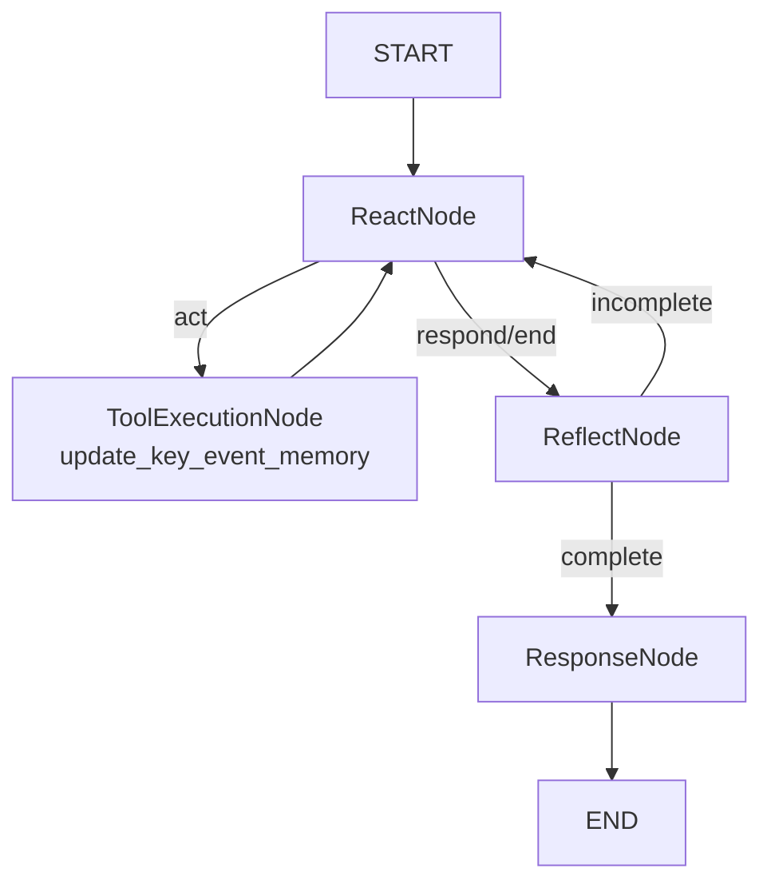

# Collection Memory Helper Agent

This helper agent decides what to store in memory and how to store it.
It updates two JSON memories under `agents/collection_agent/runtime/memory`.

## Memory Types

- Global key event memory (`global_key_event_memory.json`)
  - cross-user successful/unsuccessful procedural cues
  - event counters and sample signals that influence planning prompts

- User key event memory (`user_key_event_memory.json`)
  - user-level conversation summary (latest)
  - user-level procedural key points for follow-up calls
  - user-level follow-up considerations and outcome history

## Graph

## Node Definitions

### `ReactNode`

- Plans memory-update action for current trigger payload.
- Chooses whether to execute update tool or proceed to final response.

### `ToolExecutionNode (update_key_event_memory)`

- Extracts key events from conversation content.
- Summarizes conversation and writes:
- global key-event memory JSON
- user key-event memory JSON

### `ReflectNode`

- Validates whether memory update was complete and consistent.
- Routes back to React when update is incomplete.

### `ResponseNode`

- Emits concise system response for orchestration logs/diagnostics.
- Ends helper-agent pass.

## Tool Table

| Tool | Description | Input | Output |
| --- | --- | --- | --- |
| `update_key_event_memory` | Extracts procedural key points, summarizes conversation, classifies outcome, and updates global/user memory JSON databases. | `session_id`, `user_id`, `trigger`, `conversation_messages`, `conversation_state` | `status`, `user_id`, `global_cues_updated`, `conversation_outcome`, `extracted_key_points`, `user_summary` |
