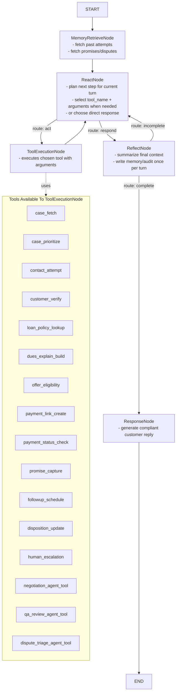

# Connections Agent

This agent models a bank collections team workflow and converts each human task into tool calls or agent-as-tool calls.

## Goal

- pull delinquent borrower cases
- contact, verify, and converse with borrowers
- collect payment immediately when possible
- apply policy-safe offers when eligible
- schedule follow-up and retry attempts
- escalate edge cases to humans with full audit trace

## What Human Teams Do -> Tool Mapping

| Human Team Activity | Tool / Agent Tool | Input | Output |
| --- | --- | --- | --- |
| Get list of defaulters from core systems | `case_fetch` | `portfolio_id`, `dpd_range`, optional filters | ranked case list with dues |
| Decide who to call first | `case_prioritize` | case list + risk signals | ordered call queue |
| Attempt call / message on preferred channel | `contact_attempt` | `case_id`, channel, template id | contact status and attempt id |
| Verify right party and credentials | `customer_verify` | masked identifiers + challenge answers | `verified` / `failed` / `locked` |
| Read loan policy and EMI context | `loan_policy_lookup` | `loan_id` | policy limits and repayment rules |
| Explain due amount and charges | `dues_explain_build` | `case_id`, locale, policy snapshot | customer-safe dues script |
| Ask for immediate payment | `payment_link_create` | `loan_id`, amount, channel, expiry | signed payment link + reference |
| Confirm payment completion | `payment_status_check` | payment reference | `success` / `pending` / `failed` |
| Handle “cannot pay now” conversation | `negotiation_agent_tool` (agent-as-tool) | case state + conversation context | recommended next offer/action |
| Check if discount/restructure allowed | `offer_eligibility` | `case_id`, hardship flags | allowed offers + reason codes |
| Capture promise to pay on future date | `promise_capture` | date/time, amount, channel | promise record + confidence |
| Schedule follow-up call/message | `followup_schedule` | `case_id`, promise date, SLA | scheduled task id |
| Log final call outcome/disposition | `disposition_update` | disposition code + notes | persisted status + audit id |
| Escalate disputes/legal/fraud cases | `human_escalation` | reason + evidence summary | queue assignment id |
| Quality-check risky interactions | `qa_review_agent_tool` (agent-as-tool) | transcript + policy snapshot | QA score + violations |

## Agent-As-Tool Strategy

Use specialized sub-agents as tools for complex reasoning that should stay modular:

- `negotiation_agent_tool`
  - purpose: objection handling and next-best-action under policy constraints
  - hard constraint: cannot finalize concession without policy approval token
- `qa_review_agent_tool`
  - purpose: audit transcript tone/compliance and flag risky language
- `dispute_triage_agent_tool`
  - purpose: classify disputes into payment, service, legal, fraud categories

## Graph (Runtime Node Graph / Mermaid)



## Node Definitions (Network Topology)

### `START`

- role: entry point for a new turn
- receives: `session_id`, user/system event (`new_case`, `inbound_reply`, `scheduled_followup`)
- sends to: `MemoryRetrieveNode`

### `MemoryRetrieveNode`

- role: load contextual state needed for correct decisioning
- reads:
- conversation history
- prior verification attempts
- promise-to-pay history
- prior disputes/escalations
- outputs to planner:
- `memory_context`
- latest `case_snapshot` (if available)
- failure behavior:
- if memory unavailable, continue with minimal context and mark `context_degraded=true`

### `ReactNode`

- role: decide next action for the turn
- decides one route:
- `respond` when no tool call is needed
- `act` when a tool call is required
- typical decisions:
- call `customer_verify` before any account disclosure
- call `payment_link_create` when borrower agrees to pay now
- call `offer_eligibility` when borrower requests concession
- safety behavior:
- never plans direct disclosure before successful verification
- important:
- this node selects `tool_name` and `arguments`
- it does not execute tools itself

### `ToolExecutionNode`

- role: execute exactly one selected tool and return structured observation
- available tool families:
- case/contact tools: `case_fetch`, `case_prioritize`, `contact_attempt`
- verification/policy tools: `customer_verify`, `loan_policy_lookup`, `offer_eligibility`
- collection tools: `payment_link_create`, `payment_status_check`
- commitment/follow-up tools: `promise_capture`, `followup_schedule`
- closing/escalation tools: `disposition_update`, `human_escalation`
- complex agent-tools: `negotiation_agent_tool`, `qa_review_agent_tool`, `dispute_triage_agent_tool`
- output:
- `observation` payload consumed by next `ReactNode` cycle

### `ReflectNode`

- role: validate/finalize turn context before response
- writes:
- state transition event (`state_before -> state_after`)
- tool call summary and trace id
- compliance tags (`verification_passed`, `offer_denied_policy`, etc.)
- placement:
- only on `respond` route to avoid repeated reflection cost during tool loops
- routing:
- `incomplete` -> loop back to `ReactNode` for corrective work
- `complete` -> proceed to `ResponseNode`
- guidance:
- keep a bounded retry count to avoid infinite reflection loops

### `ResponseNode`

- role: produce customer-safe text for channel delivery
- uses:
- planner decision
- memory context
- latest tool observation
- behavior:
- concise, compliant message
- no sensitive disclosure without verification flag

### `END`

- role: turn termination
- conditions:
- final response prepared and sent

## Sample Use Case (Node-by-Node Walkthrough)

Scenario:

- borrower: `CUST-8821`
- case: 47 DPD, EMI overdue INR 12,500
- borrower says: "I can pay after 5 days, not today."

Flow:

1. `START`
- event arrives from scheduled call queue for `case_id=COLL-10091`.

2. `MemoryRetrieveNode`
- loads prior context: borrower verified in last call, prior promise broken once.

3. `ReactNode`
- decides to refresh current case and payment posture first.
- route: `act` with tool call `case_fetch`.

4. `ToolExecutionNode` (`case_fetch`)
- returns outstanding due, late fee, and `next_best_action=collect_or_capture_promise`.

5. `ReflectNode`
- not called yet; flow returns to `ReactNode` for next decision.

6. `ReactNode`
- sees borrower cannot pay now.
- route: `act` with `offer_eligibility`.

7. `ToolExecutionNode` (`offer_eligibility`)
- returns `no_discount`, but allows promise-to-pay up to 7 days.

8. `ReflectNode`
- still deferred; flow returns to `ReactNode`.

9. `ReactNode`
- route: `act` with `promise_capture` (`+5 days`, INR 12,500), then `followup_schedule`.

10. `ToolExecutionNode`
- creates promise record and schedules follow-up task.

11. `ReflectNode`
- reflection runs before final response.
- if quality/compliance check fails, route back to `ReactNode` for correction.
- if checks pass, write disposition-ready state and audit trace.

12. `ReactNode`
- route: `respond`, which invokes `ReflectNode` first.

13. `ResponseNode`
- generates message: confirms promised date, amount, and follow-up reminder.

14. `END`
- turn completes with `disposition_update` in next action or same turn based on planner policy.

## Runtime Mapping To This Repository

- runtime shell: `src/agents/graph_agent.py`
- topology used here: `retrieve_memory -> react -> (act loop) -> reflect -> response -> end`
- note: `act` is the internal graph step label that executes `ToolExecutionNode`
- proposed concrete package:
  - `agents/connections_agent/agent.py`
  - `agents/connections_agent/config.yml`
  - `agents/connections_agent/prompts/`
- proposed tool package:
  - `src/tools/collections/`

## Tool Contract List (First Pass)

- `case_fetch(case_id|portfolio filters) -> delinquency snapshot`
- `case_prioritize(cases, risk_features) -> ordered queue`
- `contact_attempt(case_id, channel) -> attempt result`
- `customer_verify(case_id, challenges) -> verification status`
- `loan_policy_lookup(loan_id) -> policy constraints`
- `dues_explain_build(case_id, policy) -> response script`
- `offer_eligibility(case_id, context) -> eligible offers`
- `payment_link_create(loan_id, amount, channel) -> pay url + ref`
- `payment_status_check(ref_id) -> payment status`
- `promise_capture(case_id, promised_date, amount) -> promise record`
- `followup_schedule(case_id, datetime, channel) -> follow-up task`
- `disposition_update(case_id, code, notes) -> updated case`
- `human_escalation(case_id, reason) -> queue ticket`

## Guardrails

- never disclose account-specific data before successful verification
- deterministic policy engine is the final authority for offers/concessions
- every state transition and tool call must produce an audit event id
- escalation tool path available for fraud/legal/abuse/high-value cases (`human_escalation`)

## Build Sequence

1. scaffold `agents/connections_agent/` runtime files
2. implement base tools: `case_fetch`, `customer_verify`, `payment_link_create`, `followup_schedule`, `disposition_update`
3. wire planner prompts for verification -> payment -> follow-up loops
4. add agent-as-tool modules (`negotiation`, `qa_review`, `dispute_triage`)
5. add metrics dashboard hooks for RPC, PTP-kept rate, and recovery %

## Implementation Status (Local Offline Build)

Implemented under this directory (no `src/` modifications):

- Agent runtime: `agent.py`
- Rule planner: `planner.py`
- Custom reflect behavior: `nodes.py`
- Local repository: `repository.py`
- Tool package: `tools/`
- Dummy fixtures: `data/`
- Runtime state files: `runtime/`
- Missing-data requirements: `docs/missing-data-requirements.md`

Run the local agent:

```bash
python -m agents.connections_agent.main "case_fetch case_id=COLL-1001"
python -m agents.connections_agent.main --interactive
```
