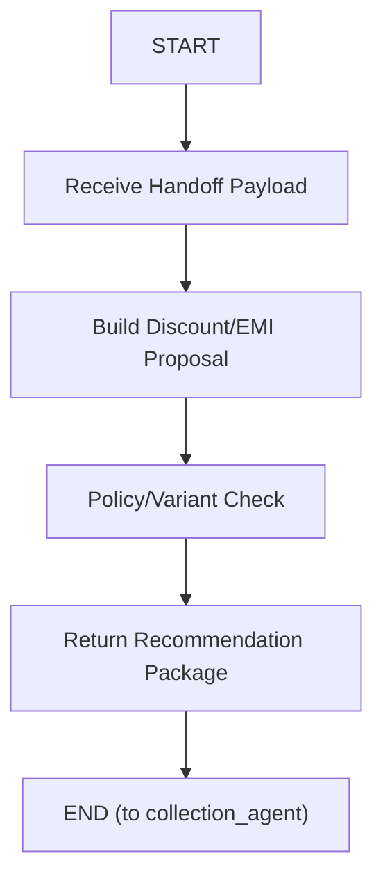

# Discount Planning Agent

Specialist agent under `agents/discount_planning_agent`.
It communicates only with `collection_agent` (agent-to-agent), not directly with customer.

## Role

- receives structured handoff payload from collection agent
- evaluates concession and EMI restructuring options
- returns recommendation package for collection agent to continue borrower conversation

## Graph



Graph assets:

- `graph.mmd`
- `graph.png`
- `graph.jpg`

## Tool Table

| Tool | Description | Typical Inputs | Typical Output |
| --- | --- | --- | --- |
| `discount_policy_snapshot` | Consolidates policy boundaries (waiver caps, restructure allowances, tenure limits) to ensure all recommendations remain compliant. | `case_id`, `loan_id?` | policy bounds |
| `emi_plan_simulator` | Simulates feasible EMI-tenure combinations using target EMI and dues context to produce borrower-acceptable variants. | `case_id`, `target_monthly_emi?`, `principal_due?` | `variants[]`, `best_fit_variant` |
| `discount_offer_optimizer` | Ranks variants and selects the most recoverable and policy-safe recommendation with confidence and rationale. | `case_id`, `variants`, `max_discount_cap?` | `recommended_offer`, `offer_variants`, `confidence`, `rationale` |

## Handoff Input (from collection agent)

- `case_id`
- `current_plan` (optional)
- `dues_snapshot` (optional)
- `policy_constraints` (optional)
- `hardship_reason` (optional)
- `target_monthly_emi` (optional)
- `max_discount_cap` (optional)
- `reason_for_handoff`

## Handoff Output (to collection agent)

- `recommended_offer`
- `offer_variants`
- `rationale`
- `compliance_flags`
- `confidence`
- `next_action_hint`

## Regenerate graph

```bash
npx -y @mermaid-js/mermaid-cli -i agents/discount_planning_agent/graph.mmd -o agents/discount_planning_agent/graph.png -b white -s 2
python3 -c "from PIL import Image; Image.open('agents/discount_planning_agent/graph.png').convert('RGB').save('agents/discount_planning_agent/graph.jpg', 'JPEG', quality=92)"
```
