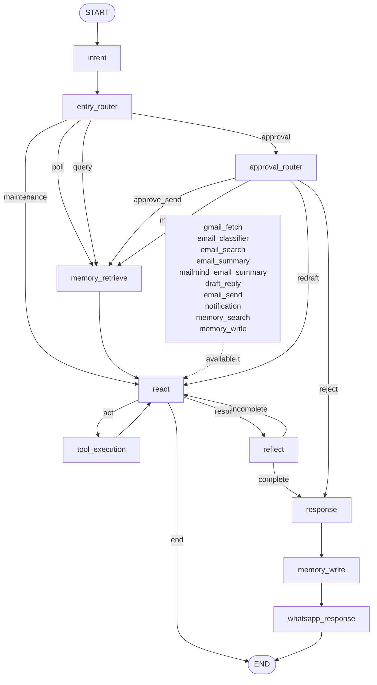

# MailMind LangGraph

## Purpose

MailMind should be expressed as a LangGraph built from the shared node primitives already available in `src/nodes`, plus a small number of MailMind-specific custom nodes.

This file is a graph design spec only. It does not define code.

## Shared Nodes To Use

Available reusable nodes from `src/nodes`:

- `IntentNode`
- `RouterNode`
- `MemoryRetrieveNode`
- `ReactNode`
- `ToolExecutionNode`
- `ReflectNode`
- `MemoryNode`
- `ApprovalNode`
- `ResponseNode`
- `WhatsAppNode`

These should be preferred over creating MailMind-only replacements.

## Shared Tools Available To ReactNode

If `ReactNode` is used, expose these tools in the MailMind tool registry:

- `gmail_fetch`
- `email_classifier`
- `email_search`
- `email_summary`
- `draft_reply`
- `email_send`
- `notification`
- `memory_search`
- `memory_write`

MailMind-specific tools that may also be exposed:

- `mailmind_email_summary`
  - grouped MailMind summary tool from `agents/mailmind/tools/email_summary.py`

## Custom MailMind Nodes

These are the only custom nodes recommended for MailMind:

- `MailMindEntryRouterNode`
  - top-level route selector for poll, query, approval, maintenance
- `MailMindApprovalRouterNode`
  - routes approve / reject / redraft / ask-context
- `MailMindContextFormatterNode`
  - optional node to normalize tool outputs before user response

Everything else should use shared nodes.

## Graph State

Recommended state keys:

- `session_id`
- `trigger_type`
- `user_input`
- `intent`
- `route`
- `steps`
- `decision`
- `observation`
- `response`
- `reflection_feedback`
- `reflection_complete`
- `memory`
- `memory_context`
- `memory_updates`
- `memory_targets`
- `approval_item`
- `approval_result`
- `channel_result`
- `waiting`
- `final`
- `errors`

## Graph Pattern

MailMind should use a ReAct-centered graph, not a fixed linear workflow graph.

Core pattern:

1. classify top-level intent
2. retrieve memory context
3. let `ReactNode` run the tool phase until it decides the tool phase is complete
4. execute the selected tools inside the ReAct loop
5. reflect once on the accumulated tool phase and produce critique / improvement feedback
6. if reflection says something is still missing, loop back into `ReactNode` with that feedback
7. otherwise build the final response
8. persist final memory state
9. end the turn through the WhatsApp response node

## Main Graph

### React Tool Set In This Graph

The `ReactNode` in this graph should be constructed with this tool set:

- `gmail_fetch`
- `email_classifier`
- `email_search`
- `email_summary`
- `mailmind_email_summary`
- `draft_reply`
- `email_send`
- `notification`
- `memory_search`
- `memory_write`

### Mermaid

## Node Roles

### `IntentNode`

Use:

- first node after `START`

Purpose:

- classify the incoming event into high-level MailMind intents

Recommended intents:

- `poll_inbox`
- `query_mail`
- `approval_reply`
- `maintenance`

Writes:

- `intent`

Next:

- `MailMindEntryRouterNode`

### `MailMindEntryRouterNode` (custom)

Use:

- top-level flow selector

Purpose:

- read `trigger_type`, `intent`, and event metadata
- choose the top-level route

Returns routes:

- `poll`
- `query`
- `approval`
- `maintenance`

### `MemoryRetrieveNode`

Use:

- before `ReactNode`

Purpose:

- build MailMind runtime context from:
  - semantic memory
  - episodic memory
  - working memory
  - procedural memory

Recommended `memories`:

- `SemanticMemory`
- `EpisodicMemory`
- `WorkingMemory`
- `ProceduralMemory`

MailMind-specific note:

- for inbox and query turns, this node should run before `ReactNode`
- for approval turns, run it only when more context is needed

### `ReactNode`

Use:

- as the main decision-making loop

Purpose:

- inspect:
  - `user_input`
  - `memory_context`
  - `observation`
  - available tools
- decide one of:
  - call a tool
  - end the tool phase and hand off to reflection
  - terminate

Expected routes:

- `act`
- `respond`
- `end`

MailMind prompt behavior:

- must know the available tools
- must know that sending email requires approval
- should prefer search / summary / draft / notify / send tools instead of hallucinating actions
- should use multiple tools when needed before handing off to reflection
- should hand off to reflection only when the tool phase is complete for the current turn

Tools that should be exposed to `ReactNode` in MailMind:

- `gmail_fetch`
  - fetch and store new Gmail messages
- `email_classifier`
  - classify stored messages
- `email_search`
  - search stored emails
- `email_summary`
  - generic shared email summary
- `mailmind_email_summary`
  - MailMind grouped summary view
- `draft_reply`
  - generate a reply draft
- `email_send`
  - send an approved draft
- `notification`
  - execute outbound notification behavior
- `memory_search`
  - retrieve long-term memory records
- `memory_write`
  - persist long-term memory records

If you keep the registry MailMind-only, these should be the default tool set.

### `ToolExecutionNode`

Use:

- standard `act` step after `ReactNode`

Purpose:

- execute the tool call selected by `ReactNode`

Expected tool families:

- Gmail tools
- memory tools
- MailMind grouped summary tool

Writes:

- `observation`

MailMind graph role:

- this node is inside the ReAct tool loop
- after each tool execution, control returns to `ReactNode`
- reflection does not run after every tool call

### `ReflectNode`

Use:

- after the ReAct tool phase, not after each individual tool call

Purpose:

- inspect the accumulated tool work for the turn
- produce feedback for the next reasoning step
- help the agent decide whether the overall tool phase was sufficient, weak, or missing something
- optionally persist a reflection trace

This is especially useful after:

- classification
- search
- summary
- draft generation
- send attempts
- notification attempts

Writes:

- critique / reflection feedback into state as `reflection_feedback`
- completion signal into state as `reflection_complete`
- optionally reflection memory side effects

MailMind graph rule:

- `ReflectNode` should not be treated as a terminal logging step
- it is a post-tool-phase review step
- its output should be visible to the next `ReactNode` pass, either through:
  - a dedicated `reflection_feedback` state key
  - or memory written immediately after reflection

Recommended effect on the next loop:

- if the tool phase was incomplete, reflection should help `ReactNode` choose a better next tool sequence
- if the tool phase was good enough, downstream routing should move to response

Graph consequence:

- the tool loop is:
  - `ReactNode -> ToolExecutionNode -> ReactNode`
- and only after tool selection is complete:
  - `ReactNode -> ReflectNode`
- from `ReflectNode`:
  - if `reflection_complete == false` -> back to `ReactNode`
  - if `reflection_complete == true` -> `ResponseNode -> MemoryNode -> WhatsAppNode`

That means reflection is a first-class checkpoint after the tool phase, not after each tool call.

### `MemoryNode`

Use:

- after `ResponseNode`

Purpose:

- update working memory
- persist episodic / semantic / error / reflection memory

Recommended responsibilities in MailMind:

- store email-processing episodes
- store approval decisions
- store send events
- store user correction signals
- store relevant summary/draft traces
- persist reflection feedback when it is useful for later turns

### `ApprovalNode`

Use:

- inside the tool / policy path when an approval item must be created

Purpose:

- enqueue `approval_item` into the configured approval queue

MailMind rule:

- `email_send` must never be called without an approved decision path

Important runtime note:

- approval does not create a separate mid-graph WhatsApp wait node
- the current turn still ends through the normal response path
- the user's approval or rejection arrives as a new turn and re-enters from `START`

### `MailMindApprovalRouterNode` (custom)

Use:

- entry point for approval reply turns

Purpose:

- parse approval outcome from WhatsApp reply context
- route to the next step

Returns routes:

- `approve_send`
- `reject`
- `redraft`
- `more_context`

Behavior:

- `approve_send`
  - route into normal planning again with approval context loaded in memory
- `reject`
  - go to `ResponseNode`
- `redraft`
  - go back to `ReactNode` to call `draft_reply` again
- `more_context`
  - go to `MemoryRetrieveNode`

### `ResponseNode`

Use:

- after `ReflectNode` when the tool phase is complete
- or when an approval-reply turn should produce a user-facing response

Purpose:

- transform the current observation / decision into final response text

MailMind-specific guidance:

- response style should be short and structured
- for search and summary responses, prefer grouped output:
  - Action Required
  - High Impact
  - Informational

### `WhatsAppNode` for Final Response

Use:

- after `ResponseNode`

Purpose:

- deliver the final response to the user via WhatsApp

Suggested configuration:

- `wait_for_reply=False`

MailMind runtime rule:

- this is the end of the turn in all user-facing cases
- any follow-up approval, clarification, or redraft request comes back as a new input and starts again from `IntentNode`

## Subgraph Recommendations

### 1. Inbox Poll Subgraph

Recommended path:

- `IntentNode`
- `MailMindEntryRouterNode`
- `MemoryRetrieveNode`
- `ReactNode`
- `ToolExecutionNode`
- `ReactNode`
- `ReflectNode`
- `ResponseNode`
- `MemoryNode`
- `WhatsAppNode`

Expected tool usage from `ReactNode`:

- `gmail_fetch`
- `email_classifier`
- optionally `draft_reply`
- optionally `notification`
- optionally `memory_write`

### 2. Query Subgraph

Recommended path:

- `IntentNode`
- `MailMindEntryRouterNode`
- `MemoryRetrieveNode`
- `ReactNode`
- `ToolExecutionNode`
- `ReactNode`
- `ReflectNode`
- `ResponseNode`
- `MemoryNode`
- `WhatsAppNode`

Expected tool usage from `ReactNode`:

- `email_search`
- `email_summary`
- `mailmind_email_summary`
- `memory_search`
- `draft_reply`

### 3. Approval Subgraph

Recommended path:

- `IntentNode`
- `MailMindEntryRouterNode`
- `MailMindApprovalRouterNode`
- `MemoryRetrieveNode` optionally
- `ReactNode`
- `ToolExecutionNode`
- `ReactNode`
- `ReflectNode`
- `ResponseNode`
- `MemoryNode`
- `WhatsAppNode`

Expected tool usage from `ReactNode`:

- `email_send`
- `draft_reply`
- `memory_write`

## ReAct Tool Policy

The MailMind `ReactNode` prompt should explicitly state:

- you may only act through tools
- do not claim an email was sent unless `email_send` ran successfully
- sending requires prior approval context
- use `gmail_fetch` only for inbox polling / maintenance paths
- use `email_search` or summary tools for query paths
- use `draft_reply` before `email_send`

## Minimal First Version

Recommended first implementation:

1. `IntentNode`
2. `MailMindEntryRouterNode`
3. `MemoryRetrieveNode`
4. `ReactNode`
5. `ToolExecutionNode`
6. `ReflectNode`
7. `ResponseNode`
8. `MemoryNode`
9. `WhatsAppNode`

This gives MailMind:

- memory-aware planning
- multi-step tool execution loop
- reflection-driven improvement after the tool phase
- response generation after reflection
- post-response memory persistence
- WhatsApp end-of-turn output

without inventing a second planner framework.

## Future Extensions

Later add:

- a RAG-style document retrieval node built on the shared `src/retrieval` layer
- a custom MailMind inbox triage node only if `ReactNode` proves insufficient
- a custom policy node for notification thresholds
- daily summary maintenance subgraph
