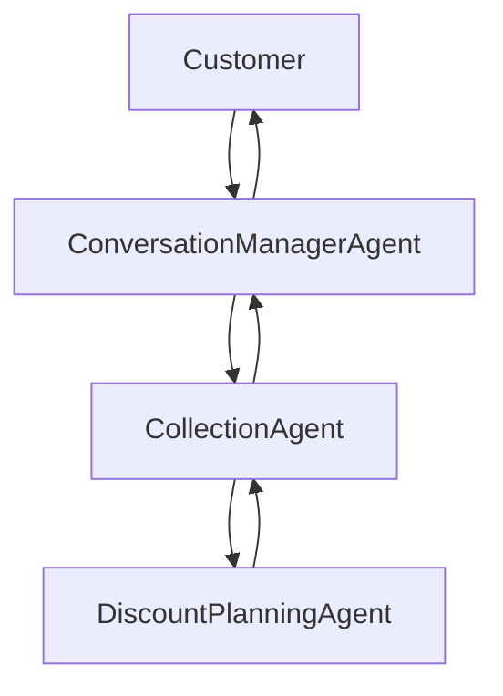

# Conversation Manager Agent

`ConversationManagerAgent` lives under `agents/collection_agent/conversation_manager`.

It does not own collections business logic. It owns the customer-facing waiting experience.

## Responsibilities

- receive customer messages
- forward them to `collection_agent`
- monitor elapsed processing time
- emit filler messages while waiting
- stop fillers when the final response arrives
- supersede stale in-flight requests when newer customer input arrives
- replay the last delivered response for repeat requests without recomputing `CollectionAgent`
- track interrupted delivery state for future voice barge-in support
- return the final response to the customer

## Architecture

## Key modules

- `agents/collection_agent/conversation_manager/ConversationManagerAgent.py`
- `agents/collection_agent/conversation_manager/ResponseBuffer.py`
- `agents/collection_agent/conversation_manager/MessageDeliveryTracker.py`
- `agents/collection_agent/conversation_manager/BargeInHandler.py`
- `agents/collection_agent/conversation_manager/InterruptionPolicy.py`
- `agents/collection_agent/conversation_manager/FillerManager.py`
- `agents/collection_agent/conversation_manager/LatencyMonitor.py`
- `agents/collection_agent/conversation_manager/ConversationManagerConfig.py`
- `agents/collection_agent/conversation_manager/runtime.py`
- `agents/collection_agent/conversation_manager/pipecat_bot.py`

## Integration surface

The conversation manager provides replacement entrypoints for:

- local debug UI / API
- SSE streaming turn execution
- Pipecat voice runtime

It treats `CollectionAgent` as a black-box business runtime. Collection business prompts, nodes, graph logic, and tools remain unchanged.
