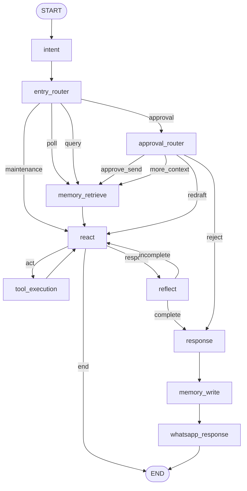

# MailMind Graph Spec

MailMind should be expressed as a LangGraph built from shared node primitives plus a small number of MailMind-specific routers.

## Shared Nodes

- `IntentNode`
- `MemoryRetrieveNode`
- `ReactNode`
- `ToolExecutionNode`
- `ReflectNode`
- `ResponseNode`
- `MemoryNode`
- `WhatsAppNode`

## MailMind-Specific Nodes

- `MailMindEntryRouterNode`
- `MailMindApprovalRouterNode`
- `MailMindContextFormatterNode`

## Shared Tool Set

The MailMind `ReactNode` should be aware of:

- `gmail_fetch`
- `email_classifier`
- `email_search`
- `email_summary`
- `mailmind_email_summary`
- `draft_reply`
- `email_send`
- `notification`
- `memory_search`
- `memory_write`

## Core Pattern

1. classify top-level intent
2. retrieve memory context
3. let `ReactNode` run the tool phase
4. execute tools through `ToolExecutionNode`
5. reflect once after the tool phase
6. if reflection is incomplete, loop back to `ReactNode`
7. otherwise build the response
8. persist memory
9. send the final WhatsApp response

## Main Graph

## Runtime Rule

WhatsApp delivery is the end of the current turn.

Any approval, clarification, or redraft input comes back as a new turn and re-enters from `START`.
