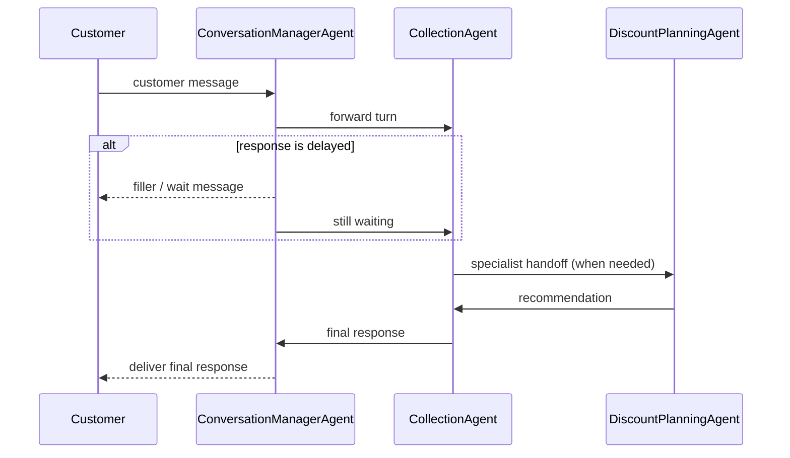

# Conversation Management Architecture

## Goal

Separate conversational pacing from collections business logic.

`CollectionAgent` remains the decision engine.
`ConversationManagerAgent` inside `agents/collection_agent/conversation_manager` becomes the customer-facing delivery layer.

## Sequence

## Ownership

- `ConversationManagerAgent`
  - latency thresholds
  - filler cadence
  - wait messaging
  - latest-input-wins interruption handling
  - stale-response suppression
  - repeat-request replay
  - VAD-driven barge-in handling and delivery tracking for voice mode
  - response delivery timing
- `CollectionAgent`
  - verification
  - planning
  - routing
  - collections policy
- `DiscountPlanningAgent`
  - hardship / settlement recommendation
  - concession planning
