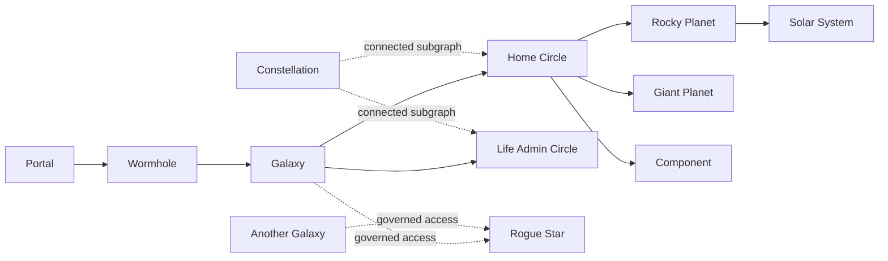

# Galaxy Terminology

Status: canonical vocabulary

This vocabulary gives the personal agent platform a consistent language across
the runtime, API, documentation, and Control Room. The astronomy metaphor is
used for structure and navigation; precise engineering terms remain in place
for security, data, and execution contracts.

## Core hierarchy



| Term | Definition |
| --- | --- |
| **Galaxy** | The top-level ownership and isolation boundary containing all of one person's or organization's Circles and shared platform services. The Wormhole is the gateway into this boundary. This project currently presents one personal Galaxy. |
| **Rogue Star** | A shared external resource that belongs to no Galaxy and may be accessed by multiple Galaxies through explicit, policy-controlled Orbits. A Rogue Star can be a hosted model, service, or other shared dependency. The external Mac Gemma service is the current example. |
| **Portal** | A human-facing channel into the Galaxy, such as chat, voice, UI, CLI, or API. Portals collect intent; they do not decide authority. |
| **Wormhole** | The single logical ingress gateway at the Galaxy boundary. It accepts a Mission, enters the correct Galaxy, then selects one or more Circles and Planets. It produces an explainable Trajectory but never grants extra permissions. |
| **Circle** | A Galaxy-level responsibility or domain grouping, such as Home, Energy, or Satellite Communications. A Circle contains Circle Members: Rocky Planets, Giant Planets, and Components. A member may participate in more than one Circle when policy permits. |
| **Circle Member** | The umbrella term for anything assigned to a Circle. Every Circle Member is a Planet—Rocky or Giant—or a non-agent Component. |
| **Planet** | The user-facing term for an autonomous, accountable agent with a Charter, capabilities, policies, memory access, and lifecycle status. Every Planet is classified as either Rocky or Giant. A Planet is not necessarily a permanently running process. |
| **Rocky Planet** | A specialist agent with a narrow domain or task Charter, such as RF link-budget analysis, clinical-evidence review, or pantry planning. It owns bounded expert work and can be reused wherever that expertise is needed. |
| **Giant Planet** | A non-specialist agent with a broad, reusable Charter for varied routine work, coordination, triage, or synthesis. It delegates narrow expert work to Rocky Planets when the task exceeds its Charter. |
| **Component** | A non-agent Circle Member that enables or constrains work: a capability, tool, Vault, Playbook, Gate or policy, model, or service. A Component does not independently own a Mission or make agentic decisions. |
| **Constellation** | A connected operational subgraph drawn from selected parts of one or more Circles. It can include Planets, Components, and their typed relationships. It is an overlay used to describe a coherent connected system—not an ownership container and not a required routing hop. |
| **Solar System** | A Planet-centered view containing that Planet and everything directly connected to it: tools, capabilities, Playbooks, memory scopes, policies, models, services, and neighboring responsibilities. Solar Systems may overlap when components are shared. |

The ownership and routing path is **Wormhole → Galaxy → Circle → Planet**; it is
not a requirement to run one process per entity. A Constellation is a connected
graph overlay assembled from parts of one or more Circles. It may cross Circle
boundaries, but it does not sit between the Galaxy and a Circle. A Rogue Star
sits outside this ownership hierarchy and never becomes part of a Galaxy merely
because that Galaxy can access it.

## Work and execution

| Term | Definition |
| --- | --- |
| **Mission** | A user goal submitted to the Galaxy. |
| **Trajectory** | The explainable route chosen for a Mission: Wormhole → Galaxy → Circle → Planet. |
| **Crew** | The temporary set of two or more Rocky and/or Giant Planets selected to collaborate on one Mission. It dissolves when the Mission ends. A single selected Planet remains a Planet, not a one-member Crew in user-facing language. |
| **Work Order** | A bounded, machine-readable delegation to one Planet. It carries scope, requested effects, memory boundary, approvals, and correlation identifiers. |
| **Flight Plan** | The selected Playbook and ordered steps used to execute a Work Order. |
| **Playbook** | A reusable workflow template. The existing technical term is intentionally retained because it is clear and familiar. |
| **Gate** | A policy or human-approval boundary that must be passed before a protected action. |

## State, relationships, and operations

| Term | Definition |
| --- | --- |
| **Orbit** | A typed relationship between nodes, such as `member_of`, `can_use`, `reads`, `governs`, or `dispatches_to`. Direction and type matter. |
| **Roster** | The registered set of available Rocky and Giant Planet Charters. This is distinct from a Mission's temporary Crew. |
| **Vault** | A memory or data-isolation boundary. Access is explicit, scoped, and auditable. |
| **Observatory** | The monitoring and replay capability for the whole Galaxy. **Control Room** remains the product-facing UI name. |
| **Mission Log** | The correlated event history for routing, Work Orders, model calls, tools, policy decisions, approvals, and outcomes. |
| **Charter** | The declarative contract defining a Planet's purpose, capabilities, policies, memory scopes, and lifecycle state. |

## Naming rules

- Use **Galaxy** for the entire owned system and **Circle** for a directly owned
  responsibility or domain group.
- Use **Rogue Star** for an external shared resource owned by no Galaxy. Connect
  it with an explicit access Orbit; never model that access as containment.
- Use **Constellation** only for a connected subgraph spanning selected parts
  of one or more Circles; never place it in the routing hierarchy.
- Use **Circle**, not guild, in user-facing text. `guild` may remain in older
  catalog identifiers until a compatibility migration is planned.
- Use **Wormhole**, not gateway, in user-facing text and new public APIs.
- Use **Planet** in user-facing language for an agent. Use **Rocky Planet** for
  a narrow specialist Charter and **Giant Planet** for a broad non-specialist
  Charter. Technical APIs may retain `agent` and `specialist` for compatibility.
- Use **Circle Member** only as the umbrella category. Use **Component** for a
  non-agent member such as a tool, Vault, Playbook, policy, model, or service.
- Use **Solar System** only for the dynamic neighborhood around a Planet;
  it is a graph view, not another independently executing agent.
- Preserve exact engineering terms such as Work Order, policy, capability,
  model, and API when metaphor would reduce clarity.

## Current concrete mapping

```text
Wormhole
└── Personal Agent Galaxy
    ├── Home Circle
    ├── Employment Boundary Circle
    ├── Science Lab Circle
    ├── Venture Exploration Circle
    ├── Energy Circle
    ├── Satellite Communications Circle
    └── other registered Circles

Personal Operations Constellation
└── connected overlay spanning selected parts of those Circles

Mac Gemma · gemma-4-E4B
└── Rogue Star outside the Galaxy, reachable through governed access
```

The current executable Roster is represented by technical `SpecialistManifest`
objects, so its graph nodes are Rocky Planets. Giant Planet is now part of the
canonical model; introducing broad-agent manifests and nodes is a separate
runtime migration and should preserve the shared Charter, Work Order, Gate,
and observability contracts.
