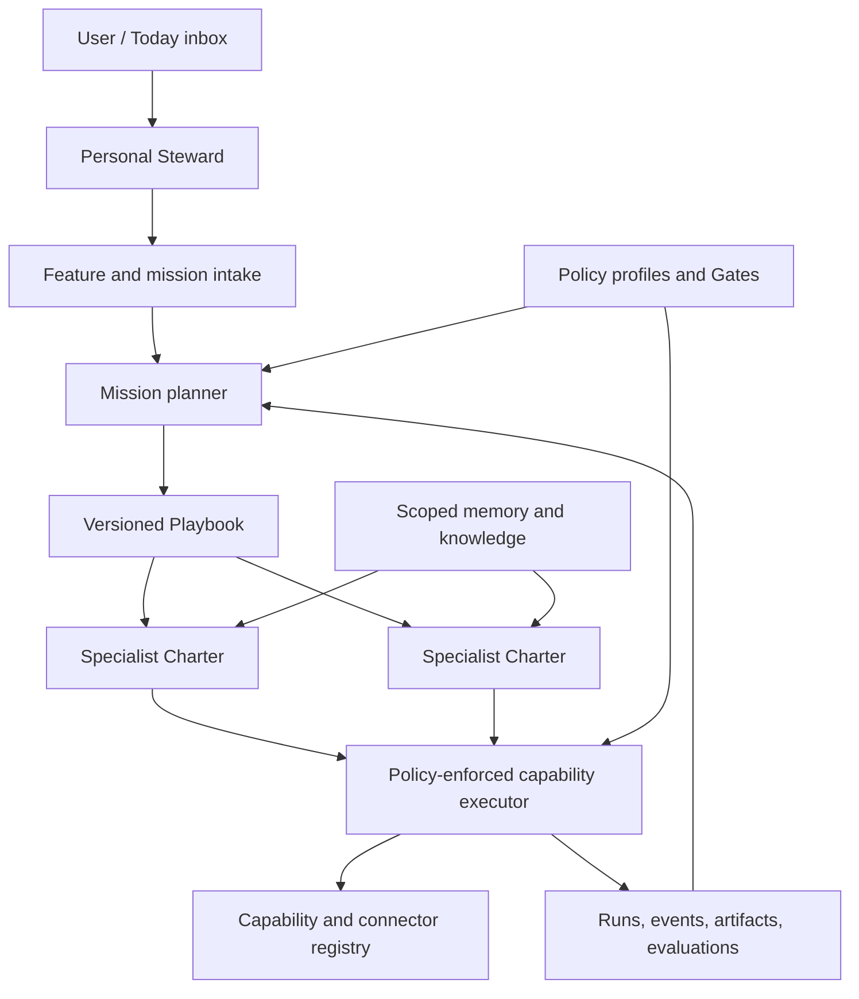
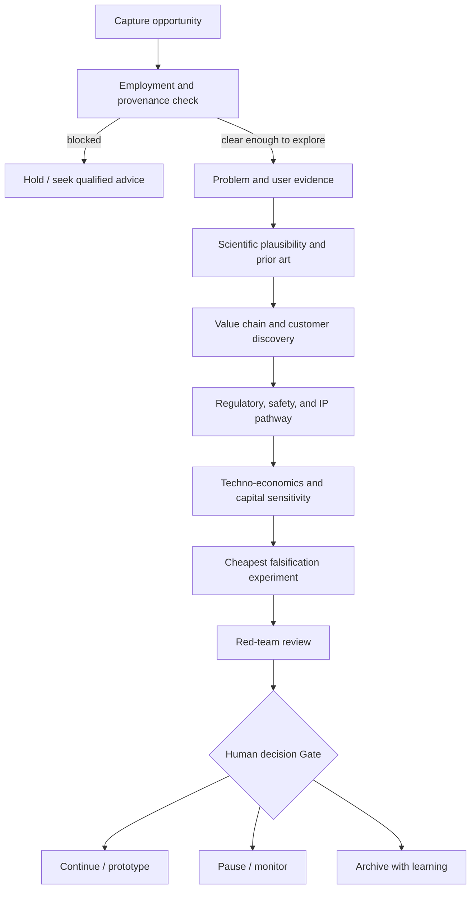

# Personal and Deep-Tech Explorer Implementation Plan

Status: execution in progress; declarative fleet slice implemented

Branch reviewed: `saket/framework_update`

Repository snapshot: 2026-09-22

Implemented in the current branch: all 70 current and proposed Specialists now
compile into validated active or sandboxed Charters over nine shared Playbooks,
four central policy profiles, six memory scopes, deterministic routing, bounded
Work orders, a local-model advisory path, CLI/API contracts, and a Control Room
sandbox launcher. This completes the roster/runtime shape of Release 1 and a
safe non-durable portion of Releases 2 and 3. Durable Runs, resumable Gates,
connector-backed effects, artifact persistence, and domain evaluation suites
remain open; sandboxed Charters are not equivalent to approved autonomous
agents.

## Outcome

Build one local-first Personal Agent Constellation that can support daily life,
protect the boundary around current employment, and systematically explore
deep-tech opportunities in energy, satellite communications, and medical
technology.

The system must remain simple as the visible roster grows. A Specialist is a
versioned configuration over reusable runtime components, not a new framework
implementation. The UI may eventually show dozens of Specialists, but their
implementation should reuse a small collection of graph templates,
capabilities, policy profiles, memory scopes, evaluation suites, and connectors.

Startup-operating Specialists remain inactive templates until an opportunity
passes technical, customer, economic, regulatory, intellectual-property, and
employment-conflict Gates.

This plan is the domain-delivery overlay for the
[Offline Agent Platform Roadmap](./offline-agent-platform-roadmap.md). It
refines the domain ordering in the
[Personal Constellation Gap and Delivery Plan](./personal-constellation-plan.md):
employment separation and venture exploration now precede Venture Studio
operations.

## Design rules

1. **Capabilities are the unit of reuse.** Searching literature, creating a
   reminder, comparing alternatives, running an experiment, and drafting a
   message are implemented once and reused by many Specialists.
2. **Playbooks are the unit of workflow.** Calling a family member, reviewing a
   bill, validating an opportunity, and planning an experiment are versioned
   workflows composed from capabilities.
3. **Charters are the unit of responsibility.** A Specialist Charter selects
   capabilities, playbooks, memory scopes, model profiles, policies, and evals.
4. **Domain packs contain knowledge, not privileged code.** Energy, satcom, and
   medical packs add taxonomies, rubrics, reference sources, prompts, fixtures,
   and eval datasets over the same runtime.
5. **Connectors do not own policy.** Calendar, mail, browser, filesystem,
   scientific, and future commerce integrations remain behind the central
   capability executor.
6. **Permissions only narrow during delegation.** A child Work order cannot see
   more data or perform more effects than its parent Run.
7. **External or irreversible actions cross a Gate.** Messages, calls,
   purchases, payments, publishing, employer-overlap work, regulated claims,
   and submissions require a preview and explicit approval.
8. **New code is the last option.** Feature intake should first reuse a
   capability, compose a Playbook, extend a Charter, or add a domain pack.
9. **Offline is enforced, not implied.** Local profiles deny non-loopback
   network access unless a Run explicitly selects an approved network profile.
10. **Activation is earned through evaluation.** Generated or modified
    Specialists remain proposed until tests and human approval succeed.

## Decide what should become an agent

Use the smallest appropriate implementation form:

| Need | Implementation form | Example |
| --- | --- | --- |
| Deterministic operation | Capability | Create a reminder, calculate a link budget, search local notes |
| Repeatable sequence | Playbook | Call Mom, weekly opportunity review, literature-to-experiment flow |
| Shared infrastructure | Platform service | Scheduling, memory, policy, approvals, event log |
| Reference material or rubric | Domain pack | Medical-device classification, battery degradation taxonomy |
| Distinct responsibility boundary | Specialist Charter | Employment Boundary Reviewer, Opportunity Portfolio Steward |
| External system access | Connector | Calendar, Gmail, scholarly search, experiment tracker |
| Distinct permissions, memory, evals, or lifecycle | New Specialist | Medical Regulatory Navigator |

Do not create a new Specialist only because a request has a new noun. Create
one when the responsibility needs a different authority boundary, memory
namespace, evaluation standard, lifecycle owner, or operational health signal.

## Target component model



### Canonical contracts

| Contract | Purpose |
| --- | --- |
| `SpecialistManifest` | Versioned Charter describing responsibility and bindings |
| `CapabilityDescriptor` | Typed input/output, effects, risk, network, timeout, and idempotency metadata |
| `PlaybookSpec` | Trigger, steps, branches, handoffs, budgets, Gates, and completion criteria |
| `RunRequest` / `RunContext` | Mission identity, owner, scopes, budgets, deadline, and cancellation lineage |
| `WorkOrder` | Typed, permission-narrowed request from one Specialist to another |
| `AgentResult` / `NodeResult` | Typed outcome, confidence, evidence, artifacts, and next actions |
| `ApprovalRequest` | Exact effect, target, data, cost, expiry, rationale, and resume token |
| `PolicyProfile` | Allowed effects, resources, data labels, recipients, hosts, and commands |
| `MemoryScope` | Namespace, provenance, sensitivity, retention, export, and deletion policy |
| `ArtifactRef` | Immutable reference to a document, dataset, notebook, report, or model output |
| `EvaluationSuite` | Contract, policy, scenario, quality, safety, and regression thresholds |
| `DomainPack` | Domain vocabulary, rubrics, prompts, sources, fixtures, and eval cases |

### Reusable graph templates

Implement a small template library instead of a graph for every Specialist:

1. `route_and_synthesize` — classify, delegate, collect, and summarize.
2. `research_with_provenance` — plan queries, gather sources, extract claims,
   verify, and produce a cited artifact.
3. `analyze_and_compare` — normalize alternatives, calculate metrics, score,
   run sensitivity analysis, and explain uncertainty.
4. `plan_and_operate` — inspect state, propose actions, cross Gates, execute,
   verify, and record.
5. `design_run_evaluate` — state a hypothesis, design an experiment, run it in
   a sandbox, score results, and preserve lineage.
6. `adversarial_review` — inspect an artifact against a rubric, identify
   unsupported claims, and return blocking and non-blocking findings.
7. `scheduled_review` — wake on a schedule, inspect state, create a digest, and
   propose follow-up work.

Prompts, policies, capabilities, and eval suites vary by Charter; graph code
does not.

## Proposed repository layout

```text
src/easy_agents/
  contracts/                 # Runtime, policy, manifest, artifact contracts
  registry/                  # Specialist, capability, playbook, model registries
  runtime/                   # Compiler, mission runner, queue, checkpoints
  policy/                    # Effect policy, Gates, secrets, data scopes
  capabilities/              # Reusable executable operations
  playbooks/                 # Reusable workflow specifications
  evaluation/                # Contract, scenario, policy, and quality runner
  domain_packs/
    personal/
    employment/
    venture_exploration/
    energy/
    satcom/
    medical/
  constellation/             # Directory and feature intake

config/constellation/
  guilds.yaml
  capabilities/*.yaml
  specialists/*.yaml
  playbooks/*.yaml
  policies/*.yaml
  model_profiles/*.yaml
  eval_suites/*.yaml

tests/
  contracts/
  policy/
  playbooks/
  domain_packs/
  scenarios/
```

Existing `src/llm`, `src/memory`, `src/nodes`, `src/tools`, and
`src/platform_logging` remain compatibility layers during migration. New
framework contracts should live under the canonical `easy_agents` namespace.

## How the proposed roster maps to reusable components

The following tables cover the requested roles while avoiding one-off agent
implementations.

### Personal life

| User-visible Specialist | Reused implementation |
| --- | --- |
| Personal Chief of Staff | `route_and_synthesize` plus task, calendar, and status capabilities |
| Calendar & Task Steward | `scheduled_review` plus calendar/task connectors |
| Home & Errands Steward | `plan_and_operate` plus household inventory and vendor capabilities |
| Shopping & Pantry Specialist | `analyze_and_compare` plus list, inventory, price, and cart-draft capabilities |
| Family & Relationships Specialist | `scheduled_review` plus contact cadence and communication-draft capabilities |
| Personal Finance Steward | `analyze_and_compare` with a read-only finance policy |
| Health & Wellness Specialist | `scheduled_review` with a non-clinical wellbeing policy |
| Travel & Administration Specialist | `research_with_provenance` plus itinerary and document checklists |
| Personal Communications Specialist | communication drafting plus approval-gated send capability |
| Digital Librarian | knowledge ingestion, classification, retrieval, retention, and backup capabilities |

Example Playbooks include `call_family_member`, `weekly_home_review`,
`grocery_restock`, `bill_due_review`, `prepare_trip`, and
`monthly_digital_cleanup`. A phone call or purchase is never an autonomous
default effect.

### Employment protection

| Requested role | Implementation form |
| --- | --- |
| Employment Boundary Guardian | Specialist Charter using `adversarial_review` and strict data-scope policy |
| Confidentiality Monitor | Central policy rules and input/output guard; not an independent model loop |
| IP Boundary Reviewer | Review Charter plus invention-provenance and overlap-assessment capabilities |
| Work Performance Assistant | Separate Charter bound only to explicitly authorized employer data |
| Time Allocation Steward | `scheduled_review` Playbook over personal calendar metadata |

Required namespaces are `personal`, `employer_authorized`, `exploration`, and
`future_company`. Default policy denies reads or writes across these scopes.
Employer information must never become training data, personal semantic
memory, or an exploration artifact without explicit authorization.

### Venture exploration

| User-visible Specialist | Reused implementation |
| --- | --- |
| Opportunity Portfolio Steward | `route_and_synthesize` plus thesis-state and scoring capabilities |
| Idea Lab | hypothesis-generation Charter with diversity and novelty evals |
| Problem Discovery Specialist | `research_with_provenance` plus problem-evidence rubric |
| Evidence Librarian | shared research template and provenance store |
| Customer Discovery Specialist | interview-plan, note-ingestion, claim-extraction, and evidence-strength capabilities |
| Scientific Reviewer | `adversarial_review` with scientific-validity rubric |
| Experiment Designer | `design_run_evaluate` without execution permission by default |
| Prototype Planner | plan/specification capabilities over the same experiment template |
| Prior-Art & IP Scout | research template with patent/publication/product source adapters |
| Technology Readiness Assessor | rubric-based analysis capability, not a separate runtime |
| Techno-Economic Analyst | `analyze_and_compare` plus cost and sensitivity models |
| Value-Chain Analyst | research and graph-analysis capabilities |
| Regulatory & Safety Navigator | research/review Charter with no authority to issue legal or clinical conclusions |
| Partnership Scout | research template plus organization/contact artifact schema |
| Funding & Programme Scout | scheduled research Playbook over approved public sources |
| Red-Team Specialist | shared adversarial-review template with venture-kill criteria |
| Venture Decision Committee | multi-Specialist Playbook ending in a human decision Gate |
| Exploration Journal | artifact and event service; not an agent |

Every opportunity receives a `ThesisRecord` with problem, user, current
solution, proposed mechanism, evidence, prior art, falsification experiment,
performance target, technology readiness, customer/payer, regulation, safety,
capital, defensibility, employment overlap, founder fit, and next decision.

### Energy domain pack

Energy Systems Scout, Electrochemistry & Storage Specialist, Hydrogen &
Industrial Decarbonization Specialist, Power Electronics Specialist, Grid &
Energy Software Specialist, Energy Materials Scout, Energy Techno-Economics
Specialist, and Energy Standards & Safety Specialist reuse the research,
analysis, experiment, and adversarial-review templates.

The pack supplies energy units, value-chain taxonomies, efficiency and
degradation rubrics, levelized-cost schemas, safety classifications, standards
sources, experiment fixtures, and sector-specific evaluation cases. Numerical
work must call deterministic calculators rather than rely on model arithmetic.

### Satellite communications domain pack

Satcom Systems Architect, RF & Link-Budget Specialist, Orbit & Constellation
Analyst, Ground-Segment Specialist, Space Hardware Specialist, Spectrum &
Authorization Navigator, Mission Assurance Specialist, Space Supply-Chain
Scout, and Downstream Applications Scout reuse the same shared templates.

The pack supplies RF/link-budget schemas, propagation and margin calculators,
orbit/coverage interfaces, spectrum and authorization source lists, hardware
qualification rubrics, mission-risk models, and satcom scenario evaluations.
Regulatory submissions, spectrum applications, transmissions, and hardware
commands are outside autonomous scope.

### Medical deep-tech domain pack

Clinical Problem Scout, Clinical Evidence Specialist, Medical Device Systems
Engineer, Diagnostics & Biotechnology Specialist, Medical AI Specialist,
Regulatory Classification Navigator, Clinical Investigation Planner, Risk &
Human-Factors Specialist, Quality-System Specialist, Health-Economics
Specialist, Hospital Workflow Specialist, and Medical Ethics & Privacy Guardian
reuse the shared research, analysis, planning, experiment, and review templates.

The pack supplies clinical-evidence grading, intended-use and classification
schemas, risk/hazard rubrics, verification and validation artifacts, human
factors checklists, health-economics models, privacy labels, and medical safety
evals. It must not diagnose, prescribe, recruit research participants, or
replace clinicians, ethics committees, regulators, or qualified counsel.

## Opportunity-validation Playbook



The score is evidence, not authority. Store individual dimensions instead of
hiding the decision in one number:

- problem severity and frequency;
- strength of user/customer evidence;
- scientific plausibility;
- novelty and prior-art risk;
- time and cost to the next proof point;
- capital intensity and scale sensitivity;
- regulatory and safety burden;
- defensibility;
- founder fit;
- employment/IP conflict risk;
- confidence and evidence provenance for every score.

## Delivery plan

### Release 0 — Trustworthy baseline

Work:

- make default tests hermetic and network-denied;
- repair package/import boundaries and isolate mutable runtime output;
- resolve or explicitly quarantine the existing failing suites;
- add lint, typing, secret scanning, and deterministic test profiles;
- preserve the existing Mac Gemma adapter as a declared loopback model profile.

Exit criteria:

- a clean checkout installs under one canonical namespace;
- default tests make no provider calls and pass;
- examples do not dirty the repository;
- local and network-enabled test profiles are explicit.

### Release 1 — Contracts, manifests, and registries

Work:

- add the canonical contracts listed above;
- evolve the current constellation catalog into separate versioned manifests;
- build Specialist, Capability, Playbook, Policy, Model, and Eval registries;
- add `list`, `inspect`, `validate`, `diff`, and `lock` operations;
- migrate the Simple Conversation agent into a manifest-compiled reference.

Exit criteria:

- a new Specialist can be added through configuration and tests without a new
  Python agent class;
- every reference is validated and version-locked;
- proposed or inactive Specialists cannot be selected for a Run.

### Release 2 — Policy-enforced capability execution

Work:

- extend tool metadata with effects, data labels, resources, network hosts,
  timeout, retries, idempotency, and approval rules;
- make the central executor the ordinary path for side effects;
- implement durable `ApprovalRequest` records and resumable Gates;
- add secret references and trace redaction;
- enforce memory and artifact scopes at read and write time.

Exit criteria:

- every capability call has an auditable policy decision;
- denied effects never invoke the connector;
- approved effects resume the same Run;
- delegation cannot widen permissions or data visibility.

### Release 3 — Durable Mission Runtime

Work:

- implement Run, task, event, artifact, approval, schedule, and checkpoint
  persistence in SQLite;
- add cancellation, deadline, retry, deduplication, and restart recovery;
- compile the reusable graph templates from `PlaybookSpec`;
- implement typed Work orders and bounded handoffs;
- enforce token, time, step, model, GPU, network, and monetary budgets.

Exit criteria:

- a mission can delegate to two Specialists and aggregate typed results;
- restarting the process does not duplicate an external effect;
- cyclic delegation terminates at a deterministic limit;
- runs expose complete event and artifact lineage.

### Release 4 — Personal foundation

Activate Personal Chief of Staff, Calendar & Task Steward, Home & Errands
Steward, Family & Relationships Specialist, Shopping & Pantry Specialist,
Personal Communications Specialist, and Digital Librarian. Keep finance
read-only and wellness non-clinical.

First Playbooks:

1. daily plan and evening review;
2. call-family reminder and approved call initiation;
3. grocery and household restock proposal;
4. bill and subscription review;
5. home-maintenance tracker;
6. weekly file and notes triage.

Exit criteria:

- one Today view shows routines, missions, and waiting Gates;
- no message, call, purchase, payment, or deletion occurs without policy;
- personal memories are inspectable, editable, exportable, and forgettable.

### Release 5 — Employment boundary

Work:

- create separate personal, employer-authorized, and exploration vaults;
- implement provenance labels for device, account, repository, dataset, source,
  and creation time;
- add overlap, NDA/confidentiality, invention provenance, and time-allocation
  review Playbooks;
- prevent employer material from entering model-development datasets or
  exploration memory;
- require a Gate before any project with possible employer overlap advances.

Exit criteria:

- cross-scope access is denied by default and covered by negative tests;
- every thesis has a provenance and employment-overlap record;
- the system can generate questions for qualified counsel without presenting
  itself as the legal decision-maker.

### Release 6 — Venture exploration core

Activate Opportunity Portfolio Steward, Idea Lab, Evidence Librarian, Problem
and Customer Discovery, Scientific Reviewer, Experiment Designer,
Techno-Economic and Value-Chain Analyst, Regulatory/IP Navigator, and Red Team.

Work:

- implement `ThesisRecord`, evidence, interview, assumption, experiment,
  decision, and learning artifacts;
- implement the opportunity-validation Playbook;
- add portfolio comparison and weekly thesis review;
- connect feature intake so a new request reuses a Charter or domain pack before
  proposing another Specialist.

Exit criteria:

- an idea can progress from capture to a human continue/pause/stop decision;
- every material claim links to evidence or is labeled as inference;
- abandoned ideas preserve their evidence and failure reason.

### Release 7 — Reusable Deep-Tech Lab

Work:

- add local document ingestion, citation graphs, datasets, notebooks, and
  immutable experiment artifacts;
- integrate sandboxed code execution and CPU/GPU resource leases;
- use the Mac-hosted Gemma service for evaluated inference tasks, never as an
  unmeasured replacement for deterministic calculations;
- add experiment tracking, benchmark datasets, statistical checks, and
  reproducibility bundles;
- implement scientific and safety adversarial-review suites.

Exit criteria:

- a Run can research, design, execute, evaluate, and report an experiment;
- results identify code, data, environment, parameters, metrics, and sources;
- rerunning a locked experiment reproduces the declared result within its
  tolerance.

### Release 8 — Energy pack

Work:

- add energy Charters and pack data over the shared templates;
- implement unit-safe calculation, efficiency, degradation, cost, and
  sensitivity capabilities;
- add energy literature, standards, market, value-chain, safety, and pilot
  evidence rubrics;
- create representative battery, hydrogen, power-electronics, and grid-software
  scenario suites.

Exit criteria:

- at least one thesis in each selected energy subdomain completes the full
  validation Playbook using synthetic or public data;
- deterministic calculations have reference-vector tests;
- uncertainty and source dates are visible in every report.

### Release 9 — Satcom pack

Work:

- add satcom Charters and pack data over the same templates;
- implement tested link-budget and propagation calculators;
- add orbit/coverage adapter interfaces, spectrum/authorization tracking,
  mission assurance, hardware qualification, and supply-chain rubrics;
- build ground, terminal, payload, connectivity, and downstream-application
  scenarios.

Exit criteria:

- reference link budgets match trusted vectors within tolerance;
- every proposal separates technical feasibility from authorization status;
- no transmission, filing, or hardware action is available without an
  explicitly implemented and approved capability.

### Release 10 — Medical deep-tech pack

Work:

- add separate device, diagnostic/biotech, and medical-AI profiles;
- implement intended-use, clinical need, evidence, hazard, human-factors,
  verification, validation, privacy, and health-economics artifacts;
- add regulatory-classification research and clinical-investigation planning
  capabilities;
- build high-sensitivity safety, bias, unsupported-claim, and privacy evals.

Exit criteria:

- every concept identifies intended user, patient population, use environment,
  benefit, hazards, evidence gaps, and regulatory uncertainty;
- no output is presented as diagnosis, treatment, regulatory approval, or
  clinical validation;
- medical data cannot enter shared or training memory without explicit policy.

### Release 11 — Control Room and activation lifecycle

Work:

- implement Today, Missions, Roster, Playbooks, Gates, Opportunity Portfolio,
  Lab, Memory Vault, and Operations views;
- expose proposal, scaffold, sandbox, evaluation, approval, activation,
  quarantine, rollback, and retirement states;
- show why a Specialist was selected, which data it can see, and which effects
  it can perform;
- add sector-specific thesis dashboards without sector-specific runtime code.

Exit criteria:

- the UI and CLI use the same local gateway contracts;
- the user can pause, resume, cancel, approve, deny, quarantine, and forget;
- no generated Specialist can self-install or self-authorize.

### Release 12 — Conditional startup activation

Only after a thesis passes the Venture Decision Gate, create a separate company
workspace and activate Product, Engineering, QA, Security, Finance,
Partnerships, Fundraising, Hiring, Sales, and Customer Success Charters as real
needs appear.

Exit criteria:

- personal, employer, exploration, and company scopes remain isolated;
- company actions inherit the same capability, policy, Gate, memory, artifact,
  event, and evaluation contracts;
- startup growth adds manifests and connectors rather than another framework.

## Pull-request-sized implementation sequence

1. Core runtime contracts and serialization tests.
2. Split manifest registries and catalog migration.
3. Executable Playbook compiler using Simple Conversation as the reference.
4. Policy metadata and a deny-by-default executor.
5. Durable Gates and SQLite Run/event/task persistence.
6. Work orders, permission narrowing, cancellation, and budgets.
7. Personal foundation capabilities and first six Playbooks.
8. Employment scopes, provenance, and conflict-review suite.
9. Thesis artifacts and opportunity-validation Playbook.
10. Research, analysis, experiment, and adversarial-review templates.
11. Energy domain pack and reference scenarios.
12. Satcom domain pack and reference scenarios.
13. Medical domain pack and safety scenarios.
14. Control Room views over the stable local gateway.

Each increment must be independently usable, preserve existing working agents,
and include migration adapters rather than requiring a flag-day rewrite.

## Test strategy

Every reusable component requires:

- schema round-trip and version-migration tests;
- registry reference and duplicate-identifier tests;
- deterministic fake-model and fake-connector tests;
- allowed, denied, and approval-required policy cases;
- secret and sensitive-data redaction cases;
- timeout, retry, cancellation, idempotency, restart, and deduplication cases;
- offline egress-denial tests;
- prompt-injection and untrusted-document cases;
- artifact provenance and memory-scope isolation tests;
- lifecycle promotion, quarantine, rollback, and retirement tests.

Each Playbook requires a golden success scenario, partial failure, cancellation,
Gate denial, expired Gate, restart, and budget-exhaustion scenario. Each domain
pack requires trusted numerical or classification reference cases, source-date
handling, unsupported-claim tests, and a red-team suite.

## Measures of simplicity and reuse

Track these architectural metrics:

- at least 80% of Specialists use an existing graph template unchanged;
- adding a Charter requires no framework-core modification;
- domain packs contain no direct connector credentials or side-effect bypasses;
- one capability implementation serves every authorized Specialist;
- all external effects pass through one policy decision path;
- registered Specialist count does not increase idle model processes;
- each new domain reuses the same Run, Work order, Gate, artifact, memory, event,
  and evaluation contracts;
- duplicate capability and overlapping-responsibility checks run in CI;
- fewer than one new graph template is introduced per domain pack on average.

## Immediate next milestone

Do not begin with 60 Charter files. The first milestone is complete when:

1. the canonical contracts and registries exist;
2. Simple Conversation is compiled from a manifest and Playbook;
3. the central executor denies undeclared effects;
4. one durable Gate pauses and resumes a Run;
5. Personal Chief of Staff can compose a reminder and draft a family message
   from shared capabilities;
6. Employment Boundary Guardian prevents an exploration Run from reading an
   employer-authorized artifact;
7. Opportunity Portfolio Steward can create and review one fully traced
   `ThesisRecord`.

That vertical slice proves the architecture needed for every later personal,
energy, satcom, medical, and conditional startup Specialist.
