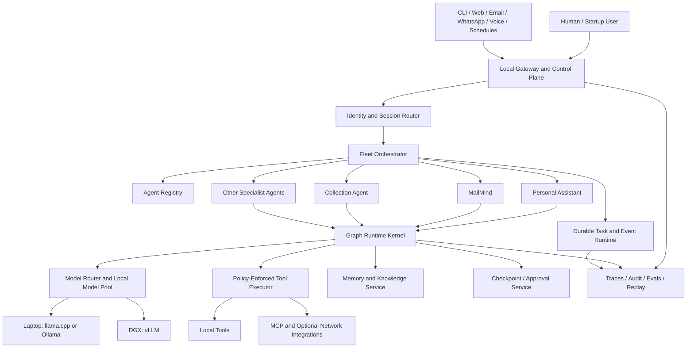

# Easy Agents Offline Agent Platform Roadmap

Status: ready for implementation

Branch: `saket/framework_update`

Repository snapshot reviewed: 2026-09-13

## Executive decision

The long-term product should be a local-first **Agent OS**: one controlled runtime
that can create, register, run, coordinate, observe, and govern many specialized
agents.

It should not become a directory full of unrelated chatbots. Every agent should
use the same contracts for models, tools, memory, tasks, handoffs, approvals,
events, channels, traces, and evaluation. This is what will make it possible to
build a personal assistant now and reuse the same foundation for startup agents
later.

The implementation should keep LangGraph as the low-level graph engine and build
Easy Agents as the opinionated framework and local control plane around it. The
repository should not reimplement graph scheduling, but it must add the missing
agent contracts, compilers, policies, fleet coordination, authoring experience,
and offline operations.

The collection agent is the behavioral reference implementation. It should be
migrated incrementally behind compatibility tests, not rewritten wholesale.

The [Personal Agent Constellation](../vision/personal-agent-constellation.md)
defines the user-facing vocabulary, overlapping personal/science/startup Guilds,
and recommended Specialist roster. Its
[gap and delivery plan](./personal-constellation-plan.md) extends this platform
sequence with feature intake, the Control Room, and domain-fleet rollout.

## North-star experience

The finished system should support this workflow:

1. Describe a new agent through an `agent.yaml`, prompts, optional custom nodes,
   and tools.
2. Validate its graph, state ownership, model requirements, permissions, memory
   access, and eval suite before it can run.
3. Start it through one CLI, API, control UI, schedule, channel, or another
   agent.
4. Run entirely offline when the selected profile says `network: deny`.
5. Pause for user input or approval and resume after a restart without repeating
   completed side effects.
6. Delegate bounded work to specialist agents using a typed handoff contract.
7. Inspect every run, tool call, model call, memory write, handoff, approval, and
   failure through a single trace.
8. Add a second or twentieth agent without editing the framework core.

The desired authoring vocabulary is:

- nodes: `IntentNode`, `EntityNode`, `RouterNode`, `ReactNode`, `ToolNode`,
  `MemoryReadNode`, `MemoryWriteNode`, `PlanStateNode`, `PlanGraphNode`,
  `ReflectNode`, `GuardrailNode`, `ApprovalNode`, `HandoffNode`, `ResponseNode`,
  and `ChannelNode`
- graph patterns: `SequentialGraph`, `ReActGraph`, `PlanExecuteGraph`,
  `ReflectGraph`, `TreeSearchGraph`, `GraphSearchGraph`, `SupervisorGraph`,
  `MapReduceGraph`, and `EventDrivenGraph`
- fleet concepts: `AgentManifest`, `AgentRegistry`, `Capability`, `Task`, `Run`,
  `Handoff`, `Policy`, `Approval`, `Checkpoint`, `Artifact`, and `Event`

`chain_of_thought`, `tree_of_thought`, and `graph_of_thought` may remain as UI
aliases for compatibility. They must describe orchestration topology, not expose
or persist a model's private chain-of-thought. Traces should store structured
decisions and concise rationales only.

### Platform taxonomy

Use these terms consistently:

- **Resource:** read-only context such as a document, database view, or device
  state.
- **Tool:** one typed executable operation with declared effects and policy.
- **Prompt:** a versioned template with a declared input and output contract.
- **Skill:** a reusable bundle of prompts, resources, tools, policies, and
  instructions that an agent can consume.
- **Node:** one graph step with declared state reads, writes, and capabilities.
- **Graph:** the control flow joining nodes into a bounded workflow.
- **Agent:** a versioned graph plus state, models, capabilities, memory policy,
  and evaluation contract.
- **Specialist:** an agent exposing a narrow capability for delegation.
- **Supervisor:** an agent allowed to plan, delegate, and aggregate bounded
  specialist work.
- **Team:** a configured set of agents plus a coordination policy.
- **Task:** durable work requested from an agent or team.
- **Run:** one execution attempt for a task.
- **Channel:** an adapter for inbound and outbound human or system messages.
- **Gateway:** the local control plane for identity, sessions, runs, channels,
  events, and operator controls.
- **Plugin:** an installable extension that registers capabilities without
  changing framework core.

This prevents “agent” from becoming the name for every function and keeps
composition understandable as the fleet grows.

## Product boundaries

### Build now

- a single-user, local-first framework and daemon
- local model and embedding support
- reusable graph patterns and typed state contracts
- durable local runs, task scheduling, and approvals
- controlled multi-agent delegation
- memory and local knowledge retrieval
- CLI, API, control UI, text, email, WhatsApp, and voice adapters
- safety policies, auditability, tests, and evaluation
- a clean path from laptop development to a DGX worker host

### Design for later, without implementing early

- multiple users and workspaces
- remote workers and distributed queues
- PostgreSQL and external vector-store adapters
- role-based administration, quotas, billing, and tenant isolation
- high availability and Kubernetes deployments
- a public plugin marketplace

### Explicit non-goals

- unrestricted self-modifying agents
- unrestricted shell, filesystem, credential, payment, or network access
- cloud services as a requirement for core operation
- storing raw model chain-of-thought
- one giant universal agent with every tool
- replacing all deterministic business rules with LLM calls
- creating a new orchestration engine when LangGraph already supplies the graph
  execution primitive

### Recommended proving fleet

Build agents because they exercise a missing platform capability, not simply to
increase the agent count:

1. **Simple Conversation:** minimal manifest, runtime, memory, and channel smoke
   test.
2. **MailMind:** real tools, retrieval, approvals, notifications, and external
   integration boundaries.
3. **Knowledge/Research:** local document ingestion, citations, artifacts,
   map/reduce, and long-running tasks.
4. **Personal Assistant:** supervisor, user memory, schedules, and cross-agent
   aggregation.
5. **Coding Agent:** filesystem and subprocess sandboxing, artifacts, approval,
   and resumable multi-step work.
6. **Collection Agent:** complex domain state, verification, guarded responses,
   voice, specialist handoffs, and large scenario evaluation.
7. **Monitoring/Ops Agent:** event-driven wakeups, recurring tasks, alerts, and
   failure recovery.
8. **Memory Consolidation Specialist:** bounded background learning with
   provenance and write policy.

The simple agent proves authoring first. MailMind should prove independent reuse
before the collection agent is heavily refactored. The collection agent remains
the final compatibility stress test.

## Repository assessment

### What is already valuable

| Area | Existing repository capability | Decision |
| --- | --- | --- |
| Graph runtime | `BaseAgent`, `GraphAgent`, LangGraph graphs, reusable nodes | Keep and evolve behind stronger contracts |
| Nodes | Intent, ReAct, reflection, response, memory, tool, approval, agent, router, WhatsApp nodes | Normalize configuration and state ownership |
| Tools | Pydantic input/output, registry, catalog, executor, execution logs | Add capability policy, idempotency, async, and MCP adapters |
| Memory | Working, episodic, semantic, reflection, error and task types; hot/warm/cold layers | Consolidate and namespace; stop parallel per-agent memory systems |
| Retrieval | FAISS backend, local embeddings, hybrid retrieval | Productize behind a knowledge/memory service |
| Models | Hugging Face, Qwen, FunctionGemma and OpenAI-compatible adapters | Replace inconsistent calls with one capability-aware client contract |
| Channels | WhatsApp, Gmail, CLI paths, Pipecat voice, local speech pipeline | Move channel lifecycle into a generic gateway |
| Observability | Structured logging, execution/node/model/tool traces | Define one event schema, redaction, replay, and metrics |
| Authoring | Graph builder UI, graph validation, Python scaffold export | Compile manifests into runnable graphs instead of placeholders |
| Reference agents | Collection Agent, MailMind, simple conversation, memory helper, discount specialist | Use as migration and compatibility fixtures |
| Evaluation | Extensive collection scenarios and a batch runner | Extract a framework-wide eval harness |

### Evidence from the current snapshot

- `src/` contains 141 Python files and about 13,883 lines.
- `agents/` contains 122 Python files and about 27,090 lines.
- the collection agent alone contains about 24,921 Python lines.
- several collection components exceed 1,000 lines; the largest planner and
  response modules exceed 2,000 lines.
- `brainstorming_agent`, `coding_agent`, and `orchestrator` are placeholders.
- graph modes are validated structurally, but generated code still uses
  placeholder nodes and does not compile a real configured runtime.
- no graph is currently compiled with a durable checkpointer.
- almost all graph execution is synchronous; there is no framework-wide
  cancellation, stream, or task lifecycle contract.
- a default test run produced 230 passes and 31 failures. The failures include
  collection behavior regressions, environment leakage, remote-provider mock
  mismatches, and an integration test that attempted a live request.

### Highest-priority architectural gaps

1. **The installed package boundary is unclear.** The distribution is named
   `easy_agent`, documentation says `easy_agents`, and runtime imports use
   `src.*`. The current tests work partly because the repository root is added
   to `PYTHONPATH`; this is not a stable SDK surface.
2. **The generic state is not generic.** `src/nodes/types.py` contains
   collections-specific verification, negotiation, and hardship fields.
3. **The generic graph is fixed.** `GraphAgent` assembles one ReAct-like loop
   instead of compiling a declared graph pattern.
4. **The best framework logic is trapped in the collection agent.** Its plan
   graph, state reconciliation, node instrumentation, routing, response safety,
   conversation management, and agent loop are not reusable.
5. **Multi-agent work is ad hoc.** The collection CLI recognizes string targets
   and manually calls the discount and memory-helper agents. There is no agent
   registry, typed handoff, task tree, permission delegation, or standard
   supervisor.
6. **Offline mode is not enforceable.** Some configurations use hosted
   providers, no policy prevents network fallback, and provider integration
   tests can see developer credentials.
7. **Side effects are not centrally governed.** Tool schemas and logs exist,
   but timeout, retry, approval, network, filesystem, and risk policy are not
   enforced by the executor.
8. **Short-term state, durable checkpoints, long-term memory, knowledge, and
   artifacts are not cleanly separated.** The collection memory helper also
   maintains a parallel JSON memory implementation.
9. **The runtime lacks durable work.** There is no shared task queue, event bus,
   scheduler, restart recovery, or idempotency contract.
10. **Interfaces and integrations are mixed into the core.** Shared schemas and
    settings contain Gmail, WhatsApp, Twilio, and collection-specific concepts;
    `APIInterface` and `CLIInterface` are empty placeholders.
11. **Tests are not hermetic.** Unit, integration, model, and scenario tests are
    not reliably separated, so the default suite can use local secrets or the
    network.
12. **Startup readiness is not yet present.** There is no workspace identity,
    agent versioning, migration policy, service authorization, usage accounting,
    or worker management.

## Target architecture



### Deployment shape

Start as a modular monolith:

- one `easy-agents` Python package
- one local gateway process
- one SQLite checkpoint/task/control database
- the existing DuckDB memory/analytics store
- FAISS plus local embeddings
- one or more local model-server processes
- optional isolated worker subprocesses for risky or resource-heavy agents

Do not start with microservices. Ports and adapters should allow the stores,
queue, model servers, and workers to be replaced later without changing agent
manifests.

### Target repository layout

The exact names may be refined through ADRs, but ownership should converge on
this shape:

```text
src/easy_agents/
  contracts/       # run, state, event, handoff, tool, approval, artifact
  runtime/         # runtime, compiler integration, lifecycle, checkpoints
  graphs/          # graph spec and executable graph-pattern builders
    patterns/
  nodes/           # reusable node implementations
  models/          # model clients, profiles, registry, router, pool
  tools/           # tool base, registry, executor, capability adapters
  memory/          # long-term memory records, policy, and stores
  knowledge/       # ingestion, chunking, indexing, retrieval, provenance
  artifacts/       # artifact metadata and local storage
  orchestration/   # agent registry, supervisor, teams, handoffs
  tasks/           # durable queue, schedules, events, cancellation
  policy/          # authorization, approvals, sandbox, redaction
  channels/        # generic message and delivery lifecycle
  integrations/    # Gmail, Twilio, Pipecat, MCP, and provider adapters
  observability/   # traces, audit, metrics, replay
  evals/           # scenario, contract, safety, and benchmark harnesses
  gateway/         # local API and control-plane services
  cli/             # one framework CLI

agents/<agent-name>/
  agent.yaml
  graph.yaml
  state.py
  prompts/
  nodes/            # domain-only nodes
  tools/            # domain-only tools
  policies/
  evals/
  tests/
  README.md

extensions/<plugin-name>/
  plugin.yaml
  easy_agents_plugin/  # registered tools, models, stores, channels, or skills
  tests/
```

Runtime data should live outside source-controlled agent packages. Seed and
golden data should be clearly separated from mutable sessions, logs, indexes,
model caches, and generated artifacts.

## Canonical contracts

### Agent manifest

Every runnable agent must have a versioned manifest. A representative shape is:

```yaml
api_version: easyagents/v1alpha1
kind: Agent
metadata:
  name: mailmind
  version: 0.1.0
  description: Decision-oriented email assistant
spec:
  entrypoint: agents.mailmind.agent:MailMindAgent
  graph:
    pattern: react_reflect
    file: graph.yaml
  state_schema: agents.mailmind.state:MailMindState
  models:
    planner: local_reasoning
    extractor: local_structured_small
  tools:
    allow:
      - email.search
      - email.summarize
      - email.draft
      - email.send
  memory:
    read: [thread, user_semantic, agent_episodic]
    write: [thread, agent_episodic]
  policy: policies/mailmind.yaml
  channels: [cli, web, whatsapp]
  evals: evals/manifest.yaml
```

The manifest is declarative metadata. Domain logic stays in typed nodes, tools,
policies, prompts, and schemas.

### Runtime objects

The core package should define versioned Pydantic models for:

- `RunRequest`: agent, input, caller, channel, session, budget, deadline, and
  requested output schema
- `RunContext`: workspace, user, session, task, run, parent run, trace,
  permissions, model profile, and cancellation token
- `RunState`: generic messages, observations, decisions, artifacts, errors, and
  namespaced extension state
- `NodeResult`: state delta, route, events, artifacts, and optional interrupt
- `AgentResult`: status, user-facing content, structured output, artifacts,
  usage, error, and next action
- `ToolCall` and `ToolResult`: typed invocation, effect metadata, idempotency
  key, timestamps, and audit fields
- `HandoffEnvelope`: caller, target capability or agent, bounded input,
  expected output schema, delegated permissions, budget, and lineage
- `ApprovalRequest` and `ApprovalDecision`
- `EventEnvelope`: version, event type, subject, correlation IDs, payload, and
  timestamp
- `ArtifactRef`: immutable reference to files, reports, images, code, or other
  large results that should not be copied into graph state

Required identifiers from the first version:

- `workspace_id`
- `user_id`
- `session_id`
- `task_id`
- `run_id`
- `parent_run_id`
- `trace_id`
- `agent_name`
- `agent_version`

Even the personal single-user profile should populate these IDs. Startup mode
can then add authorization and tenant enforcement without changing contracts.

### State ownership

The generic state should contain only framework fields. Domain state should be
namespaced and typed by each agent.

Recommended logical shape:

```text
core.messages
core.decisions
core.observations
core.errors
core.artifacts
core.runtime
agent.<agent-name>.*
node.<node-id>.*
```

Each field must have one declared owning node or reducer. Cross-node mutation of
the same business field should fail manifest validation unless a reducer is
declared. State passed to the checkpointer must be JSON-serializable.

### Node contract

Every node should:

- accept `RunState` plus injected dependencies
- return a `NodeResult` or typed state delta
- declare fields read and written
- declare model and tool capabilities required
- declare whether it can interrupt, retry, or perform side effects
- emit normalized lifecycle events
- have a deterministic fake for tests

Nodes should not load global configuration, construct provider clients, or write
arbitrary files themselves.

### Graph patterns

| Pattern | Runtime meaning | Primary use |
| --- | --- | --- |
| `SequentialGraph` | One acyclic ordered path | Extraction and deterministic workflows |
| `ReActGraph` | Decide, act, observe loop with hard budgets | Tool-using assistants |
| `PlanExecuteGraph` | Build typed plan, execute steps, revise remaining work | Multi-step operational tasks |
| `ReflectGraph` | Execute, validate, retry or finish | Quality-sensitive outputs |
| `TreeSearchGraph` | Generate bounded candidates, score, select | Planning alternatives |
| `GraphSearchGraph` | Explore and merge bounded dependent candidates | Complex research and design |
| `SupervisorGraph` | Route and delegate to specialist agents | Agent fleets |
| `MapReduceGraph` | Parallel bounded work and typed aggregation | Document and batch processing |
| `EventDrivenGraph` | Wake from event, schedule, webhook, or queue | Always-on assistants |

Every loop must declare maximum steps, wall time, model calls, tool calls, and
handoff depth. Every graph must have explicit success, failure, cancellation,
waiting-for-input, and waiting-for-approval exits.

## Subsystem plan

### 1. Package and configuration boundary

Adopt one canonical Python namespace: `easy_agents`. The distribution should be
`easy-agents`. Move shared code under `src/easy_agents/` and preserve temporary
compatibility imports so agents can migrate gradually.

Split configuration into:

- framework settings
- runtime profile
- model profiles
- storage profile
- channel and integration profiles
- agent manifests
- policies
- secret references

Configuration precedence must be deterministic and testable:

`built-in defaults < config files < selected profile < environment < CLI`

Loading one project's `.env` must not inherit unrelated ambient values by
accident. Secrets must be referenced by name and resolved at runtime; they must
never be serialized into manifests, checkpoints, traces, or tool results.

### 2. Runtime kernel and durability

Replace the fixed `GraphAgent` assembly with:

- `GraphCompiler`
- `NodeRegistry`
- `GraphPatternRegistry`
- `AgentRuntime`
- `RunManager`
- `CheckpointStore`
- `InterruptManager`

Use LangGraph checkpointing for node-level persistence. Use a local SQLite
checkpointer first. All external side effects must execute as idempotent tasks
with stable idempotency keys so a resumed run cannot send a message, make a
payment action, or schedule a callback twice.

The runtime must expose synchronous, asynchronous, and streaming APIs plus
cancellation. A single state machine should define:

```text
queued -> running -> completed
                  -> waiting_input -> running
                  -> waiting_approval -> running
                  -> retry_scheduled -> running
                  -> failed
                  -> cancelled
```

### 3. Authoring layer and graph compiler

The graph builder, YAML loader, CLI, and runtime must consume the same schema.
The compiler should:

- resolve node and tool types from registries
- validate input/output and state schemas
- validate state ownership and reducers
- validate start/end paths, cycles, loop budgets, and unreachable nodes
- validate model capability requirements
- validate requested tools against the policy
- bind prompts and dependency references
- compile a runnable LangGraph graph
- emit a locked, versioned resolved manifest for reproducibility

Replace the placeholder Python scaffold with either:

- a directly runnable manifest, or
- generated code containing real configured node bindings

Add CLI commands:

```text
easy-agents init
easy-agents new <name> --template <pattern>
easy-agents validate <agent>
easy-agents graph <agent>
easy-agents run <agent>
easy-agents eval <agent>
easy-agents replay <run-id>
easy-agents agents list
easy-agents models list
easy-agents tools list
easy-agents daemon start|status|stop
```

### 4. Model runtime

Replace the inconsistent `generate(...)` method shapes with one contract:

```text
ModelClient.generate(ChatRequest) -> ModelResponse
ModelClient.generate_structured(ChatRequest, schema) -> typed result
ModelClient.stream(ChatRequest) -> events
```

Add:

- `ModelProfile`: provider, model, endpoint, context size, structured-output
  support, tool-calling support, modalities, privacy class, concurrency, and
  resource requirements
- `ModelRegistry`: discovered and configured models
- `ModelRouter`: selects a compatible model for a node's declared requirement
- `ModelPool`: explicit lifecycle/cache instead of metaclass singletons
- health, warm-up, timeout, retry, circuit-breaker, and cancellation handling
- token/context budgeting and prompt truncation policy
- grammar/schema-constrained local generation where supported

Recommended local profiles:

- laptop/Apple Silicon: llama.cpp or Ollama through an OpenAI-compatible local
  endpoint
- DGX/NVIDIA: vLLM through the same internal client contract
- embedded/small tasks: specialized local classifier, extractor, embedding,
  reranker, VAD, STT, and TTS models

`offline_strict` must reject every non-loopback model endpoint and must never
fall back to a hosted provider. A separate `hybrid_opt_in` profile may permit
explicit cloud models.

### 5. Tools, capabilities, and interoperability

Extend each tool with metadata:

- namespaced name and version
- effects: read, write, delete, send, network, shell, payment, or device control
- risk level
- required permissions
- allowed resource scopes
- network requirement and host allowlist
- timeout and retry policy
- idempotency behavior
- approval policy
- secret references
- concurrency limit
- audit/redaction rules

The `ToolExecutor` must be the only normal path for tool side effects. It should
perform policy evaluation before execution and audit both allowed and denied
calls. High-risk actions should use durable approvals and resume the original
run after the decision.

Add an MCP client adapter after the internal policy contract is established.
MCP-discovered tools, resources, and prompts should be wrapped as normal Easy
Agents capabilities; discovery must never bypass local permissions. Later, an
MCP server adapter can expose selected local agents or tools to other hosts.

### 6. Memory, knowledge, and artifacts

Separate four concerns:

1. **Thread state:** short-term graph state stored by the checkpointer.
2. **Long-term memory:** episodic, semantic, reflection, error, preference, and
   task memories.
3. **Knowledge:** indexed documents and other source material used for RAG.
4. **Artifacts:** files and large outputs referenced by immutable IDs.

Every memory and knowledge record should carry:

- workspace, user, agent, and optional session namespace
- source and provenance
- sensitivity label
- confidence and importance
- created, updated, expiry, and last-access timestamps
- schema and embedding versions
- links to source runs, messages, tools, and artifacts

Build on the current DuckDB, JSONL archive, FAISS, and hybrid retrieval work.
Add deterministic local embedding profiles, index rebuild/version commands,
delete/forget operations, retention, export, backup, and corruption recovery.

Memory writes should be proposed by a generic `MemoryConsolidationAgent` or
deterministic policy and then validated before storage. An agent must not turn a
single untrusted message into global semantic memory automatically. The
collection memory helper's parallel JSON stores should migrate to this service.

### 7. Fleet orchestration

Implement an `AgentRegistry` with capability descriptors, versions, health,
accepted input schemas, output schemas, permissions, and resource requirements.

Implement a `SupervisorAgent` that routes by capability and returns a typed task
tree. Delegation must use `HandoffEnvelope`, not string targets. The envelope
must include:

- requested capability and optional preferred agent
- bounded input and expected output schema
- parent task/run lineage
- delegated permissions, never more than the caller owns
- model/tool/time/token/handoff budgets
- deadline, priority, and cancellation propagation
- memory visibility and artifact references

Start with in-process agents, then add isolated local worker subprocesses.
Parallel work should only be used when dependencies permit it and resource
budgets allow it. Hard limits must prevent ping-pong delegation and runaway
agent trees.

The current collection outer loop should become a compatibility adapter over
this runtime. `DiscountPlanningAgent` and the memory helper should then be real
registered specialists.

### 8. Tasks, events, and schedules

Implement a durable local task service using SQLite first:

- queue and lease tasks
- recover abandoned leases
- schedule one-time and recurring work
- record dependencies and parent/child tasks
- wait for human input, approval, external event, or a future time
- cancel and propagate cancellation
- retry with bounded exponential backoff
- use idempotency and deduplication keys

Implement a small durable event journal with subscriptions for:

- inbound channel messages
- schedule triggers
- file and inbox events
- agent lifecycle events
- tool/model health changes
- approval decisions
- task completion/failure

Do not add Kafka or a distributed workflow engine during the personal phase.
Define ports so a startup deployment can replace the local task/event adapters.

### 9. Gateway, channels, and conversation management

Extract the useful collection conversation-manager behavior into a generic
channel delivery layer:

- canonical inbound/outbound message envelopes
- sender-to-user/session identity mapping
- duplicate suppression and idempotency
- latest-input-wins supersession
- streaming progress and filler messages
- stale-response suppression
- replay of the last delivered result
- barge-in and cancellation for voice
- delivery acknowledgements and retries
- conversation close and retention lifecycle

The gateway should expose local API, CLI, web/control UI, webhook, and event
entrypoints. Channel adapters should cover email, WhatsApp, and Pipecat voice
without putting provider-specific fields in core state.

The personal assistant becomes the default front door. It should route tasks to
specialists, summarize results, ask for approvals, and maintain user-level
context. Direct invocation of a specialist remains available for debugging and
specialized channels.

### 10. Policy, security, and privacy

The human user is the root authority. Agents receive least-privilege capability
grants per manifest, task, and handoff.

Required controls:

- `offline_strict` egress denial with explicit loopback exceptions
- sender pairing or allowlists for externally reachable channels
- filesystem roots and read/write/delete scopes
- subprocess command policy and sandboxing
- network host allowlists
- approval for destructive, financial, communication, credential, and other
  high-risk side effects
- secret resolution from environment or OS keychain without trace exposure
- structured redaction for credentials and sensitive personal data
- prompt-injection trust labels for channel, document, memory, and tool content
- output/content guardrails configurable per domain
- immutable audit records for side effects and policy decisions
- memory retention, export, and deletion
- backup encryption and documented recovery

Startup mode later adds workspace isolation, service authentication, RBAC,
quotas, and tenant-scoped encryption keys. The IDs and namespaces should exist
now, while the enforcement can remain single-user.

### 11. Observability, replay, and evaluation

Standardize lifecycle events such as:

```text
run.created
run.started
node.started
model.requested
model.completed
tool.requested
policy.decided
approval.requested
handoff.started
memory.written
artifact.created
node.completed
run.completed
run.failed
```

Every event should carry correlation IDs and redact secrets by construction.
Traces should support live streaming, JSONL export, database query, and replay.
Replay should be able to substitute recorded model/tool outputs for deterministic
debugging.

Extract the collection batch runner into a generic eval package supporting:

- unit and contract tests
- graph topology and state-ownership tests
- golden scenario tests
- trace assertions
- model-quality evals
- tool and policy safety tests
- prompt-injection and data-leakage tests
- interruption, restart, idempotency, and recovery tests
- latency and resource benchmarks

Default tests must be network-free. Mark provider, GPU, voice-device, and live
integration tests separately and require explicit flags. CI should run a small
CPU-only matrix using fake models and tools.

### 12. Local operations and startup evolution

The local daemon should provide:

- model, agent, worker, channel, queue, and storage health
- start/stop/restart and graceful shutdown
- run/task/approval inspection
- local-only bind by default
- structured logs and rotation
- database/index backup and restore
- manifest and schema migrations
- offline installation and cached model verification

Support two first-class runtime profiles:

- `personal_laptop`: one process plus local model endpoint, conservative
  concurrency, local filesystem stores
- `personal_dgx`: gateway plus GPU model server and local worker pool, with
  resource-aware concurrency

Only after the single-user platform is stable should `startup_single_host` and
then distributed profiles be added.

## Repository migration map

| Current source | Target change |
| --- | --- |
| `src/agents/base_agent.py` | Keep minimal behavior; make typed `RunRequest -> AgentResult` the primary contract |
| `src/agents/graph_agent.py` | Split into graph compiler, runtime, and run manager; remove fixed graph construction |
| `src/nodes/types.py` | Remove collection fields; introduce generic core state and namespaced domain extensions |
| `src/nodes/*.py` | Keep useful nodes; add manifests, read/write declarations, async support, and normalized results |
| `src/graph_builder/spec.py` | Replace placeholder generation with versioned manifest/graph compilation |
| `src/tools/*` | Add namespaced capabilities, policies, idempotency, async execution, and MCP wrapping |
| `src/llm/*` | Unify client API; add registry, router, pool, health, and strict-offline enforcement |
| `src/memory/*` and `src/retrieval/*` | Consolidate into memory/knowledge services with namespaces and lifecycle operations |
| `src/utils/config.py` | Split core config from Gmail/Twilio/model/integration profiles; fix deterministic precedence |
| `src/storage/duckdb_store.py` | Separate generic persistence from MailMind-specific repository concerns |
| `src/schemas/tool_io.py` | Move Gmail-specific schemas into the Gmail integration package |
| `src/speech/pipecat_*.py` | Remove collection-specific naming and bind through generic voice/channel profiles |
| `src/interfaces/api.py` and `cli.py` | Implement real gateway clients or remove the placeholders |
| `agents/collection_agent/agent.py` | Preserve domain graph while replacing custom lifecycle, instrumentation, and handoffs with shared runtime components |
| `agents/collection_agent/nodes/plan_proposal_graph_node.py` | Extract a generic versioned plan graph engine; keep collections policy in an adapter |
| `agents/collection_agent/nodes/plan_proposal_state_node.py` | Extract generic state-overlay/classification hooks; keep fields domain-specific |
| `agents/collection_agent/nodes/plan_proposal_directive_node.py` | Split generic plan/directive contracts from collections decision policy |
| `agents/collection_agent/nodes/collection_response_node.py` | Extract response compilation, validation, and leakage protection; keep collections templates/policy local |
| `agents/collection_agent/nodes/collection_reflect_node.py` | Extract configurable validation/retry framework |
| `agents/collection_agent/conversation_manager/*` | Move transport-neutral delivery lifecycle into the gateway/channel package |
| `agents/collection_agent/evaluation/*` | Generalize scenario execution and trace assertions into `easy_agents.evals` |
| `agents/collection_memory_helper_agent/*` | Replace parallel JSON memory with a registered memory-consolidation specialist |
| `agents/discount_planning_agent/*` | Convert the dataclass helper into a typed registered specialist agent |
| `agents/mailmind/*` | First independent consumer of the new manifest/runtime after the minimal example |
| placeholder agent directories | Implement only as reference agents when their required platform phase is ready |

## Phased implementation roadmap

### Phase 0 — Establish a trustworthy baseline

Deliverables:

- classify tests as unit, contract, scenario, integration, GPU, voice, and live
- make the default test command hermetic and network-disabled
- prevent ambient `.env` values from contaminating unit tests
- adjudicate every collection failure against the documented behavior before
  either fixing code or changing an expectation
- record a passing collection scenario baseline and trace fixtures
- expand `.gitignore` for runtime directories, logs, PID files, archives, editor
  metadata, and generated artifacts
- move tracked mutable runtime JSON into fixtures or seed data
- align project name, package name, README, and supported Python/dependency
  versions
- add formatting, lint, type, and secret-scan configuration

Exit criteria:

- default tests make zero network calls and pass from a clean checkout
- live integration tests require an explicit command and never print secrets
- runtime execution does not dirty the repository
- the collection golden scenarios and expected trace shapes are versioned

### Phase 1 — Create the versioned SDK contract

Deliverables:

- canonical `easy_agents` package namespace with compatibility imports
- contracts for run, context, state, result, event, artifact, handoff, tool, and
  approval
- framework/domain state separation and field ownership metadata
- unified configuration loader and secret references
- normalized error taxonomy
- explicit dependency injection for model, storage, memory, tools, and tracing

Exit criteria:

- the simple conversation agent runs through the new `AgentRuntime`
- all core state is JSON-serializable and free of collection fields
- an agent can return text, structured data, and artifact references through the
  same result contract

### Phase 2 — Compile real agents from manifests

Deliverables:

- `AgentManifest` and `GraphSpec` v3
- registries for nodes, tools, models, channels, and graph patterns
- manifest validator and graph compiler
- real implementations of `SequentialGraph`, `ReActGraph`, and `ReflectGraph`
- CLI create/validate/run/graph commands
- graph builder updated to read and save the same schema
- runnable templates for conversation, tool-using, and approval workflows

Exit criteria:

- a generated agent contains no placeholder execution code
- adding a basic agent requires no edits under `src/easy_agents`
- CLI, UI, and Python use the same resolved manifest

### Phase 3 — Make execution durable and govern side effects

Deliverables:

- SQLite LangGraph checkpointer
- run/task lifecycle persistence
- async invocation, event streaming, and cancellation
- durable interrupts for user input and approvals
- policy-enforced tool executor
- idempotency, timeout, retry, concurrency, and audit support
- replay using recorded model/tool results

Exit criteria:

- killing the process mid-run and restarting resumes from a checkpoint
- an approved side effect is not repeated on resume
- denied and approval-required tool calls are visible in the trace

### Phase 4 — Complete the offline model layer

Deliverables:

- unified model client, profile, registry, router, and pool
- local llama.cpp/Ollama profile and DGX/vLLM profile
- structured-output and tool-call conformance tests
- model health, warm-up, context budgets, timeouts, and cancellation
- strict offline egress tests
- local embedding, reranking, STT, and TTS profiles

Exit criteria:

- core demos and evals run with the network disabled
- no offline run can silently fall back to a hosted endpoint
- nodes request capabilities instead of hardcoding a model name

### Phase 5 — Consolidate memory, knowledge, and artifacts

Deliverables:

- namespaced memory service over current storage layers
- document/knowledge ingestion and retrieval contracts
- versioned FAISS indexes and local hybrid retrieval
- memory consolidation workflow
- artifact store and references
- retention, forget, export, backup, rebuild, and recovery commands
- migration of collection helper memory

Exit criteria:

- two agents can share explicitly permitted user memory without sharing private
  agent memory
- removing a memory also removes or tombstones its vector entry
- all retrieved claims preserve source provenance

### Phase 6 — Build the local agent fleet

Deliverables:

- agent registry and capability discovery
- Feature Architect proposals that choose reuse, composition, extension, or a
  new Draft Charter
- `SupervisorGraph`, `PlanExecuteGraph`, and `MapReduceGraph`
- typed handoffs and task trees
- local worker pool and resource-aware scheduling
- loop, depth, time, token, model, and tool budgets
- durable events and scheduled jobs
- migration of the collection discount and memory-helper handoffs

Exit criteria:

- the supervisor delegates a task to at least two specialists and aggregates the
  result through typed schemas
- permissions can only narrow across a handoff
- cancellation and failure propagate through the task tree
- delegation loops terminate deterministically

### Phase 7 — Build the personal-assistant gateway

Deliverables:

- generic conversation/delivery manager extracted from collections
- local daemon, API, CLI client, and control UI
- identity/session routing
- web, WhatsApp, email, and voice channel adapters
- schedules, notifications, interruption, and delivery tracking
- personal assistant front-door agent

Exit criteria:

- one user can continue the same task across two configured channels
- voice barge-in cancels or supersedes stale work correctly
- externally reachable channels pair or authenticate senders
- the gateway binds locally unless explicitly configured otherwise

### Phase 8 — Migrate and prove the reference agents

Migration order:

1. simple conversation agent
2. MailMind read/search/summarize flow
3. MailMind approval/send flow
4. collection memory helper
5. discount planning specialist
6. collection graph, one slice at a time
7. brainstorming agent
8. coding agent with a strict workspace sandbox

For the collection graph, extract in this order:

1. tracing and node wrapper
2. run/result and response-target compatibility adapter
3. typed handoff and outer agent loop
4. generic response directive and guardrail hooks
5. generic plan state/graph primitives
6. conversation delivery manager
7. domain state cleanup

Exit criteria:

- all reference agents use manifests and the shared runtime
- collection behavior and safety evals meet or exceed the frozen baseline
- collection-specific concepts no longer appear in generic state or shared
  speech/runtime APIs

### Phase 9 — Prepare the startup deployment profile

Deliverables, only after prior phases are stable:

- workspace and user authorization enforcement
- PostgreSQL control/checkpoint adapter
- external object/vector store adapters where justified
- remote authenticated workers
- quotas, usage accounting, and per-workspace policies
- deployment migrations, rolling compatibility, and backup/restore drills
- security review and threat model for exposed gateways

Exit criteria:

- tenant isolation tests cover state, memory, artifacts, traces, tools, and
  channels
- old in-flight runs survive a compatible agent upgrade
- startup deployment can still run with self-hosted models and storage

## First implementation sequence for this branch

The first pull-request-sized changes should be:

### PR 1 — Baseline and repository hygiene

- make default pytest hermetic
- register and isolate integration markers
- fix environment precedence/isolation
- prevent live provider tests from running by default
- classify the 22 collection-related failures as code regressions or stale
  expectations and resolve them without weakening safety
- expand runtime/generated-file ignores
- document the clean test commands

### PR 2 — Core contracts and state separation

- introduce `RunRequest`, `RunContext`, `AgentResult`, `NodeResult`,
  `HandoffEnvelope`, `EventEnvelope`, and `ArtifactRef`
- reduce generic `AgentState` to framework fields
- keep `CollectionGraphState` as the domain extension
- adapt `GraphAgent` and the simple conversation agent without changing their
  visible behavior
- add serialization and contract tests

### PR 3 — Manifest and executable graph compiler

- add `AgentManifest` and GraphSpec v3
- implement node/model/tool registries
- compile the simple conversation agent from a manifest
- make the graph builder export a runnable configuration
- add `easy-agents new`, `validate`, and `run`

After these three changes, proceed with durable execution and policy-enforced
tools before extracting large collection planner modules.

## Definition of done for the framework

The framework milestone is complete when all of the following are true:

- a clean checkout installs and imports through one canonical package namespace
- default tests are green, deterministic, and offline
- agents are declared by versioned manifests and compiled by one runtime
- graph patterns have executable semantics, not labels
- state fields have typed ownership and checkpoint-safe serialization
- runs survive restart and resume without duplicate side effects
- every side-effecting tool call passes policy and audit
- strict offline mode is technically enforced
- local models are selected by capability and resource profile
- memory is namespaced, attributable, exportable, and deletable
- agent handoffs are typed, bounded, permission-limited, and traceable
- schedules and events can wake agents durably
- the personal-assistant gateway can coordinate multiple specialists
- MailMind and the collection agent both run on the shared contracts
- creating a new ordinary agent requires no framework-core edits
- startup-specific multi-user components can be added through existing ports
  without rewriting agent definitions

## Success measures

- 100% of side-effecting tool calls have a policy decision and audit record.
- 100% of runs, child tasks, model calls, tool calls, handoffs, approvals, and
  artifacts share trace lineage.
- strict-offline test runs make zero non-loopback network calls.
- default tests contain zero live credentials and make zero live provider calls.
- a process-kill recovery test proves checkpoint resume and side-effect
  idempotency.
- two independently authored agents share the framework without shared domain
  code.
- a new template-generated tool agent can be created, validated, and run without
  editing `src/easy_agents`.
- collection regression, privacy, verification, payment, and escalation suites
  remain green throughout extraction.

## Architectural decision log to create during implementation

Create short ADRs for decisions that affect compatibility:

1. canonical package and distribution naming
2. manifest and graph-spec versioning
3. generic state and reducer ownership
4. LangGraph version and checkpoint serialization
5. SQLite control store versus DuckDB memory/analytics roles
6. local model serving profiles
7. tool capability and approval policy
8. memory namespaces and consolidation
9. task/event durability and idempotency
10. agent versioning and in-flight run compatibility

## Reference material

The implementation direction is consistent with these primary references:

- [LangGraph persistence and checkpoints](https://docs.langchain.com/oss/python/langgraph/persistence)
- [LangGraph subgraphs](https://docs.langchain.com/oss/python/langgraph/use-subgraphs)
- [LangGraph interrupts](https://docs.langchain.com/oss/python/langgraph/interrupts)
- [llama.cpp local inference and OpenAI-compatible server](https://github.com/ggml-org/llama.cpp)
- [vLLM OpenAI-compatible server](https://docs.vllm.ai/en/latest/serving/openai_compatible_server/)
- [Model Context Protocol architecture](https://modelcontextprotocol.io/docs/learn/architecture)
- [OpenClaw local gateway and channel model](https://github.com/openclaw/openclaw)

These are reference points, not dependencies on their full product stacks. Easy
Agents should remain a focused Python framework and local runtime tailored to
this repository's personal-assistant and future startup goals.
