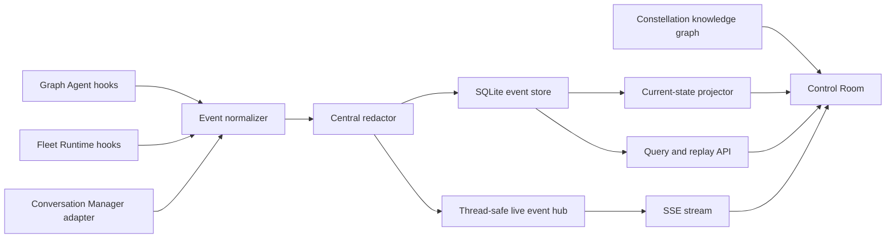

# Realtime Monitoring and Tracing Plan

Status: local MVP implemented; durable controls and distributed hardening pending

Branch reviewed: `saket/framework_update`

Repository snapshot: 2026-09-22

## Outcome

Build a local-first Operations view inside the existing Control Room that lets
one person understand an agent fleet while it is running. It will reuse the
Constellation knowledge graph as the stable topology and overlay live execution
state on it.

The first release must answer these questions without reading logs:

- Which Missions and Specialists are active, queued, waiting, blocked, failed,
  or complete?
- Why was each Specialist selected and which Playbook is it running?
- Which Specialist handed work to which other Specialist?
- Which model, tool, memory scope, policy, and Gate is involved right now?
- Where is time being spent and where did an error originate?
- What changed during a run, in exact event order?
- Can the same run be replayed after a restart without exposing secrets or
  private reasoning?

The monitoring system is an observability surface. It does not grant new agent
permissions and does not become an alternative side-effect path.

## Implementation snapshot

The local MVP described by this plan is now implemented:

- Phase 0: canonical contracts, legacy normalization, correlation fields,
  allowlisting, bounds, and redaction are complete.
- Phase 1: append-only SQLite storage, monotonic cursors, idempotent event IDs,
  persisted projections, restart restore, and deterministic rebuild are
  complete.
- Phase 2: Fleet Mission, Work-order, Specialist, policy, approval, Playbook,
  step, and model instrumentation is complete. Older Graph Agents can use the
  pipeline through their existing `TraceSink` input but are not globally
  auto-wired.
- Phase 3: snapshots, filtered history, Mission/Run detail, timeline, metrics,
  and resumable SSE endpoints are complete.
- Phase 4: Map/Live modes, operational counters, node-state overlays, activity
  edges, filters, inspectors, reconnect states, and reduced motion are complete.
- Phase 5: retained Mission timelines and deterministic graph replay through a
  sequence scrubber are complete for the local event window.
- Phase 6 is partial: failed, blocked, and approval-waiting alerts exist;
  durable Gate decisions, cancel/retry/quarantine commands, scheduled retention,
  export/delete workflows, percentile aggregates, and optional OpenTelemetry
  export remain pending.

Implementation and usage details are in
[Realtime Monitoring and Tracing](../reference/functionalities/observability.md).

## Product model

The Control Room should expose three related modes:

| Mode | Question answered | Data source |
| --- | --- | --- |
| **Map** | What exists and how may it relate? | Versioned Constellation catalog and knowledge graph |
| **Live** | What is happening now? | Durable event stream plus current-state projection |
| **Replay** | What happened during this Mission? | Persisted events ordered by server sequence |

Map topology remains stable. Live events change badges, colors, counters, and
activity edges; they must not continuously rearrange the force layout.

The existing vocabulary remains useful:

- **Mission**: the user's bounded objective.
- **Work order**: a delegated unit of work for one Specialist.
- **Run**: one execution attempt for a Mission or Work order.
- **Span**: a timed operation inside a Run, such as a Playbook step, tool call,
  model call, or memory access.
- **Event**: one immutable fact about a lifecycle transition.
- **Gate**: an approval or policy checkpoint.
- **Projection**: rebuildable current state calculated from ordered events.
- **Alert**: a derived condition that needs attention, not an unstructured log
  message.

## Repository starting point

This is an extension rather than a greenfield subsystem. The repository already
has:

- `ExecutionTrace` for an agent turn and summaries of node, model, and tool
  activity;
- context-local `trace_turn()` and `trace_node()` instrumentation;
- `record_llm_call()` and `record_tool_call()` hooks used by shared model and
  tool adapters;
- real-time `TraceSink` implementations for stdout, JSONL, and in-memory UI
  callbacks;
- graph events including `turn_started`, `turn_finished`, `node_started`,
  `node_finished`, `node_state`, `llm_call`, and `tool_call`;
- a Fleet Runtime with Missions, Work orders, policy decisions, approvals,
  Specialist results, and Playbook steps;
- a FastAPI gateway and a dependency-light SVG Constellation UI;
- static graph nodes for Specialists, Guilds, capabilities, tools, memories,
  Playbooks, policies, models, and services.

The current gaps are:

- traces are scoped to individual agent turns rather than a complete Mission;
- Fleet Runtime lifecycle transitions are not emitted;
- events do not share a versioned envelope, monotonic sequence, parent span,
  severity, or data classification;
- current events can contain raw user input, graph state, observations, model
  output, and errors without central redaction;
- JSONL is not queryable and has no retention or replay contract;
- the browser has no live stream, current-state projection, timeline, or run
  inspector;
- Conversation Manager events and graph traces are related but not normalized;
- there is no reconnect, backpressure, dropped-event accounting, or fleet-level
  metric model.

## Architecture decision

Use a modular monolith for the first release: one local FastAPI service, one
SQLite database in WAL mode, and Server-Sent Events (SSE) from the service to
the browser.



Events are persisted before they are published. The database is authoritative;
the live stream is only the low-latency delivery path. Current-state and metric
tables are rebuildable projections, not competing sources of truth.

### Why SSE first

SSE matches the primary need: a one-way stream from the local service to one or
more browser tabs. It works with FastAPI's streaming response, has a standard
`Last-Event-ID` reconnect mechanism, uses ordinary HTTP, and is simpler to
operate than a bidirectional WebSocket protocol.

Commands such as cancel, approve, deny, pause, or resume remain explicit POST
requests with policy checks. WebSockets can be added later only if remote
workers or high-frequency bidirectional traffic make them necessary.

### Delivery guarantees

The first release provides at-least-once browser delivery with deterministic
deduplication:

1. SQLite assigns a monotonically increasing `sequence` when the event commits.
2. The event is published to connected subscribers only after the commit.
3. An SSE client registers its bounded queue before reading catch-up events.
4. Catch-up events are read after the supplied cursor and sent in sequence.
5. Queue events with a sequence at or below the last sent sequence are ignored.
6. On reconnect, `Last-Event-ID` resumes from the durable store.

Event identifiers are unique and append is idempotent. Ordering is guaranteed
inside one local event store; timestamps are descriptive and never used as the
ordering key.

## Canonical event contract

Add a versioned `TraceEvent` Pydantic model. The exact Python shape can evolve,
but version 1 must carry:

```json
{
  "schema_version": 1,
  "event_id": "evt-uuid",
  "sequence": 1842,
  "occurred_at": "2026-09-22T10:15:22.412Z",
  "event_type": "tool.completed",
  "severity": "info",
  "status": "completed",
  "mission_id": "mission-uuid",
  "work_order_id": "work-uuid",
  "run_id": "run-uuid",
  "trace_id": "trace-uuid",
  "span_id": "span-uuid",
  "parent_span_id": "span-parent-uuid",
  "actor": {"kind": "specialist", "id": "research_scout"},
  "subject": {"kind": "tool", "id": "paper_search"},
  "summary": "Paper search completed",
  "duration_ms": 281.4,
  "attributes": {"result_count": 12},
  "metrics": {},
  "data_classification": "internal",
  "redaction_version": 1
}
```

Required invariants:

- IDs, event type, server timestamp, severity, classification, and schema
  version are always present.
- A Mission event has `mission_id`; nested activity also carries its Run and
  parent identifiers.
- `actor` says who performed the operation. `subject` points to the graph entity
  being used or changed.
- `summary` is a short operational fact, not a prompt, response, memory value,
  tool payload, or chain-of-thought.
- `attributes` is type-specific, size-limited, allowlisted, and redacted before
  persistence or fan-out.
- terminal events include status and duration when known.
- exceptions are stored as bounded error type/code and safe message; stack
  traces remain opt-in local debug data with a shorter retention period.

### Initial event taxonomy

Use dotted names so lifecycle pairs and filters remain predictable:

| Area | Events |
| --- | --- |
| Mission | `mission.created`, `mission.routed`, `mission.started`, `mission.completed`, `mission.failed`, `mission.cancelled` |
| Work order | `work_order.created`, `work_order.queued`, `work_order.started`, `work_order.completed`, `work_order.blocked`, `work_order.failed` |
| Specialist | `specialist.selected`, `specialist.started`, `specialist.completed`, `specialist.failed` |
| Playbook | `playbook.started`, `step.started`, `step.completed`, `step.waiting`, `step.failed` |
| Graph | `node.started`, `node.state_changed`, `node.completed`, `node.failed`, `transition.selected` |
| Handoff | `handoff.requested`, `handoff.accepted`, `handoff.completed`, `handoff.rejected` |
| Policy and Gates | `policy.allowed`, `policy.blocked`, `approval.requested`, `approval.approved`, `approval.denied`, `approval.expired` |
| Tool | `tool.requested`, `tool.started`, `tool.completed`, `tool.failed` |
| Model | `model.requested`, `model.started`, `model.completed`, `model.failed` |
| Memory | `memory.read`, `memory.write`, `memory.denied`, `memory.deleted` |
| Artifact | `artifact.created`, `artifact.updated`, `artifact.deleted` |
| Runtime | `worker.online`, `worker.offline`, `worker.heartbeat`, `resource.sampled`, `stream.gap_detected` |
| Alert | `alert.opened`, `alert.acknowledged`, `alert.resolved` |

Do not create one-off names in domain agents. Add an event type only when its
meaning, actor/subject mapping, required attributes, and privacy policy are
documented and contract-tested.

### Legacy event mapping

Preserve existing sinks while normalizing their events into the new pipeline:

| Existing event | Canonical event |
| --- | --- |
| `turn_started` | `specialist.started` with a Run root span |
| `turn_finished` | `specialist.completed` or `specialist.failed` |
| `node_started` | `node.started` |
| `node_finished` | `node.completed` or `node.failed` |
| `node_state` | `node.state_changed`, with only allowlisted state metadata |
| `llm_call` | one completed `model.completed` span; split start/finish in new adapters |
| `tool_call` | one completed or failed tool span; split start/finish in new executor hooks |
| Collection `hop_started`/`hop_update` | Work-order or handoff lifecycle events through an adapter |

`ExecutionTrace.to_dict()` remains available for compatibility. The central
pipeline becomes another `TraceSink`, so existing Graph Agents do not need a
second instrumentation API.

## Storage and projections

Use Python's standard `sqlite3` module initially; do not add a database
framework to the critical path.

### Authoritative table

`trace_events` stores the immutable event envelope. Important columns such as
sequence, time, type, severity, status, Mission, Run, trace, actor, and subject
are real indexed columns. The bounded type-specific attributes remain JSON.

Indexes must cover:

- `(mission_id, sequence)`;
- `(run_id, sequence)`;
- `(event_type, sequence)`;
- `(actor_kind, actor_id, sequence)`;
- `(status, sequence)` and `(severity, sequence)` for operations queries.

### Rebuildable projections

Maintain small projection tables for fast initial rendering:

- `mission_projection`: objective summary, status, start/end time, active run
  counts, last sequence, and attention state;
- `run_projection`: Specialist, Playbook, status, current span, duration,
  token totals, tool counts, errors, and last sequence;
- `entity_activity_projection`: last state and counters for graph entity IDs;
- `alert_projection`: open/acknowledged/resolved alerts;
- optional minute buckets for aggregate metrics after the MVP.

Projection handlers must be pure and idempotent. A maintenance command must be
able to delete and rebuild every projection from `trace_events`.

### Retention and maintenance

Provide configuration rather than hard-coded deletion:

- operational events: 30 days by default;
- debug attributes and opt-in stack traces: 7 days;
- aggregate Mission summaries: 180 days;
- open approvals and safety events: retained until explicitly resolved and past
  the configured audit window.

Pruning runs in bounded batches, records what range was removed, and never runs
during an active transaction. Add export to redacted JSONL before deletion.
Database path, retention, maximum attribute size, queue size, and stream
heartbeat must be configurable. The runtime directory stays outside source
control.

## Live stream and backpressure

Implement a process-local, thread-safe `LiveEventHub`. Existing FastAPI sync
routes and agent runs can emit from worker threads, while SSE subscribers live
on asyncio event loops. Subscriber delivery therefore needs loop-safe
scheduling rather than assuming all events originate on the API loop.

Each subscriber has a bounded queue. Under pressure:

- never drop terminal, error, policy, approval, or alert events;
- coalesce replaceable `resource.sampled`, heartbeat, and progress events;
- disconnect a subscriber that cannot keep up after the configured grace
  period; it can catch up from SQLite;
- publish `stream.gap_detected` and increment a dropped/coalesced metric when a
  gap is possible;
- never block agent execution on a slow browser.

SSE sends a comment heartbeat every 10–15 seconds, assigns the durable sequence
as the SSE `id`, and uses the canonical event type as `event`. A clean shutdown
closes subscribers after database writes finish.

## Local API

Add these read-only endpoints first:

| Endpoint | Purpose |
| --- | --- |
| `GET /api/operations/snapshot` | Current active Missions, Runs, graph activity, alerts, server sequence, and stream health |
| `GET /api/events` | Cursor-based filtered history by Mission, Run, entity, type, status, severity, and time |
| `GET /api/events/stream` | SSE live stream with cursor/`Last-Event-ID` catch-up |
| `GET /api/missions` | Recent Mission projections |
| `GET /api/missions/{id}` | Mission summary and Work-order DAG |
| `GET /api/missions/{id}/timeline` | Ordered replay data |
| `GET /api/runs/{id}` | Run, spans, model/tool totals, warnings, and errors |
| `GET /api/metrics/summary` | Bounded aggregate operational metrics |

Cursor, limit, and filters require strict validation. Default and maximum page
sizes prevent accidental full-database reads.

Later command endpoints may support cancel, approve, deny, retry, quarantine,
and acknowledge. They are not SSE messages and they must call the same policy
engine and Gate service used by non-UI clients.

## Control Room UX

### Global layout

Extend the present UI instead of creating a separate application shell:

- top mode selector: **Map · Live · Replay**;
- top operational counters: active Missions, active Specialists, waiting Gates,
  errors, queue depth, and stream connection;
- left filters: time window, Mission, Guild, status, severity, event family,
  and “attention only”;
- center: current SVG graph with an operational overlay;
- right inspector: selected Mission, Run, Specialist, tool, model, memory, Gate,
  or event;
- bottom timeline: ordered event rail with live-follow toggle and replay scrubber.

### Graph behavior

Static catalog nodes keep their current IDs and coordinates. Operational state
is a separate browser projection keyed by those IDs.

| State | Visual treatment |
| --- | --- |
| Idle | Current catalog appearance |
| Queued | Small neutral queue badge |
| Running | Cyan outer ring and restrained pulse |
| Waiting for Gate | Amber ring and approval badge |
| Blocked | Red stop badge |
| Failed | Red error ring retained until acknowledged or filtered |
| Completed | Brief green confirmation that fades to idle |

Live edges show execution, not merely catalog relationships:

- Specialist → Specialist: handoff;
- Specialist → Tool: tool invocation;
- Specialist → Model: model call;
- Specialist → Memory: scoped read/write;
- Specialist → Playbook: selected procedure;
- Policy/Gate → Run: allow, block, or waiting decision.

Animate only a short directional marker or stroke, then retain a small recent
activity count. Do not restart the force simulation for every event. Mission,
Work-order, Run, and approval nodes are temporary overlay nodes and disappear
when the selected time window no longer includes them.

### Inspector and timeline

The inspector should show:

- safe objective summary and current status;
- routing explanation and selected Specialist/Playbook;
- Work-order parent and children;
- current and completed spans with duration;
- model name, token counts when reported, and local/remote classification;
- tool name, policy decision, status, and duration without raw arguments;
- memory scope and operation without memory content;
- warnings, safe error details, and next suggested operator action;
- Gate preview with exact effect, target, data class, reason, and expiry when the
  control plane is implemented.

Replay pauses live-follow, rebuilds the browser projection to a selected
sequence, and renders the exact same graph state reducer used for live events.
Returning to Live requests a fresh snapshot and resumes after its sequence.

### Accessibility and failure states

- Never rely on color alone; use labels, icons, and status text.
- Respect the existing reduced-motion setting and the operating-system
  preference; pulses and moving edge markers become static state marks.
- All filters, event rows, nodes, timeline controls, and inspector sections are
  keyboard operable.
- Announce new high-severity alerts through a polite live region, not every
  trace event.
- Show explicit `live`, `reconnecting`, `replaying`, `stale`, and `offline`
  stream states.
- A disconnected stream must not clear the last known graph state. Mark it
  stale, reconnect with the cursor, and reconcile against a snapshot.

## Privacy and security model

Observability is a high-risk data path because it sees inputs and outputs from
many domains. Apply these rules before the first event is stored:

- never store or display chain-of-thought, hidden reasoning, or private model
  scratchpads;
- raw prompts, responses, user messages, memory values, tool arguments, and
  tool results are off by default;
- replace content with bounded summaries, counts, field names, content hashes,
  and artifact references where needed;
- centrally redact credentials, bearer tokens, cookies, API keys, passwords,
  OTPs, bank/account identifiers, and configured personal patterns;
- keep personal, employer-authorized, medical, financial, and exploration data
  classifications explicit and filterable;
- memory events show scope, operation, record count, and latency—not stored
  content;
- error events remove request URLs, headers, query secrets, filesystem roots,
  and unbounded provider response bodies;
- apply redaction to the canonical structured object, then persist and publish
  that same safe object so the database and UI cannot diverge;
- bind the MVP to loopback. Before any non-loopback binding, add authentication,
  CSRF protection for commands, authorization, and TLS or a trusted tunnel;
- prevent event attributes from injecting HTML; continue rendering content with
  `textContent` in the browser.

Add privacy tests using planted secrets. The exact secrets must be absent from
SQLite, SSE frames, JSONL compatibility sinks, logs, API payloads, and rendered
HTML.

## Metrics and alerts

Derive metrics from canonical events instead of instrumenting a separate
counter system:

- active, queued, completed, failed, blocked, and waiting Missions;
- Mission and Work-order throughput;
- end-to-end and per-span p50/p95 duration;
- queue and Gate wait time;
- Specialist utilization and failure rate;
- handoff depth, fan-out, and rejected handoffs;
- tool and model call count, latency, and failure rate;
- prompt/completion/total tokens when adapters report them;
- memory read/write/denial counts by safe scope;
- event append latency, SSE connected clients, reconnects, queue pressure, and
  coalesced/dropped events;
- local Gemma readiness and call failure status without probing external hosts.

Do not estimate money unless a versioned local price table has been explicitly
configured. Label missing token or resource values as unknown, never zero.

Initial alerts should be deterministic and low-noise:

- Mission or Work order failed;
- approval waiting beyond its threshold;
- run has no progress beyond its timeout;
- repeated tool/model failures over a bounded window;
- handoff depth or execution budget near its limit;
- event persistence failure;
- subscriber gaps or unhealthy local model service.

## Reusable component layout

Keep monitoring components generic and independent of the Fleet UI:

```text
src/easy_agents/observability/
  contracts.py       # TraceEvent, filters, enums, schema version
  normalizer.py      # legacy TraceSink and domain-event adapters
  redaction.py       # allowlists, size limits, secret/data redaction
  store.py           # SQLite append, query, retention, export
  hub.py             # thread-safe live subscriptions and backpressure
  projection.py      # pure Mission/Run/entity/alert reducers
  pipeline.py        # normalize -> redact -> persist -> project -> publish
  metrics.py         # event-derived aggregates and alert rules

src/easy_agents/constellation/
  operations_api.py  # snapshot, query, replay, and SSE routes

endpoints/static/constellation/
  app.js              # shell and existing static graph
  operations.js       # stream lifecycle, filters, inspector, timeline
  operations_state.js # pure browser reducer used by live and replay
```

Avoid a service-per-component architecture. Python callers should depend on
small protocols (`EventSink`, `EventStore`, `EventPublisher`, `Projector`) so
SQLite or in-process delivery can be replaced later without changing agent
code.

## Delivery plan

Each phase is independently reviewable and leaves the existing Map functional.

### Phase 0 — Contract and privacy foundation

Work:

- add canonical event, entity reference, filters, severity, status, and data
  classification contracts;
- define event-type attribute allowlists and size limits;
- implement and test the central redactor;
- add adapters for current `TraceSink` events without removing JSONL/stdout;
- add correlation context for Mission, Work order, Run, trace, and parent span.

Exit:

- every existing Graph Agent event can be normalized;
- malformed and oversized events fail safely;
- planted secrets never leave the redactor;
- old trace sinks and focused tests still pass.

### Phase 1 — Durable event store and projection

Work:

- create SQLite schema, migrations, WAL configuration, append/query/export, and
  bounded retention;
- implement Mission, Run, entity-activity, and alert projections;
- implement rebuild and consistency-check commands;
- add an in-memory store for deterministic unit tests.

Exit:

- duplicate event IDs do not produce duplicate events;
- process restart preserves sequence, queries, and current state;
- deleting projections and rebuilding them produces byte-equivalent API state;
- concurrent local writers cannot corrupt ordering.

### Phase 2 — Fleet and shared runtime instrumentation

Work:

- instrument Mission creation, routing, selection, policy, Work orders,
  Playbook steps, approvals, model calls, results, and synthesis;
- upgrade shared model/tool hooks to emit start and terminal spans;
- add safe memory access events at shared memory boundaries;
- adapt Conversation Manager hop/handoff events;
- carry correlation context through delegated calls and permission narrowing.

Exit:

- one multi-Specialist Mission produces a complete correlated event tree;
- failures and approval stops always close or pause the correct spans;
- no domain agent needs to know about SQLite, SSE, or the UI.

### Phase 3 — Live API

Work:

- add snapshot, event query, Mission, Run, timeline, metric, and SSE endpoints;
- implement subscribe-before-catch-up, cursor deduplication, heartbeat, bounded
  queues, coalescing, and slow-client recovery;
- expose store, stream, and projection health in `/health`;
- keep the existing mission and knowledge-graph APIs backward compatible.

Exit:

- a browser reconnect gets no missing or duplicate visible state transitions;
- slow clients do not slow Mission execution;
- terminal, policy, approval, error, and alert events are never intentionally
  dropped;
- stream and query endpoints remain loopback-only by default.

### Phase 4 — Live graph vertical slice

Work:

- add Map/Live mode selection and operational counters;
- build the pure browser state reducer;
- subscribe to SSE after a snapshot and reconcile by sequence;
- overlay Specialist, Playbook, tool, model, policy, and memory state;
- add active edge markers, connection state, status filters, and a basic event
  inspector;
- preserve positions and avoid force-layout reheating on events.

Exit:

- starting a sandbox Mission visibly activates its Specialist and Playbook;
- a local Gemma call and its completion or failure appear live;
- waiting approval, blocked, failure, and completion states are distinguishable
  without relying only on color;
- reduced-motion mode has no pulsing or moving markers.

### Phase 5 — Mission DAG, timeline, and replay

Work:

- render temporary Mission, Work-order, Run, and Gate nodes;
- add Work-order DAG and span waterfall views in the inspector;
- add the event rail, time filters, live-follow, sequence scrubber, and playback
  speed;
- rebuild UI state from the same reducer for live and replay;
- add redacted JSONL export from the inspector.

Exit:

- replaying an event range yields the same final projection as live execution;
- the user can navigate from an error to its Run, parent Work order, Specialist,
  and preceding causal events;
- refresh and restart preserve replay history.

### Phase 6 — Alerts, controls, and operational hardening

Work:

- add deterministic alert rules, acknowledgement, and alert history;
- integrate durable Gates before adding approve/deny UI controls;
- add cancel/retry/quarantine only after the Mission Runtime has matching safe
  commands and idempotency;
- add retention UI, export/delete flows, health diagnostics, and recovery;
- add optional OpenTelemetry export behind an explicit configuration boundary,
  while keeping local SQLite fully functional without it.

Exit:

- every UI command has a policy decision and audit event;
- recovery from browser disconnect, service restart, database lock contention,
  local model outage, and malformed events is covered by tests;
- the operator can identify and act on stalled, failed, or waiting work without
  using raw logs.

## Test strategy

### Unit and contract tests

- schema serialization and forward-compatible version rejection;
- event correlation and parent/child invariants;
- redaction, allowlists, size limits, and adversarial strings;
- projection idempotency and deterministic replay;
- metric calculations with unknown fields;
- browser reducer tests using fixed event fixtures.

### Store and stream integration tests

- concurrent append, unique event IDs, monotonic sequence, rollback, and restart;
- cursor pagination, combined filters, retention, export, and projection rebuild;
- subscribe/catch-up race, `Last-Event-ID`, reconnect, duplicate suppression, and
  heartbeat;
- bounded queues, coalescing, slow clients, disconnected clients, and graceful
  shutdown;
- database write failure does not publish an event that was not committed.

### Runtime scenarios

- single sandboxed Specialist with no model;
- local Gemma success, readiness failure, timeout, and malformed response;
- multi-Specialist Mission and handoff;
- policy block and approval-required Mission;
- tool success/failure and memory read/write/deny;
- nested graph nodes and a mid-run exception;
- Conversation Manager handoff and loop guard.

### UI and accessibility tests

- initial snapshot plus live reconciliation;
- status and edge overlay mapping for every event family;
- disconnected/stale/reconnecting states;
- Live to Replay to Live transition;
- keyboard navigation, focus order, live-region behavior, contrast, and reduced
  motion;
- text rendering remains safe for HTML-like event content.

### Performance tests

Use a repeatable synthetic generator, not live models, to test:

- at least 100 registered Specialists;
- 25 concurrent Runs and 10,000 retained events;
- burst delivery of 1,000 replaceable progress/resource events;
- stream reconnect after a 5,000-event gap;
- projection rebuild from 100,000 events.

Initial local targets on the development Mac:

- p95 commit-to-browser latency below 500 ms under the normal 25-Run load;
- operations snapshot response below 250 ms for 100 graph nodes and 10,000
  retained events;
- reconnect and catch-up without visible gaps or duplicates;
- no unbounded growth in subscriber queues or browser DOM event rows;
- graph interactions remain responsive while events arrive.

These are product acceptance targets, not promises about model execution time.

## MVP acceptance criteria

The first usable release is complete when:

1. Running a Mission from the existing UI creates durable, correlated Mission,
   Work-order, Specialist, policy, Playbook, and terminal events.
2. The Live graph updates in under 500 ms at p95 on the local development
   machine and shows tools/models when they are used.
3. Closing and reopening the browser resumes after the last sequence without a
   missing or duplicate final state.
4. Restarting the service preserves history and rebuilds the same projection.
5. Policy block, waiting approval, model failure, tool failure, and completed
   states are visually and textually distinct.
6. Replay to any event sequence produces the same graph state as processing
   those events live.
7. Planted credentials and sensitive content are absent from the database,
   stream, API, logs, exports, and DOM.
8. Terminal, policy, approval, error, and alert events survive pressure; a slow
   UI never blocks agent execution.
9. The system works entirely on loopback with no external observability
   service and no external network request.
10. Existing Map, Feature Intake, Fleet, and sandbox Mission behavior remains
    backward compatible.

## Explicit non-goals for the first release

- cloud-hosted telemetry or a mandatory Prometheus/Grafana stack;
- multi-user authentication and remote internet exposure;
- distributed ordering across multiple machines;
- raw token-by-token model output in the graph;
- storage or visualization of chain-of-thought;
- full-text indexing of prompts, responses, or memory content;
- autonomous approve/deny decisions from the monitoring UI;
- arbitrary dashboard builders or domain-specific chart plugins;
- replacing logs, traces, and metrics with a third-party platform.

## Recommended first implementation slice

Start with a thin end-to-end slice before building the full timeline:

1. canonical event contract and redactor;
2. SQLite append/query plus Mission and entity projections;
3. pipeline adapter attached to `TraceSink` and Fleet Runtime lifecycle hooks;
4. operations snapshot and SSE stream;
5. Live mode that lights one Specialist, Playbook, policy, and model node;
6. reconnect and secret-leak tests.

That slice proves correlation, persistence, privacy, streaming, and graph
projection together. Timeline, DAG, aggregate metrics, alerts, and safe command
controls can then build on contracts already exercised by real Missions.
