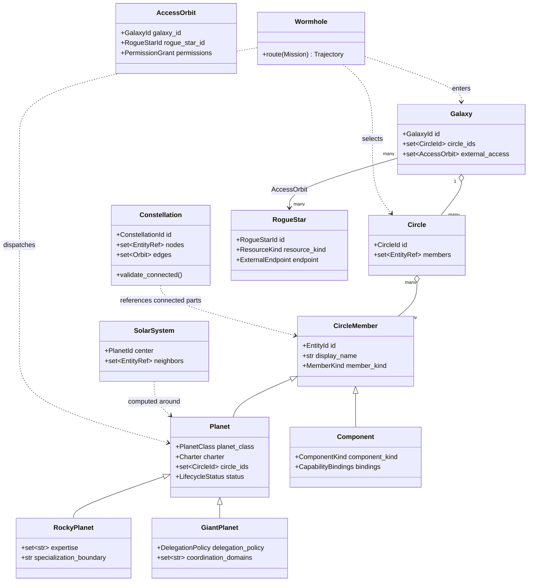

# Terminology-First Domain Model Migration

Status: approved terminology; implementation plan

Branch baseline: `saket/framework_update`

Canonical vocabulary: [Galaxy Terminology](../architecture/galaxy-terminology.md)

## Goal

Make the canonical Galaxy vocabulary a real domain model instead of a UI-only
translation. Every stable term receives a typed code contract, while existing
`guild`, `specialist`, `fleet`, and `constellation` APIs remain compatible
during a staged migration.

The key inheritance rule is:

```text
CircleMember
├── Planet
│   ├── RockyPlanet   # specialist agent
│   └── GiantPlanet   # broad non-specialist agent
└── Component
```

Mac Gemma is a `RogueStar`: an external shared resource referenced by access
Orbits, never contained by a Galaxy.

## Non-negotiable invariants

1. A `Galaxy` directly owns `Circle` objects; a `Constellation` is never placed
   between them in an ownership or routing hierarchy.
2. A `Circle` contains `CircleMember` references. A member is a `Planet` or a
   non-agent `Component`.
3. Every `Planet` is exactly one of `RockyPlanet` or `GiantPlanet`.
4. `RockyPlanet` and `GiantPlanet` inherit the same Charter, policy, memory,
   execution, and observability contracts from `Planet`.
5. A `Constellation` is a connected subgraph drawn from parts of one or more
   Circles. It owns neither those Circles nor their members.
6. A `SolarSystem` is a computed one-Planet neighborhood, not a persisted
   worker or ownership boundary.
7. A `RogueStar` belongs to no Galaxy. `AccessOrbit` grants bounded access and
   never implies containment or ownership.
8. The Mission route is `Wormhole → Galaxy → Circle → Planet`.
9. Permissions can only narrow during routing and delegation.
10. User-facing terminology is canonical. Legacy names survive only in marked
    compatibility adapters and versioned input contracts.

## Target package structure

Create a small domain package rather than duplicating implementations for each
Planet:

```text
src/easy_agents/galaxy/
├── __init__.py
├── enums.py             # stable string enums and discriminators
├── identity.py          # EntityId and typed references
├── members.py           # CircleMember and Component
├── planets.py           # Planet, RockyPlanet, GiantPlanet
├── charters.py          # Charter and lifecycle contracts
├── circles.py            # Circle and CircleMembership
├── constellations.py     # connected-subgraph definition/validation
├── galaxies.py           # Galaxy ownership aggregate
├── rogue_stars.py        # RogueStar and AccessOrbit
├── solar_systems.py      # computed neighborhood projection
├── missions.py           # Mission, Trajectory, Crew, WorkOrder
├── operations.py         # Gate, Observatory, MissionLog references
├── registry.py           # GalaxyRegistry and indexes
├── runtime.py            # GalaxyRuntime over reusable executors
├── routing.py            # Wormhole and routing policy
├── schemas.py            # versioned serialization contracts
└── compatibility.py      # old-name loaders and aliases only
```

The existing tool, memory, model, node, and observability packages remain
reusable dependencies. They should not be copied into `easy_agents.galaxy`.

## Class model



### Planet inheritance

Use inheritance only for stable identity and validation. Keep execution logic
in reusable services so subclasses do not become large, duplicated agent
implementations.

Conceptual Pydantic shape:

```python
class Planet(CircleMember):
    member_kind: Literal[MemberKind.PLANET] = MemberKind.PLANET
    charter: Charter
    circle_ids: frozenset[CircleId]
    status: LifecycleStatus


class RockyPlanet(Planet):
    planet_class: Literal[PlanetClass.ROCKY] = PlanetClass.ROCKY
    expertise: frozenset[str]
    specialization_boundary: str


class GiantPlanet(Planet):
    planet_class: Literal[PlanetClass.GIANT] = PlanetClass.GIANT
    coordination_domains: frozenset[str]
    delegation_policy: DelegationPolicy
```

`PlanetRunner` executes either subclass through the same Charter, Playbook,
Gate, model, tool, memory, and tracing interfaces. Giant-specific coordination
is a policy/Playbook difference, not a separate runtime framework.

## Terminology-to-code map

| Canonical term | Target contract | Current source to migrate |
| --- | --- | --- |
| Galaxy | `Galaxy` aggregate | implicit `galaxy:personal` graph node |
| Portal | `Portal` protocol and `PortalRequest` | HTTP, CLI, chat, and voice entrypoints |
| Wormhole | `Wormhole` routing service | `WormholeRouter` / `ConstellationGateway` |
| Circle | `Circle` aggregate | `GuildDefinition`, `guild:*`, `guilds` fields |
| Circle Member | `CircleMember` base model | implicit node membership |
| Planet | `Planet` base model | agent and Specialist abstractions |
| Rocky Planet | `RockyPlanet` | `SpecialistDefinition`, `SpecialistManifest`, `SpecialistAgent` |
| Giant Planet | `GiantPlanet` | new broad-agent manifest using the same runtime |
| Component | `Component` | capability, tool, memory, Playbook, policy, model, service nodes |
| Constellation | `Constellation` graph view | current graph node and older catalog/package naming |
| Solar System | `SolarSystem` projection | one-hop neighborhood computed by the UI |
| Rogue Star | `RogueStar` external resource | external Mac Gemma model profile |
| Orbit | `Orbit` and `AccessOrbit` | `KnowledgeGraphEdge` |
| Mission | `Mission` | `MissionRequest` plus Mission projection |
| Trajectory | `Trajectory` | `GalaxyRoutePlan` and `RoutingPath` |
| Crew | `Crew` | routed team list |
| Work Order | `WorkOrder` | existing `WorkOrder` |
| Flight Plan | `FlightPlan` | selected `PlaybookSpec` plus resolved steps |
| Gate | `Gate` interface and decisions | `PolicyEngine`, approval policy |
| Roster | `Roster` view | `FleetRegistry.specialists` |
| Vault | `Vault` contract | `MemoryScopeSpec` and memory backends |
| Observatory | `Observatory` facade | `ObservabilityPipeline` |
| Mission Log | `MissionLog` | event store plus correlated projections |
| Charter | `Charter` | `SpecialistManifest` and declarative definitions |

## Serialization and compatibility strategy

The migration must not perform a repository-wide blind rename.

- Introduce schema version 2 with canonical fields: `circles`, `planets`,
  `planet_id`, `planet_class`, and `circle_ids`.
- Load version-1 `guilds` and `specialists` through explicit adapters.
- Preserve stable entity IDs initially, including `guild:*`, `specialist:*`,
  and `model:mac_gemma`; add canonical aliases rather than changing stored IDs
  in the same release.
- Keep `SpecialistManifest`, `SpecialistAgent`, `FleetRegistry`, and
  `FleetRuntime` as deprecated aliases or facades for at least two schema
  versions.
- Keep API v1 responses stable. Add `/api/v2/galaxy`, `/api/v2/planets`, and
  `/api/v2/wormhole/route` before deprecating old routes.
- Normalize old `specialist.*` events into canonical `planet.*` projection
  events. During transition, readers accept both; do not double-count by
  emitting two independently projected events.
- Persist the canonical `planet_class` discriminator so deserialization returns
  the correct subclass without name-based guessing.

## Delivery phases

### Phase 0 — Freeze the language

- Treat `docs/architecture/galaxy-terminology.md` as the source of truth.
- Add an architecture decision record stating that vocabulary changes require
  a schema review and migration note.
- Add a terminology lint list for prohibited new public uses of `guild` and
  ambiguous uses of `agent`.

Exit criteria: documentation, UI labels, and new public contracts agree on all
canonical terms.

### Phase 1 — Add the domain package without changing behavior

- Add enums, typed IDs, `CircleMember`, `Component`, `Planet`, `RockyPlanet`,
  `GiantPlanet`, `Charter`, and unit tests.
- Convert one existing Specialist manifest through a v1-to-v2 adapter and prove
  round-trip stability.
- Add `RogueStar` and `AccessOrbit`; encode Mac Gemma's external ownership and
  loopback endpoint separately.

Exit criteria: the new models validate independently, serialize deterministically,
and do not change current runtime outputs.

### Phase 2 — Move graph topology to canonical entities

- Replace stringly typed `GraphNodeKind` usage with canonical enums.
- Build graph nodes from `Galaxy`, `Circle`, Planet subclasses, `Component`,
  `Constellation`, and `RogueStar` objects.
- Validate that every Constellation subgraph is connected.
- Reject Galaxy containment edges targeting Rogue Stars.
- Compute Solar Systems through a projection service.

Exit criteria: the graph has no invalid ownership edge, Mac Gemma remains a
Rogue Star, and topology snapshots are deterministic.

### Phase 3 — Generalize routing and execution around Planet

- Replace Specialist-only candidates with `PlanetCandidate`.
- Rename `GalaxyRoutePlan` to `Trajectory`; retain a compatibility alias.
- Make `Wormhole.route()` return Circle and Planet references only.
- Introduce `PlanetRunner` and run both subclasses through the existing policy,
  Playbook, model, memory, tool, and event services.
- Add Giant Planet delegation policy and bounded Rocky Planet handoffs.

Exit criteria: one Rocky Planet and one Giant Planet can execute the same safe
Mission contract; delegation cannot widen permissions.

### Phase 4 — Migrate registry, manifests, and feature intake

- Introduce `GalaxyRegistry`, `Roster`, and canonical YAML schema v2.
- Convert all 70 current Specialists to Rocky Planet records mechanically.
- Classify broad roles as Giant Planets only through an explicit reviewed
  manifest change, never from role names.
- Update feature intake to decide reuse/compose/extend/create across both Planet
  subclasses and Components.

Exit criteria: all current Charters compile from v2, v1 fixtures still load,
and the feature architect can propose either Planet class.

### Phase 5 — Migrate APIs, events, CLI, and Control Room

- Add v2 APIs and canonical CLI output.
- Project `planet.*`, `circle.*`, `galaxy.*`, `constellation.*`, and
  `rogue_star.*` observability events.
- Render Rocky and Giant Planets distinctly and keep Rogue Stars visibly
  outside Galaxy ownership.
- Display technical compatibility names only in diagnostic metadata.

Exit criteria: a user can route, run, monitor, and replay both Planet classes
without seeing legacy terminology in normal UI paths.

### Phase 6 — Migrate legacy applications and remove aliases

- Adapt Collection Agent, MailMind, Simple Conversation, and other runnable
  applications through `Portal` and `PlanetRunner` interfaces.
- Remove old aliases only after telemetry and fixtures show no v1 consumers.
- Publish a migration guide with before/after YAML, Python, API, and event
  examples.

Exit criteria: repository search finds legacy terms only in compatibility code,
migrations, historical documents, and domain-specific natural-language names.

## Testing strategy

### Domain and invariant tests

- discriminated deserialization returns `RockyPlanet` or `GiantPlanet`;
- a Planet cannot be both subclasses or neither subclass;
- a Component cannot receive a Work Order;
- a Circle accepts valid Circle Members and rejects dangling references;
- a Constellation must be connected and span at least one Circle;
- a Galaxy cannot contain a Rogue Star;
- several Galaxies can hold separate `AccessOrbit` objects to one Rogue Star;
- Solar System projection returns only the selected Planet's direct neighbors;
- Wormhole Trajectories never include Constellation as a hop;
- delegation monotonically narrows permissions.

### Compatibility tests

- golden v1 catalogs load into v2 objects;
- v1 API and CLI snapshots remain stable during the support window;
- old Specialist event fixtures rebuild into canonical Planet projections;
- existing IDs resolve through canonical aliases;
- all 70 current manifests compile as Rocky Planets before any reclassification.

### End-to-end tests

- route and run one Rocky Planet;
- route a broad Mission to a Giant Planet, then delegate to a Rocky Planet;
- access Mac Gemma through a policy-approved Rogue Star Orbit;
- block a missing or unauthorized Rogue Star Orbit;
- inspect both Planet classes and the Rogue Star in Map, Live, and Replay;
- execute the safe whole-Roster audit with no model or network side effects.

## Migration order and pull-request boundaries

Keep each change independently reviewable:

1. domain enums, IDs, and base models;
2. Planet inheritance and serialization;
3. Circle, Galaxy, Constellation, Solar System, and Rogue Star invariants;
4. v1 catalog adapter and golden fixtures;
5. canonical graph projection;
6. Planet routing and runtime facade;
7. Giant Planet delegation behavior;
8. API/CLI/event v2 contracts;
9. Control Room migration;
10. legacy application adapters and eventual deprecation cleanup.

Do not mix ID migration, runtime behavior changes, and storage migrations in a
single pull request.

## Definition of done

The migration is complete when:

- every canonical term has the contract listed in this plan;
- `Planet` is the shared base and both subclasses run through one reusable
  runtime;
- Galaxy/Circle ownership, Constellation overlays, and Rogue Star access are
  enforced as validation rules rather than UI conventions;
- all 70 current roles are represented without behavior regression;
- at least one reviewed Giant Planet exists and can safely delegate to a Rocky
  Planet;
- old configurations and events migrate deterministically;
- focused, full regression, API, replay, and browser tests pass;
- legacy names remain only inside the documented compatibility boundary.
