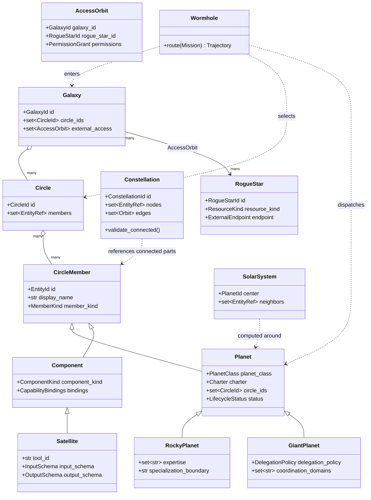

# Terminology-First Domain Model Migration

Status: approved terminology; active living implementation plan

Branch baseline: `saket/framework_update`

Last reviewed against the repository: 2026-09-24

Terminology baseline commits: `4e212b3`, `cb30657`

Canonical vocabulary: [Galaxy Terminology](../architecture/galaxy-terminology.md)

## Goal

Make the canonical Galaxy vocabulary a real domain model instead of a UI-only
translation. Every stable term receives a typed code contract, while existing
`guild`, `specialist`, `fleet`, and `constellation` APIs remain compatible
during a staged migration.

The key inheritance rule is:

```text
CircleMember
├── Planet
│   ├── RockyPlanet   # specialist agent
│   └── GiantPlanet   # broad non-specialist agent
└── Component
    └── Satellite      # callable tool
```

Mac Gemma is a `RogueStar`: an external shared resource referenced by access
Orbits, never contained by a Galaxy.

## Current repository baseline

This plan starts from working code rather than a blank design. The compatibility
boundary must remain explicit while each legacy implementation is replaced.

| Area | Current implementation | Migration state |
| --- | --- | --- |
| Canonical vocabulary | Architecture guide, Control Room Guide, and feature documentation define Galaxy, Circle, Planet classes, Component, Satellite, Constellation, Solar System, Wormhole, and Rogue Star | Implemented as product language |
| Wormhole routing | `easy_agents.fleet.gateway.WormholeRouter` routes Galaxy → Circle → Rocky Planet and returns `GalaxyRoutePlan` / `RoutingPath` | Working v1 implementation; canonical contracts pending |
| Planet runtime | `SpecialistManifest`, `SpecialistAgent`, `FleetRegistry`, and `FleetRuntime` compile and run 70 specialist roles | Working v1 implementation; Rocky/Giant inheritance pending |
| Satellites | Existing `BaseTool`, `ToolRegistry`, and `ToolExecutor`; graph nodes retain `tool:*` IDs and `kind=tool` with `topology_role=satellite` | Canonical UI/documentation projection implemented; typed `Satellite` adapter pending |
| Rogue Stars | Mac Gemma is projected outside Galaxy ownership with governed access metadata and live readiness checks | Graph contract implemented; typed `RogueStar` and `AccessOrbit` pending |
| Topology | Typed v1 graph projection with direct Galaxy → Circle ownership, Constellation overlay edges, and route-only dispatch edges | Working v1 implementation; canonical aggregate source pending |
| Observatory | Durable SQLite event store, redaction, projection, SSE live stream, and replay | Working v1 implementation; canonical event aliases pending |
| Public interfaces | Local FastAPI, CLI, and dependency-free Control Room use v1 schemas and legacy technical identifiers | Compatibility surface; v2 APIs pending |
| Persistence schemas | Catalog, fleet catalog, graph overlay, and trace events are version 1 | Versioned migration and golden fixtures pending |
| Security posture | Local-first service with policy checks and redaction; HTTP endpoints are not an authenticated multi-user boundary | Must remain loopback-only until the hardening gates in this plan pass |

The focused Galaxy/fleet/observability suite is green. The broader repository
currently has known Collection Agent, environment-isolation, and remote-model
mock failures. Every migration slice must keep its focused suite green and must
not increase the recorded broader-suite failure set; existing failures are debt
to repair, not a baseline to silently ignore.

## Non-negotiable invariants

1. A `Galaxy` directly owns `Circle` objects; a `Constellation` is never placed
   between them in an ownership or routing hierarchy.
2. A `Circle` contains `CircleMember` references. A member is a `Planet` or a
   non-agent `Component`; every callable tool is represented by the specialized
   `Satellite` Component.
3. Every `Planet` is exactly one of `RockyPlanet` or `GiantPlanet`.
4. `RockyPlanet` and `GiantPlanet` inherit the same Charter, policy, memory,
   execution, and observability contracts from `Planet`.
5. A `Constellation` is a connected subgraph drawn from parts of one or more
   Circles. It owns neither those Circles nor their members.
6. A `SolarSystem` is a computed one-Planet neighborhood, not a persisted
   worker or ownership boundary.
7. A `RogueStar` belongs to no Galaxy. `AccessOrbit` grants bounded access and
   never implies containment or ownership.
8. The Mission route is `Wormhole → Galaxy → Circle → Planet`.
9. Permissions can only narrow during routing and delegation.
10. User-facing terminology is canonical. Legacy names survive only in marked
    compatibility adapters and versioned input contracts.
11. A `Satellite` is always a non-agent `Component`. It can be invoked only
    through an authorized Planet Orbit and can never own a Mission, Charter, or
    Work Order.
12. Stable IDs, persisted events, and public v1 fields never change without a
    versioned adapter, golden fixture, rollback path, and migration note.

## Target package structure

Create a small domain package rather than duplicating implementations for each
Planet:

```text
src/easy_agents/galaxy/
├── __init__.py
├── enums.py             # stable string enums and discriminators
├── identity.py          # EntityId and typed references
├── members.py           # CircleMember and Component
├── satellites.py        # Satellite adapter over the existing tool subsystem
├── planets.py           # Planet, RockyPlanet, GiantPlanet
├── charters.py          # Charter and lifecycle contracts
├── circles.py           # Circle and CircleMembership
├── constellations.py     # connected-subgraph definition/validation
├── galaxies.py           # Galaxy ownership aggregate
├── rogue_stars.py        # RogueStar and AccessOrbit
├── solar_systems.py      # computed neighborhood projection
├── missions.py           # Mission, Trajectory, Crew, WorkOrder
├── operations.py         # Gate, Observatory, MissionLog references
├── registry.py           # GalaxyRegistry and indexes
├── runtime.py            # GalaxyRuntime over reusable executors
├── routing.py            # Wormhole and routing policy
├── schemas.py            # versioned serialization contracts
└── compatibility.py      # old-name loaders and aliases only
```

The existing tool, memory, model, node, and observability packages remain
reusable dependencies. They should not be copied into `easy_agents.galaxy`.

## Class model



### Planet inheritance

Use inheritance only for stable identity and validation. Keep execution logic
in reusable services so subclasses do not become large, duplicated agent
implementations.

Conceptual Pydantic shape:

```python
class Planet(CircleMember):
    member_kind: Literal[MemberKind.PLANET] = MemberKind.PLANET
    charter: Charter
    circle_ids: frozenset[CircleId]
    status: LifecycleStatus


class RockyPlanet(Planet):
    planet_class: Literal[PlanetClass.ROCKY] = PlanetClass.ROCKY
    expertise: frozenset[str]
    specialization_boundary: str


class GiantPlanet(Planet):
    planet_class: Literal[PlanetClass.GIANT] = PlanetClass.GIANT
    coordination_domains: frozenset[str]
    delegation_policy: DelegationPolicy
```

`PlanetRunner` executes either subclass through the same Charter, Playbook,
Gate, model, Satellite, memory, and tracing interfaces. Giant-specific
coordination is a policy/Playbook difference, not a separate runtime framework.
The Satellite adapter delegates to the existing `BaseTool`, `ToolRegistry`, and
`ToolExecutor` contracts so terminology does not duplicate execution code.

## Terminology-to-code map

| Canonical term | Target contract | Current source to migrate |
| --- | --- | --- |
| Galaxy | `Galaxy` aggregate | implicit `galaxy:personal` graph node |
| Portal | `Portal` protocol and `PortalRequest` | HTTP, CLI, chat, and voice entrypoints |
| Wormhole | `Wormhole` routing service | `WormholeRouter` / `ConstellationGateway` |
| Circle | `Circle` aggregate | `GuildDefinition`, `guild:*`, `guilds` fields |
| Circle Member | `CircleMember` base model | implicit node membership |
| Planet | `Planet` base model | agent and Specialist abstractions |
| Rocky Planet | `RockyPlanet` | `SpecialistDefinition`, `SpecialistManifest`, `SpecialistAgent` |
| Giant Planet | `GiantPlanet` | new broad-agent manifest using the same runtime |
| Component | `Component` | capability, memory, Playbook, policy, model, service nodes |
| Satellite | `Satellite` Component | `BaseTool`, `ToolRegistry`, `ToolExecutor`, and `tool:*` graph nodes |
| Constellation | `Constellation` graph view | current graph node and older catalog/package naming |
| Solar System | `SolarSystem` projection | one-hop neighborhood computed by the UI |
| Rogue Star | `RogueStar` external resource | external Mac Gemma model profile |
| Orbit | `Orbit` and `AccessOrbit` | `KnowledgeGraphEdge` |
| Mission | `Mission` | `MissionRequest` plus Mission projection |
| Trajectory | `Trajectory` | `GalaxyRoutePlan` and `RoutingPath` |
| Crew | `Crew` | routed team list |
| Work Order | `WorkOrder` | existing `WorkOrder` |
| Flight Plan | `FlightPlan` | selected `PlaybookSpec` plus resolved steps |
| Gate | `Gate` interface and decisions | `PolicyEngine`, approval policy |
| Roster | `Roster` view | `FleetRegistry.specialists` |
| Vault | `Vault` contract | `MemoryScopeSpec` and memory backends |
| Observatory | `Observatory` facade | `ObservabilityPipeline` |
| Mission Log | `MissionLog` | event store plus correlated projections |
| Charter | `Charter` | `SpecialistManifest` and declarative definitions |

## Serialization and compatibility strategy

The migration must not perform a repository-wide blind rename.

- Introduce schema version 2 with canonical fields: `circles`, `planets`,
  `planet_id`, `planet_class`, and `circle_ids`.
- Load version-1 `guilds` and `specialists` through explicit adapters.
- Preserve stable entity IDs initially, including `guild:*`, `specialist:*`,
  and `model:mac_gemma`; add canonical aliases rather than changing stored IDs
  in the same release.
- Keep `SpecialistManifest`, `SpecialistAgent`, `FleetRegistry`, and
  `FleetRuntime` as deprecated aliases or facades for at least two schema
  versions.
- Keep API v1 responses stable. Add `/api/v2/galaxy`, `/api/v2/planets`, and
  `/api/v2/wormhole/route` before deprecating old routes.
- Normalize old `specialist.*` events into canonical `planet.*` projection
  events. During transition, readers accept both; do not double-count by
  emitting two independently projected events.
- Persist the canonical `planet_class` discriminator so deserialization returns
  the correct subclass without name-based guessing.

## Living-plan and repository propagation rule

The migration is implemented as vertical slices. A coding change is incomplete
until every affected repository surface is either updated in the same change or
explicitly marked as a compatibility surface with a removal milestone. Do not
rename only the UI, and do not introduce a domain class that the API, events,
documentation, and tests cannot yet explain.

| Surface | Required work in every affected slice |
| --- | --- |
| Domain contracts | Add or update typed models, invariants, discriminators, and stable identifiers. Prefer immutable Pydantic models at ownership and authorization boundaries. |
| Catalog and persistence | Update YAML/SQLite schemas, version fields, loaders, migration adapters, and deterministic golden fixtures. Never infer a destructive migration from display names. |
| Runtime and policy | Route and execute through shared services; evaluate authorization before Satellite, memory, model, or external effects; preserve cancellation and correlation IDs. |
| API, CLI, and events | Add canonical output without silently breaking v1 consumers. Document aliases and deprecation windows. Normalize once at the boundary to avoid double counting. |
| Control Room | Update filters, labels, glyphs, inspector metadata, Map/Live/Replay projections, accessibility text, and cache versions together. |
| Documentation | Update the terminology source of truth, functionality reference, usage guides, examples, and this plan whenever implementation discoveries change the design. |
| Verification | Add invariant, compatibility, negative-security, API, replay, and browser checks proportional to the slice. Record any accepted limitation with an owner and removal criterion. |

When implementation reveals a better model, change the code and this plan in
the same pull request. A terminology or invariant change also requires an
architecture decision record. Documentation drift is treated as a regression,
not cleanup for a later documentation phase.

## Hardening standards applied during every phase

Hardening is not a final polishing phase. Each vertical slice must satisfy the
relevant controls before the next layer depends on it.

### Trust boundaries and authorization

- Keep the development server bound to loopback until authentication,
  Galaxy/tenant selection, and request authorization are implemented and
  tested. Reject forwarded identity headers unless a trusted proxy is
  explicitly configured.
- Apply default-deny policy before every external effect, Satellite invocation,
  memory read/write, model request, delegation, and cross-Galaxy Rogue Star
  access. A child Work Order may narrow but never widen its parent's grant.
- Bind approvals to the Mission, Work Order, effect, parameters, principal,
  expiry, and single-use nonce. Re-check policy at execution time rather than
  trusting a planning-time decision.
- Validate Rogue Star endpoints against an explicit allowlist. Block arbitrary
  redirects, unexpected hosts, and scheme changes so configuration cannot
  become an SSRF path. The Mac Gemma loopback endpoint is an explicit profile,
  not a general network exemption.

### Satellite and runtime safety

- Validate Satellite input and output schemas, maximum payload sizes, declared
  effects, and required Vault access before execution.
- Add timeouts, cancellation propagation, bounded retries with jitter, and
  idempotency keys for side-effecting Satellites. Never automatically retry an
  unknown or non-idempotent external effect.
- Introduce per-Mission budgets for elapsed time, model tokens, Satellite calls,
  delegated Work Orders, and external requests. Reject cycles and cap Crew
  fan-out/depth.
- Isolate arbitrary or third-party Satellite implementations before treating
  them as production-safe; registration alone must not grant filesystem,
  process, secret, or network access.

### Data, model, and observability safety

- Enforce Galaxy, Circle, Vault, employer, personal, and future-company data
  boundaries in storage queries as well as prompts. Add retention, deletion,
  export, and backup/restore tests for durable state.
- Treat retrieved content and model output as untrusted. Keep authorization in
  deterministic code, validate structured model output, constrain tool choice,
  and test prompt-injection and data-exfiltration attempts.
- Redact credentials, personal data, tool arguments, model prompts, and outputs
  according to classification before persistence or streaming. Test that Map,
  Live, Replay, errors, and exported artifacts do not bypass redaction.
- Preserve monotonic event sequence, correlation and causation IDs, schema
  versions, and replay determinism. Bound SSE queues, expose dropped-event
  counters, and recover from client disconnects without blocking shutdown.

### Operability and failure behavior

- Add readiness checks for required local stores and selected model profiles;
  keep liveness independent of optional external dependencies.
- Use structured error codes at boundaries and do not expose raw exceptions,
  paths, prompts, credentials, or provider responses to UI/API clients.
- Define degraded behavior for unavailable Rogue Stars, Vaults, Satellites, and
  models. A fallback may reduce capability but may not expand permissions or
  cross a configured offline boundary.
- Make migrations restartable and reversible, take backups before destructive
  schema changes, and test rollback using copied fixtures rather than live user
  data.

## Delivery phases

### Phase 0 — Freeze the language

Progress: **partially complete**. Canonical documentation and Control Room
labels exist; the architecture decision record and automated terminology checks
remain.

- Treat `docs/architecture/galaxy-terminology.md` as the source of truth.
- Add an architecture decision record stating that vocabulary changes require
  a schema review and migration note.
- Add a terminology lint list for prohibited new public uses of `guild` and
  ambiguous uses of `agent`.
- Store approved compatibility spellings (`tool:*`, `tool.*`, `specialist:*`,
  and v1 fields) in one lint configuration so engineering names are not falsely
  reported as product-language regressions.
- Add a generated terminology matrix test covering Python discriminators, YAML
  roles, API labels, UI labels, documentation headings, and aliases.

Exit criteria: documentation, UI labels, and new public contracts agree on all
canonical terms.

### Phase 1 — Add the domain package without changing behavior

Progress: **pending**. The current `easy_agents.constellation` and
`easy_agents.fleet` packages remain the adapters and source behavior.

- Add enums, typed IDs, `CircleMember`, `Component`, `Satellite`, `Planet`, `RockyPlanet`,
  `GiantPlanet`, `Charter`, and unit tests.
- Convert one existing Specialist manifest through a v1-to-v2 adapter and prove
  round-trip stability.
- Add `RogueStar` and `AccessOrbit`; encode Mac Gemma's external ownership and
  loopback endpoint separately.
- Make ownership collections immutable after validation and reject duplicate,
  dangling, cross-Galaxy, and discriminator-mismatched references.
- Add `Satellite` as a thin adapter over the current tool subsystem; do not fork
  registration, schema validation, logging, or execution logic.
- Fuzz identifier and schema boundaries with invalid, oversized, and unknown
  fields before any v2 loader accepts persisted user data.

Exit criteria: the new models validate independently, serialize deterministically,
and do not change current runtime outputs.

### Phase 2 — Move graph topology to canonical entities

Progress: **pending**, with the current v1 projection already expressing the
intended Galaxy, Circle, Satellite, Constellation, and Rogue Star labels.

- Replace stringly typed `GraphNodeKind` usage with canonical enums.
- Build graph nodes from `Galaxy`, `Circle`, Planet subclasses, `Component`,
  `Satellite`, `Constellation`, and `RogueStar` objects.
- Validate that every Constellation subgraph is connected.
- Reject Galaxy containment edges targeting Rogue Stars.
- Compute Solar Systems through a projection service.
- Reject duplicate edges, dangling endpoints, invalid ownership directions,
  Constellation nodes outside referenced Circles, and unauthorized Satellite or
  Rogue Star Orbits.
- Keep projection ordering deterministic and cap graph-query depth/size so a
  malformed topology cannot exhaust the Control Room or API process.

Exit criteria: the graph has no invalid ownership edge, Mac Gemma remains a
Rogue Star, and topology snapshots are deterministic.

### Phase 3 — Generalize routing and execution around Planet

Progress: **pending**, with `WormholeRouter` and `FleetRuntime` serving as the
behavioral baseline.

- Replace Specialist-only candidates with `PlanetCandidate`.
- Rename `GalaxyRoutePlan` to `Trajectory`; retain a compatibility alias.
- Make `Wormhole.route()` return Circle and Planet references only.
- Introduce `PlanetRunner` and run both subclasses through the existing policy,
  Playbook, model, memory, Satellite/tool, and event services.
- Add Giant Planet delegation policy and bounded Rocky Planet handoffs.
- Add Mission deadlines, cancellation, idempotency, budgets, maximum Crew size,
  maximum delegation depth, and cycle detection before enabling recursive
  Planet collaboration.
- Re-evaluate policy immediately before each effect and propagate the narrowed
  Permission Grant, correlation ID, and causation ID into every Work Order and
  Satellite call.

Exit criteria: one Rocky Planet and one Giant Planet can execute the same safe
Mission contract; delegation cannot widen permissions.

### Phase 4 — Migrate registry, manifests, and feature intake

Progress: **pending**. All current records remain v1 and must continue loading
through explicit adapters throughout this phase.

- Introduce `GalaxyRegistry`, `Roster`, and canonical YAML schema v2.
- Convert all 70 current Specialists to Rocky Planet records mechanically.
- Classify broad roles as Giant Planets only through an explicit reviewed
  manifest change, never from role names.
- Update feature intake to decide reuse/compose/extend/create across both Planet
  subclasses and Components.
- Make migrations dry-runnable, deterministic, restartable, and reversible;
  record source version and checksum without mutating the v1 source file.
- Reject activation when a Charter references missing policies, Vaults,
  Satellites, models, Playbooks, or Circles. Draft generation never grants
  permissions or activates code.

Exit criteria: all current Charters compile from v2, v1 fixtures still load,
and the feature architect can propose either Planet class.

### Phase 5 — Migrate APIs, events, CLI, and Control Room

Progress: **pending**, with canonical user-facing labels already projected over
v1 technical kinds in the current Control Room.

- Add v2 APIs and canonical CLI output.
- Project `planet.*`, `circle.*`, `galaxy.*`, `constellation.*`, and
  `rogue_star.*` observability events.
- Render Rocky and Giant Planets distinctly and keep Rogue Stars visibly
  outside Galaxy ownership.
- Display technical compatibility names only in diagnostic metadata.
- Add authenticated principal and Galaxy context before any non-loopback
  deployment; enforce request-size, rate, concurrency, and stream limits.
- Return stable public error codes and redacted messages. Add contract tests for
  malformed identifiers, unauthorized access, stale approvals, replay gaps,
  slow SSE consumers, and unavailable Rogue Stars.
- Verify accessibility and terminology in Map, Live, Replay, Guide, filters,
  inspector panels, empty/error states, and exported diagnostics.

Exit criteria: a user can route, run, monitor, and replay both Planet classes
without seeing legacy terminology in normal UI paths.

### Phase 6 — Migrate legacy applications and remove aliases

Progress: **pending**.

- Adapt Collection Agent, MailMind, Simple Conversation, and other runnable
  applications through `Portal` and `PlanetRunner` interfaces.
- Remove old aliases only after telemetry and fixtures show no v1 consumers.
- Publish a migration guide with before/after YAML, Python, API, and event
  examples.
- Run each legacy application behind a compatibility adapter with explicit
  Vault, Satellite, policy, and channel boundaries; do not expose application
  internals as Galaxy-domain contracts.
- Remove an alias only after usage telemetry or repository-wide fixtures show
  no consumers and the documented rollback window has elapsed.

Exit criteria: repository search finds legacy terms only in compatibility code,
migrations, historical documents, and domain-specific natural-language names.

### Phase 7 — Production-readiness and recovery audit

Progress: **pending**. This audit validates controls already introduced in each
earlier phase; it is not the first time hardening work is performed.

- Threat-model Portal/Wormhole ingress, Planet delegation, Satellites, Vaults,
  Rogue Stars, model prompts, event streaming, and administrative operations.
- Run load, soak, cancellation, crash-recovery, migration rollback, backup
  restore, and event-replay determinism tests with bounded local fixtures.
- Verify secret scanning, dependency audit, least-privilege deployment,
  loopback/non-loopback configuration, retention jobs, audit export, alerts,
  and operator runbooks.
- Remove temporary migration flags only after recovery drills and v1 rollback
  paths have been exercised and signed off.

Exit criteria: the deployment profile has documented security assumptions,
measured capacity, tested recovery objectives, no unresolved critical findings,
and an operator can diagnose and safely stop or roll back a Mission.

## Testing strategy

### Domain and invariant tests

- discriminated deserialization returns `RockyPlanet` or `GiantPlanet`;
- a Planet cannot be both subclasses or neither subclass;
- a Component, including a Satellite, cannot receive a Work Order;
- a Satellite can execute only when invoked by an authorized Planet and may be
  shared by multiple Planets through explicit Orbits;
- a Circle accepts valid Circle Members and rejects dangling references;
- a Constellation must be connected and span at least one Circle;
- a Galaxy cannot contain a Rogue Star;
- several Galaxies can hold separate `AccessOrbit` objects to one Rogue Star;
- Solar System projection returns only the selected Planet's direct neighbors;
- Wormhole Trajectories never include Constellation as a hop;
- delegation monotonically narrows permissions.

### Compatibility tests

- golden v1 catalogs load into v2 objects;
- v1 API and CLI snapshots remain stable during the support window;
- old Specialist event fixtures rebuild into canonical Planet projections;
- existing IDs resolve through canonical aliases;
- all 70 current manifests compile as Rocky Planets before any reclassification.

### Security and isolation tests

- unauthenticated or cross-Galaxy requests cannot read, route, replay, or invoke;
- Circle and Vault boundaries hold in storage queries, prompt assembly, events,
  UI projections, exports, and delegated Work Orders;
- expired, replayed, widened, mismatched, and already-consumed approvals fail;
- unregistered Satellites and unauthorized effects fail closed before execution;
- Rogue Star redirects and endpoints outside the allowlist fail before network
  access;
- prompt-injection payloads cannot choose undeclared Satellites, widen grants,
  reveal secrets, or cross an offline boundary;
- redaction covers success, validation error, provider error, cancellation,
  replay, SSE, and export paths.

### Reliability and recovery tests

- Mission cancellation reaches running Planet, Satellite, and model operations;
- deadlines, budgets, Crew fan-out, delegation depth, and cycle detection are
  deterministic under concurrent requests;
- idempotency prevents duplicate side effects after timeout or process restart;
- bounded retry behavior distinguishes transient, permanent, and unknown-effect
  failures;
- event sequence and projections recover after restart without duplicates or
  gaps, and slow consumers cannot block publishers or shutdown;
- v1-to-v2 migrations survive interruption and can roll back from copied golden
  fixtures;
- backup and restore reproduce topology, Mission Logs, policies, and Vault
  metadata without leaking excluded secrets.

### End-to-end tests

- route and run one Rocky Planet;
- route a broad Mission to a Giant Planet, then delegate to a Rocky Planet;
- invoke a Satellite through a policy-approved Planet Orbit;
- access Mac Gemma through a policy-approved Rogue Star Orbit;
- block a missing or unauthorized Rogue Star Orbit;
- inspect both Planet classes and the Rogue Star in Map, Live, and Replay;
- execute the safe whole-Roster audit with no model or network side effects.

### Verification gates for every implementation slice

1. Run the smallest affected unit and contract tests while iterating.
2. Run Galaxy, fleet, observability, API, and UI contract tests before commit.
3. Run JavaScript syntax checks and a browser interaction check for Control Room
   changes.
4. Run the repository suite with live-provider tests explicitly marked. Compare
   failures with the recorded baseline and reject new failures.
5. Run formatting, static typing, dependency/secret scanning, and migration
   fixture checks once those gates are added in Phase 0/1.
6. Record the commands and results in the relevant functionality reference or
   pull-request evidence; never describe an excluded live test as passing.

## Migration order and pull-request boundaries

Keep each change independently reviewable:

1. domain enums, IDs, and base models;
2. Component and Satellite adapter over the existing tool subsystem;
3. Planet inheritance and serialization;
4. Circle, Galaxy, Constellation, Solar System, and Rogue Star invariants;
5. v1 catalog adapter, golden fixtures, dry-run, and rollback;
6. canonical graph projection and topology validation;
7. Planet routing, runtime facade, budgets, cancellation, and idempotency;
8. Giant Planet delegation behavior and cycle/fan-out controls;
9. authenticated API/CLI/event v2 contracts and redacted errors;
10. Control Room Map/Live/Replay/Guide migration and accessibility checks;
11. legacy application adapters and eventual deprecation cleanup;
12. recovery, load, threat-model, and production-readiness sign-off.

Do not mix ID migration, runtime behavior changes, and storage migrations in a
single pull request.

### Pull-request checklist

- [ ] The slice names its canonical contracts and any temporary legacy aliases.
- [ ] Domain, catalog/persistence, runtime/policy, API/events, Control Room,
      documentation, and tests were reviewed using the propagation table.
- [ ] Authorization and data boundaries fail closed, and permissions do not
      widen across routing, delegation, model selection, or Satellite calls.
- [ ] Schema and ID changes include versioning, golden fixtures, dry-run,
      rollback, and a migration note.
- [ ] Side effects declare idempotency, timeout, retry, cancellation, approval,
      and audit behavior.
- [ ] Logs, errors, events, replay, and UI were checked for sensitive-data
      leakage.
- [ ] Focused tests pass and the broader known-failure set did not grow.
- [ ] This plan and the canonical terminology document reflect discoveries made
      while coding.

## Definition of done

The migration is complete when:

- every canonical term has the contract listed in this plan;
- `Planet` is the shared base and both subclasses run through one reusable
  runtime;
- Galaxy/Circle ownership, Constellation overlays, and Rogue Star access are
  enforced as validation rules rather than UI conventions;
- all 70 current roles are represented without behavior regression;
- at least one reviewed Giant Planet exists and can safely delegate to a Rocky
  Planet;
- old configurations and events migrate deterministically;
- focused, full regression, API, replay, and browser tests pass;
- security, isolation, cancellation, idempotency, recovery, and rollback gates
  pass for every enabled effect and persistence boundary;
- operational limits, readiness, degraded behavior, alerts, backups, and
  runbooks are documented and tested;
- legacy names remain only inside the documented compatibility boundary;
- the terminology matrix, implementation, UI, references, and this living plan
  agree at the final reviewed commit.
