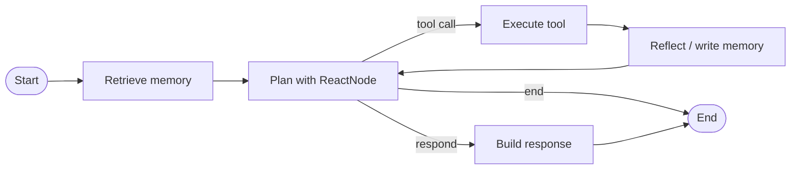

# Current Capabilities

This page describes the code that exists in the repository today. It is intentionally separate from the [Offline Agent Platform Roadmap](../plans/offline-agent-platform-roadmap.md), which describes the intended future platform.

## What the Repository Is

`easy_agents` is an early-stage, graph-native Python framework plus several concrete agent applications. Its strongest reusable foundations are typed tools, graph nodes, working and long-term memory, tracing, model adapters, and agent-as-node composition.

It is local-first, not automatically air-gapped. The graph runtime, deterministic tools, local storage, graph builder, and mock channels can run without hosted services. Hosted LLMs, Gmail, Twilio, remote voice backends, and initial downloads of local model weights require external access.

## Runtime Flow

The shared `GraphAgent` currently compiles this fixed default loop:

Concrete agents may assemble different graphs directly with LangGraph. `CollectionAgent`, `MailMindAgent`, and `SimpleConversationAgent` all specialize the runtime rather than relying on a declarative agent manifest.

## Capability Matrix

| Area | Implemented now | Maturity and constraints | Detailed reference |
| --- | --- | --- | --- |
| Agent contract | Minimal `BaseAgent` with identity, optional LLM, structured logging, trace sink, and `run()` | Small and usable; return type is deliberately not standardized yet | [Agent runtime and nodes](./functionalities/agent-runtime-and-nodes.md) |
| Shared graph runtime | `GraphAgent` with memory retrieval, ReAct planning, tool execution, reflection, and response nodes | Usable internal runtime; graph topology is fixed in the class and execution is synchronous | [Agent runtime and nodes](./functionalities/agent-runtime-and-nodes.md) |
| Reusable nodes | Agent delegation, approval, intent, memory read/write, ReAct, reflection, response, routing, tools, WhatsApp | Implemented; the shared state still contains several collection-specific fields | [Agent runtime and nodes](./functionalities/agent-runtime-and-nodes.md) |
| Tool system | `BaseTool`, `ToolRegistry`, schema catalog export, `ToolExecutor`, input/output validation, logging, optional memory capture | Strong reusable foundation; execution is synchronous and policy enforcement is not centralized | [Tools and execution](./functionalities/tools.md) |
| Memory | Working memory; hot, warm, and cold layers; DuckDB and JSONL/archive backends; typed memory; indexing and hybrid retrieval | Broad implementation; persistence and retrieval choices still require manual wiring | [Memory and retrieval](./functionalities/memory.md) |
| Model adapters | Hugging Face/local models, FunctionGemma, native Mac `gemma-4-E4B` completions, OpenAI, Groq, NVIDIA, arbitrary endpoints, OpenAI-compatible servers | Mac Gemma mocked and live loopback contracts pass; the checked-in hosted remote regression suite currently fails | [Model adapters](./functionalities/models.md) |
| Channels and sources | Mock/Twilio WhatsApp, Gmail source/sender, Pipecat and voice-processing interfaces | Local/fake contracts pass; live services were not tested | [Channels, sources, and voice](./functionalities/channels-and-voice.md) |
| Observability | Versioned correlated events, pre-storage redaction, SQLite history, rebuildable projections, SSE, Mission/Run APIs, alerts, and Map/Live/Replay Control Room modes | Fleet Runtime is wired end to end; older standalone agents require explicit `trace_sink` wiring, and durable approval/cancel controls remain pending | [Observability](./functionalities/observability.md) |
| Graph Builder | Local web UI, node/agent catalog, structural validation, JSON export, Python scaffold export | API tests pass; exported Python is not yet a runnable generated application | [Graph Builder](./functionalities/graph-builder.md) |
| Agent composition | `AgentNode` can invoke any object with `run()` and optionally expose its result as observation/response | Implemented in-process; discovery, permissions, budgets, and durable handoffs are not centralized | [Agent runtime and nodes](./functionalities/agent-runtime-and-nodes.md) |
| Configuration | YAML defaults, repository `.env` loading, environment overrides through `AppSettings` | Core tests pass; one stale dotenv naming test remains | [Configuration](./functionalities/configuration.md) |
| Constellation feature intake | Versioned starter Roster, overlapping Guild membership, feature fit analysis, risk inference, and proposed Draft Charters | Offline first slice; lexical matching only, and it does not scaffold, persist, activate, or execute agents | [Constellation feature intake](./functionalities/constellation-feature-intake.md) |
| Galaxy Map | Typed knowledge-graph API and dependency-free local UI for the Wormhole, Galaxy, Rogue Stars, Constellation overlays, Circles, Planets, capabilities, tools, memory scopes, Playbooks, policies, models, and services | Interactive topology and Wormhole → Galaxy → Circle → Planet route highlighting are implemented; Circle Member terminology distinguishes Rocky and Giant Planets from non-agent Components; Mac Gemma is modeled as an external, cross-Galaxy Rogue Star | [Galaxy Knowledge Graph](../guides/constellation-map.md) |
| Specialist fleet | One reusable Wormhole, hierarchical Galaxy and Circle routing, 70 manifest-compiled Rocky Planets, nine shared Playbooks, scoped Work orders, central policy decisions, local-model advisory execution, CLI/API, and a realtime whole-fleet audit | 14 existing Charters are active; 56 new or startup-conditional Charters are sandboxed; Giant Planet is defined in the canonical model but does not yet have a separate runtime manifest type | [Run the Specialist Fleet](../guides/run-specialist-fleet.md) |

## Reusable Node Catalog

The public exports in `src.nodes` currently include:

- `IntentNode` for classification or routing decisions
- `ReactNode` for tool-or-response planning with deterministic override hooks
- `ToolExecutionNode` for validated tool execution
- `MemoryRetrieveNode` and `MemoryNode` for reading and updating memory
- `ReflectNode` for post-action reflection and optional memory writing
- `ResponseNode` for final response construction
- `RouterNode` for conditional flow selection
- `ApprovalNode` for approval-gated operations
- `WhatsAppNode` for channel delivery
- `AgentNode` for nesting another agent runtime

All reusable nodes accept the shared `AgentState` shape and return a partial state update. LangGraph merges those updates during execution.

## Tool Contract

A reusable tool declares four things:

1. a unique `name`
2. a human-readable `description`
3. a Pydantic `input_schema`
4. a Pydantic `output_schema`

`ToolExecutor` validates the input, invokes the tool, validates the output, records a structured tool log, and can write success or failure events to memory. The built-in examples include safe arithmetic and unit conversion; email and memory capabilities add domain-oriented tools.

See [Create an Agent](../guides/create-an-agent.md) for a complete tool-using example.

## Memory Model

The repository has two related memory paths:

- Conversation working memory stores recent messages and session-scoped state.
- Long-term memory supports typed records such as episodic, semantic, procedural, task, reflection, and error memory across hot, warm, and cold layers.

Long-term memory can use an in-process hot cache, DuckDB warm storage, and JSONL/archive cold storage. Retrieval can be lexical or optionally vector/hybrid when the corresponding extras and embedding model are installed.

See [Memory Architecture](../architecture/memory-architecture.md) for the component-level design.

## Existing Agents

### Collection Agent

This is the most developed application in the repository. It includes customer and case context loading, identity verification, collections planning, payment and promise workflows, negotiation state, a discount specialist, a memory helper, traces, batch evaluation, a browser UI, and optional voice paths.

Its orchestration is application-specific: a loop in `agents/collection_agent/main.py` interprets string targets such as `customer`, `self`, and `discount_planning_agent`. It is not yet the generic orchestrator described in the roadmap.

Start with the [Collection Agent README](../../agents/collection_agent/README.md).

### MailMind

MailMind is an email-focused agent with fake or Gmail-backed ingestion, classification, search, summary, reply drafting, approval-gated sending, and mock or Twilio WhatsApp notifications. It uses a DuckDB repository and a graph assembled from shared and MailMind-specific nodes.

Start with the [MailMind overview](../agents/mailmind/overview.md), [scope](../agents/mailmind/scope.md), and [graph](../agents/mailmind/graph.md).

### Simple Conversation

The simple conversation agent is the smallest working example. It demonstrates graph compilation, deterministic planning overrides, working memory, response creation, mock/Twilio WhatsApp delivery, and traces.

See [Simple Conversation Agent](../agents/simple-conversation.md).

### Specialist Agents

- [Discount Planning Agent](../../agents/discount_planning_agent/README.md) produces settlement or hardship recommendations for Collection Agent.
- [Collection Memory Helper](../../agents/collection_memory_helper_agent/README.md) extracts key events from collection conversations and stores user-scoped memory.

### Placeholders

The brainstorming agent, coding agent, and generic orchestrator are placeholders. Their directories and documentation names reserve intended roles, but they should not be presented as runnable capabilities.

## What Is Not Implemented Yet

The following roadmap concepts do not exist as stable platform features today:

- independent user-authored `agent.yaml` files with migration, diff, and lock operations (the current fleet compiles typed Charters from the validated Constellation graph)
- installable capability packs
- a persistent runtime registry with installed-version locks and activation history (the current registry is read-only and rebuilt from packaged catalogs)
- durable/resumable approval records, budgets, and effect execution (the fleet policy engine currently blocks or gates an advisory Mission before model execution)
- durable cross-agent handoffs and resumable checkpoints
- process or container isolation for arbitrary tools
- automatic wiring of the canonical event pipeline into every older standalone agent
- a packaged runtime with a stable public import namespace
- automatic Charter/Playbook scaffolding, evaluation, installation, or activation from a feature proposal

Do not copy CLI commands or manifest examples from the roadmap and expect them to run yet.

## Known Engineering Boundaries

- Run repository examples from the checkout root because the distribution name (`easy_agent`) and current `src.*` imports are not yet aligned as a stable public package API.
- The shared graph state contains domain fields that should eventually move into agent-specific state extensions.
- Most graph execution and tool execution is synchronous.
- Fleet Specialists currently produce policy-governed advisory results and Work orders; they do not imply that every declared connector or domain calculator exists.
- The Graph Builder validates structure and exports scaffolding; dependency wiring remains manual.
- The complete test suite mixes isolated tests with integration/provider checks and does not yet consistently mark them.
- Some existing agents use different LLM call conventions or configuration paths, so a model adapter that works in one runtime is not automatically verified for every runtime.

These boundaries are tracked as platform work in the [Offline Agent Platform Roadmap](../plans/offline-agent-platform-roadmap.md).

See the [Functionality Catalog and Verification Matrix](./functionalities/README.md) for exact test results, reproduction commands, and the live integrations that were not invoked.
