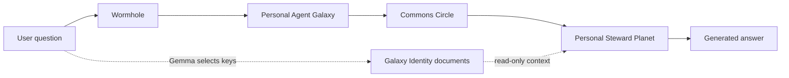

# Galaxy Identity Circle

Status: verified local functionality

The Galaxy Identity Circle is the read-only documentation library through
which the Personal Agent Galaxy describes itself. It is deliberately not an
agent team: it has no Rocky Planet, no Giant Planet, no Mission handler, and no
`dispatches_to` relationship.

## Data model

`GalaxyIdentityLibrary` is an immutable versioned contract containing ten
`IdentityDocument` pages:

| Key | What it documents |
| --- | --- |
| `name` | Stable display name and ownership identity |
| `role` | Purpose and operating scope |
| `personality` | Behavioral traits |
| `voice` | Communication principles |
| `values` | Design and assistance principles |
| `capabilities` | Semantic abilities and the current Chat action list |
| `boundaries` | Safety limits and disabled external effects |
| `architecture` | Live topology counts, route, and reasoning model |
| `storage` | Conversation, Vault, journal, and artifact surfaces |
| `terminology` | Canonical Galaxy vocabulary |

Every page has a stable key, title, summary, key-value `entries`, provenance,
and `read_only: true`. `executing_planet_ids` is schema-constrained to an empty
tuple. Declarative values and live registry facts are rebuilt together when
the Control Room starts.

## How questions use the library



The natural-language planner asks Gemma for both an operational Circle/Planet
and up to five `identity_document_keys`. No keyword or regular-expression
router chooses those keys. Code validates the model output and retrieves only
the named pages. Therefore a self-description request remains a normal
operational Mission while identity documentation is reference context, not an
execution hop.

The dedicated Identity tab offers the same model-selected lookup without
starting a Mission. A user may also browse any key directly.

## HTTP API

```bash
# List the library and all pages
curl -sS http://127.0.0.1:8030/api/v2/galaxy/identity

# Retrieve one page by stable key
curl -sS \
  http://127.0.0.1:8030/api/v2/galaxy/identity/documents/architecture

# Ask Gemma which pages answer a question
curl -sS -X POST \
  http://127.0.0.1:8030/api/v2/galaxy/identity/select \
  -H 'Content-Type: application/json' \
  -d '{"query":"What are your values and limitations?"}'
```

The selection response includes the validated keys, retrieved documents,
model identifier, attempt count, reasoning summary, and selection duration.
Gemma unavailability returns HTTP 503; invalid model output after the bounded
retry returns HTTP 502; an unknown direct key returns HTTP 404.

## Adding or changing a page

Update all three identity definitions together in
`src/easy_agents/constellation/personality.py`:

1. add the stable key to `IdentityDocumentKey`;
2. add its title and summary to `IDENTITY_DOCUMENT_DEFINITIONS`;
3. construct its `IdentityDocument` in `GalaxyIdentityLibrary.from_registry`.

The library validator rejects a missing, extra, or mismatched index entry. The
knowledge graph automatically projects each definition as a read-only
`document:*` Component inside `guild:galaxy_identity`, and the Identity tab
reads the API dynamically. Do not add the Identity Circle to a Planet's guilds
or create a `dispatches_to` edge.

## Verification

```bash
.venv/bin/pytest -q \
  tests/test_wormhole_chat.py \
  tests/test_constellation_knowledge_graph.py \
  tests/test_constellation_feature_intake.py \
  tests/test_galaxy_domain.py

node --check endpoints/static/constellation/app.js
```

The tests verify the empty executing-Planet list, ten keyed pages, direct page
lookup, Gemma-selected retrieval, operational Commons routing for identity
questions, graph document nodes, absence of Planet membership/dispatch edges,
and the dedicated Control Room tab.
