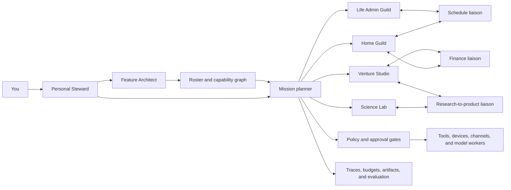

# The Personal Agent Constellation

Status: product direction

Last reviewed: 2026-09-13

## Product decision

The product should be a **Personal Agent Constellation**: a private, local-first
system in which narrow specialists are created on demand, participate in one or
more domain groups, and collaborate through governed work orders.

The goal is not to keep 100 model loops running or allow every agent to message
every other agent. That shape is expensive, difficult to debug, and creates
unclear authority. The system may eventually have hundreds of registered
specialists, but only the few needed for a mission should be instantiated.

Current multi-agent frameworks point in the same direction:

- the OpenAI Agents SDK distinguishes a manager that retains control from a
  handoff that transfers control, and treats handoffs, guardrails, sessions, and
  tracing as explicit runtime primitives ([orchestration](https://openai.github.io/openai-agents-python/multi_agent/),
  [handoffs](https://openai.github.io/openai-agents-python/handoffs/),
  [guardrails](https://openai.github.io/openai-agents-python/guardrails/));
- LangChain documents routers, supervisor/subagent patterns, handoffs, skills,
  and custom workflows as patterns that can be mixed, while LangGraph
  checkpoints provide persistence, human review, time travel, and fault
  tolerance ([multi-agent patterns](https://docs.langchain.com/oss/python/langchain/multi-agent),
  [persistence](https://docs.langchain.com/oss/python/langgraph/persistence));
- AutoGen advises starting with a single agent and adding a team only when the
  task benefits from the extra coordination, while its distributed runtime uses
  explicit host/worker message routing rather than an uncontrolled full mesh
  ([teams](https://microsoft.github.io/autogen/stable/user-guide/agentchat-user-guide/tutorial/teams.html),
  [distributed runtime](https://microsoft.github.io/autogen/stable/user-guide/core-user-guide/framework/distributed-agent-runtime.html));
- CrewAI similarly separates autonomous collaborating crews from structured,
  auditable flows ([CrewAI concepts](https://docs.crewai.com/)).

These are design references, not required dependencies. Easy Agents should keep
LangGraph as its graph engine and own its local control plane, contracts,
policies, and user experience.

## Vocabulary

Use approachable terms in the UI and keep precise technical names in manifests
and APIs.

| UI term | Meaning | Technical contract |
| --- | --- | --- |
| **Constellation** | The user's entire private agent system | workspace plus registry, runtime, policies, and services |
| **Steward** | The trusted front door that clarifies and routes the user's goal | supervisor agent |
| **Specialist** | One narrow, testable agent role | agent manifest plus graph and eval contract |
| **Guild** | A domain group whose members are allowed to collaborate | configured team and coordination policy |
| **Liaison** | A specialist that belongs to multiple guilds | multi-team membership; not a more powerful agent class |
| **Mission** | A user goal that may contain dependent work | durable root task |
| **Playbook** | The bounded workflow used to complete a mission | typed graph or task DAG |
| **Work order** | One delegation between specialists | handoff envelope and child task |
| **Capability** | A typed operation a specialist can perform | tool, resource, skill, or agent capability descriptor |
| **Charter** | What a specialist is for and what it may access | versioned agent manifest |
| **Roster** | Searchable specialists and their health/status | agent registry |
| **Gate** | A policy or human decision required before work continues | guardrail or durable approval |
| **Run** | One execution attempt | run record with trace lineage |
| **Control Room** | The UI for missions, specialists, gates, health, and cost | local control-plane web UI |

Avoid introducing more nautical or military metaphor. These terms are enough to
make the system memorable without hiding its technical meaning.

## Operating model



The Steward does not possess every tool. It can clarify, plan, delegate, request
approval, and synthesize. Guild coordinators are runtime roles selected for a
mission; they are not permanent all-powerful “master agents.” A Specialist may
join multiple Guilds and is then shown as a Liaison, but its permissions remain
those declared in its Charter.

Specialists communicate only when a Playbook contains a Work order between
them. Each Work order must state the requested capability, typed input and
output, parent mission, deadline, resource budget, delegated permissions, data
visibility, and cancellation lineage. Permissions can narrow during delegation
but cannot expand.

## Recommended roster

This is a capability map, not a command to implement every role immediately.
Several roles can begin as different Charters over shared graph templates and
models. Split a role into a new Specialist only when it needs distinct
permissions, memory, evaluation, lifecycle, or operational ownership.

### Foundation and cross-guild specialists

| Specialist | Responsibility |
| --- | --- |
| Personal Steward | One front door for goals, clarification, routing, status, and final synthesis |
| Feature Architect | Decide whether a requested feature should reuse, compose, extend, or create |
| Mission Planner | Turn an approved goal into a bounded task DAG with budgets and stop conditions |
| Safety Steward | Evaluate permissions, sensitive data, side effects, prompt-injection risk, and gates |
| Knowledge Librarian | Search permitted knowledge, preserve provenance, summarize, and verify claims |
| Schedule Coordinator | Coordinate calendars, reminders, routines, deadlines, and availability |
| Communications Operator | Draft messages and send only after the appropriate gate |
| Memory Curator | Propose, validate, expire, export, and forget long-term memories |
| Automation Engineer | Build deterministic triggers and Playbooks before proposing another agent |
| System Operator | Monitor queues, workers, models, storage, backups, failures, and recovery |
| Cost and Resource Broker | Select models/workers and enforce time, token, GPU, network, and money budgets |
| Artifact Curator | Track documents, reports, data, code, media, versions, and immutable references |

### Home and life in India

| Specialist | Responsibility and boundary |
| --- | --- |
| Household Operator | Maintenance, inventory, chores, utilities, and vendor coordination |
| Shopping Planner | Lists, comparisons, reorder proposals, and price monitoring; no autonomous purchase |
| Bill and Subscription Tracker | Due dates, anomalies, renewals, and cancellation proposals |
| Local Services Researcher | Research plumbers, electricians, repairs, domestic services, and other local vendors |
| Travel Coordinator | Indian rail/IRCTC, flights, hotels, local commute, itineraries, and travel documents |
| Government Document Coordinator | Aadhaar, PAN, passport, driving-licence, DigiLocker, and renewal checklists; sensitive-data gate |
| Personal Finance Controller | Budget, cash flow, expenses, goals, and read-only analysis; payments require approval |
| Tax Preparation Assistant | Organize ITR/GST/supporting material and questions for a CA; not a tax authority |
| Family Coordinator | Shared calendars, school/family logistics, birthdays, and delegated reminders |
| Meal and Nutrition Planner | Preferences, pantry, meal plans, shopping lists, and non-clinical nutrition support |
| Wellness Coach | Habits, fitness, sleep, and appointments; no diagnosis or emergency substitution |
| Learning Coach | Courses, reading, spaced repetition, language learning, and progress review |
| Digital Life Curator | Files, photos, backups, device inventory, renewals, and account-recovery checklists |
| Emergency Preparedness Assistant | Contacts, documents, checklists, supplies, and drills; always surfaces human emergency services |
| Home Automation Liaison | Translate approved intents into Home Assistant devices and automations |

Home automation should integrate instead of recreating the device ecosystem.
Home Assistant already provides trigger-condition-action automations and a voice
pipeline that can run fully on local hardware ([automation basics](https://www.home-assistant.io/docs/automation/basics/),
[fully local voice](https://www.home-assistant.io/voice_control/voice_remote_local_assistant)).

### Science and machine-learning exploration

| Specialist | Responsibility |
| --- | --- |
| Literature Scout | Search papers, repositories, standards, and datasets with provenance |
| Paper Reader | Extract methods, assumptions, equations, results, limitations, and open questions |
| Citation and Claim Verifier | Check whether sources actually support claims and distinguish evidence from inference |
| Research Librarian | Maintain topic maps, reading queues, annotations, and source relationships |
| Hypothesis Generator | Generate falsifiable hypotheses from evidence and explicitly label speculation |
| Experiment Designer | Define controls, metrics, sample size, ablations, risks, and stopping criteria |
| Data Curator | Profile, validate, label, version, document, and govern datasets |
| Statistics Specialist | Select tests, quantify uncertainty, check leakage, and review causal claims |
| Math Specialist | Work through derivations, symbolic checks, proofs, and numerical validation |
| ML Engineer | Implement training and inference code inside a sandbox |
| Environment and Reproducibility Engineer | Lock dependencies, seeds, hardware facts, containers, and rerun instructions |
| Experiment Runner | Schedule approved CPU/GPU jobs, checkpoint work, and respect resource budgets |
| Evaluation Specialist | Build benchmarks, baselines, rubrics, regressions, robustness, and safety tests |
| Results Analyst | Compare runs, create figures, perform error analysis, and flag unsupported conclusions |
| Scientific Reviewer | Adversarially review novelty, methods, leakage, limitations, and reproducibility |
| Technical Writer | Produce reports, notebooks, papers, posters, and documentation from traced evidence |
| Research-to-Product Liaison | Translate validated research into product hypotheses and engineering experiments |

Experiment tracking should use a dedicated backend rather than chat history.
MLflow, for example, records parameters, code versions, datasets, metrics, and
artifacts as runs and exposes a local UI ([MLflow Tracking](https://mlflow.org/docs/latest/ml/tracking)).

### Startup and company building

| Specialist | Responsibility and boundary |
| --- | --- |
| Founder Chief of Staff | Goals, priorities, decision log, operating cadence, dependencies, and follow-through |
| Strategy Analyst | Options, assumptions, scenarios, competitive advantage, and strategy reviews |
| Market Researcher | Market structure, competitors, substitutes, trends, and positioning with sources |
| Customer Discovery Researcher | Interview plans, note synthesis, problem hypotheses, and evidence strength |
| Product Operator | Requirements, roadmap, acceptance criteria, trade-offs, and product analytics |
| UX Researcher | Research plans, usability evidence, personas, journeys, and accessibility |
| Product Designer | Wireframes, prototypes, design systems, and handoff artifacts |
| Software Architect | Architecture, interfaces, ADRs, security boundaries, and technical planning |
| Software Engineer | Scoped implementation and tests in an isolated workspace |
| QA Engineer | Unit, contract, integration, end-to-end, accessibility, and regression coverage |
| Release Engineer | Build, versioning, changelog, staged release, and rollback plans |
| Platform/SRE Operator | Environments, health, alerts, capacity, incidents, backup, and recovery |
| Security Reviewer | Threat models, dependencies, secrets, access, abuse cases, and remediation |
| Data and Analytics Specialist | Event definitions, data quality, funnels, cohorts, dashboards, and experiments |
| Growth Researcher | Ethical acquisition hypotheses, channel experiments, and measurement |
| Content and Brand Operator | Briefs, copy, editorial calendar, brand consistency, and review workflow |
| Sales Researcher | Accounts, qualification, research, pipeline hygiene, and outreach drafts |
| Customer Success Operator | Onboarding, health signals, support synthesis, playbooks, and renewal risk |
| Finance and Runway Controller | Budget, forecast, bookkeeping preparation, runway, and scenario analysis |
| Legal and Compliance Coordinator | Issue spotting, evidence collection, obligations, and questions for qualified counsel |
| Hiring Coordinator | Role scorecards, sourcing plans, interview loops, notes, and candidate communication drafts |
| People Operations Coordinator | Onboarding, policy workflow, goals, feedback cadence, and records |
| Fundraising Coordinator | Data-room checklist, narrative, investor research, meeting preparation, and follow-up drafts |
| Partnerships and Procurement Operator | Partner research, vendor comparisons, requirements, and approval-gated negotiation support |
| Meeting and Decision Recorder | Agenda, transcript, decisions, owners, deadlines, and follow-up reconciliation |

Legal, medical, financial, identity, payment, employment, public publishing, and
security-sensitive work stays human-controlled. The Specialist may research,
prepare, simulate, or draft; the final regulated judgment or external action
must cross a Gate.

## Shared platform capabilities

The roster depends on platform services that are not themselves conversational
agents:

- identity, user preferences, relationships, location, language, timezone, and
  consent;
- a versioned Charter and Capability registry with semantic and exact search;
- local model routing across laptop, workstation, and DGX profiles;
- typed Work orders, durable tasks, schedules, events, retries, cancellation,
  and idempotency;
- strict-offline enforcement and explicit opt-in network profiles;
- tool, filesystem, subprocess, device, communication, credential, payment, and
  data-scope policies;
- durable Gates that pause and resume the same Run;
- thread state, long-term memory, knowledge, and artifact storage as separate
  systems;
- sandboxed execution for code, documents, downloads, and untrusted input;
- trace, log, metric, audit, cost, and resource correlation;
- evaluation datasets, regression suites, red-team cases, canary activation,
  quarantine, rollback, and retirement;
- encrypted backups, export, deletion, retention, secret references, and
  disaster recovery;
- connectors for calendar, email, messages, storage, documents, Home Assistant,
  research sources, developer systems, and startup tools.

MCP can become the connector boundary, but its tools may execute arbitrary code
and its metadata is not inherently trusted. Discovered capabilities therefore
must still pass local authorization, consent, scope, and audit policy
([MCP security guidance](https://modelcontextprotocol.io/specification/2025-03-26),
[MCP authorization](https://modelcontextprotocol.io/specification/2025-06-18/basic/authorization)).

## Control Room information architecture

The UI should expose the real operational model:

1. **Today** — active missions, upcoming routines, waiting decisions, failures,
   and a single input box.
2. **Constellation** — a graph of Guilds and Specialists. A Liaison appears once
   with membership arcs into each Guild; the graph is a roster view, not a live
   message animation.
3. **Mission** — task DAG, current Run, specialist ownership, Work orders,
   checkpoints, artifacts, budgets, and cancellation.
4. **Roster** — Charter, capabilities, version, health, permissions, eval score,
   resource profile, and lifecycle status.
5. **Playbooks** — reusable workflows with triggers, conditions, steps, Gates,
   versions, and tests.
6. **Gates** — approvals grouped by risk with a human-readable preview of the
   exact action, data, recipient, cost, and expiry.
7. **Capability Library** — tools, connectors, resources, secrets references,
   scopes, network requirements, and recent use.
8. **Memory Vault** — what is remembered, why, provenance, sensitivity,
   namespace, expiry, edit/export/forget controls.
9. **Lab** — proposed Charters and capabilities, sandbox runs, evaluations,
   diffs, promotion, quarantine, and rollback.
10. **Operations** — model/worker health, task queue, traces, errors, latency,
    resource use, storage, backup, and strict-offline state.

OpenTelemetry is a suitable vendor-neutral representation for correlated
traces, metrics, and logs, although the local UI may store and render those
signals itself ([OpenTelemetry documentation](https://opentelemetry.io/docs/)).
Agent-specific spans should preserve the mission, task, run, parent run,
specialist, node, tool, and approval lineage; the OpenAI Agents SDK trace model
is a useful reference for workflow, agent, generation, function, guardrail, and
handoff spans ([Agents SDK tracing](https://openai.github.io/openai-agents-python/tracing/)).

## Feature-to-agent behavior

When the user enters a new feature, the Feature Architect must return exactly
one primary recommendation:

- **Reuse** an existing Capability owned by an existing Specialist.
- **Compose** a Playbook from two or more existing Specialists.
- **Extend** the Charter of the closest Specialist with a missing Capability.
- **Create** a new proposed Specialist when the responsibility is genuinely
  separate.

It must also return matched evidence, confidence, Guild placement, requested
effects, missing capabilities, risk, approval requirement, permissions, an eval
plan, and the next lifecycle step. Creation follows:

```text
proposed -> scaffolded -> sandboxed -> evaluated -> approved -> active
                                                    -> quarantined -> retired
```

Low-risk scaffolding may be automatic. Activation never is. A generated
Specialist cannot grant itself capabilities, credentials, data visibility,
network access, or a position of authority. The concrete feature-intake
contract and current offline implementation are documented in
[Feature Intake and Draft Charters](../guides/feature-intake.md).
